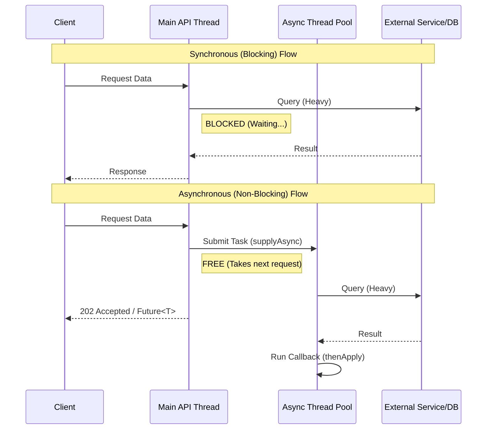

## 1. Interview-Style Opening

"Asynchronous programming is a concurrency model that allows a unit of work to run separately from the main application thread. This ensures the main thread—typically the one handling HTTP requests in a web server—isn't blocked waiting for long-running operations like I/O, database queries, or external API calls.

In Java, specifically within the Spring ecosystem, we have evolved from raw `Threads` to `CompletableFuture` and now to full reactive stacks. I typically implement this using `CompletableFuture` for standard services or Spring’s `@Async` annotation for fire-and-forget tasks. Let me break down how we achieve this reliably."

## 2. Problem Understanding and Clarification

The goal is to explain **what** asynchronous programming is and **how** to implement it effectively.

**Clarifications \& Constraints:**

* **Definition:** It's about non-blocking execution. A caller submits a task and continues its own work without waiting for the result immediately.
* **Why?** To improve throughput and responsiveness (latency), not necessarily to make a single task faster.
* **Mechanisms:** We need to handle return values (Futures), exceptions, and thread pool management.
* **Context:** I will focus on a modern Spring Boot backend context.

**Key Approaches:**

1. **`CompletableFuture` (Java 8+):** For composing multiple async tasks.
2. **`@Async` (Spring):** For declarative background tasks.
3. **Reactive Streams (WebFlux):** For high-concurrency, non-blocking I/O (brief mention as an alternative).

## 3. High-Level Approach (Before Code)

My standard approach involves three layers:

1. **The Trigger:** The API or service method that initiates the work.
2. **The Execution Unit:** A separate thread pool (`ExecutorService`) customized for the workload (CPU-bound vs. I/O-bound).
3. **The Result Handler:** A callback or `Future` wrapper that processes the result when it's ready.

**Why not just `new Thread()`?**
Creating threads is expensive (OS overhead). We use pooled threads to reuse resources.

**Comparison:**

* **Synchronous:** `User` -> `Service` -> `Database` (User waits 2s).
* **Asynchronous:** `User` -> `Service` (returns "Processing...") -> `Worker` -> `Database`.


## 4. Visual Explanation (Mermaid-First)

Here is the flow of an asynchronous request using `CompletableFuture` versus a standard blocking call.



**Diagram Explanation:**
In the async flow, the `MainThread` is immediately freed after submitting the task. This allows a Tomcat server with 200 threads to handle thousands of concurrent requests, provided the heavy lifting is offloaded effectively.

## 5. Java Code (Production-Quality)

I will demonstrate the `CompletableFuture` approach as it's the most flexible for chaining logic. I will also show a custom `Executor` configuration, which is mandatory for production (never use the default pool).

### Configuration (Thread Pool)

```java
import org.springframework.context.annotation.Bean;
import org.springframework.context.annotation.Configuration;
import org.springframework.scheduling.annotation.EnableAsync;
import org.springframework.scheduling.concurrent.ThreadPoolTaskExecutor;

import java.util.concurrent.Executor;

@Configuration
@EnableAsync
public class AsyncConfig {

    @Bean(name = "customAsyncExecutor")
    public Executor asyncExecutor() {
        ThreadPoolTaskExecutor executor = new ThreadPoolTaskExecutor();
        // Core size: threads always alive
        executor.setCorePoolSize(10);
        // Max size: burst capacity
        executor.setMaxPoolSize(50);
        // Queue: buffer before rejection
        executor.setQueueCapacity(100);
        executor.setThreadNamePrefix("AsyncWorker-");
        executor.initialize();
        return executor;
    }
}
```


### Service Implementation

```java
import org.springframework.scheduling.annotation.Async;
import org.springframework.stereotype.Service;
import java.util.concurrent.CompletableFuture;

@Service
public class ReportService {

    // Simulating a dependency that fetches data
    private final DataRepository dataRepo;

    public ReportService(DataRepository dataRepo) {
        this.dataRepo = dataRepo;
    }

    /**
     * Way 1: Using Spring's @Async annotation.
     * The proxy handles submission to the executor.
     */
    @Async("customAsyncExecutor")
    public CompletableFuture<Report> generateReportAsync(String reportId) {
        try {
            System.out.println("Processing in thread: " + Thread.currentThread().getName());
            
            // Simulate heavy I/O
            Data data = dataRepo.fetchData(reportId); 
            Thread.sleep(1000); 

            Report report = new Report(reportId, data, "COMPLETED");
            return CompletableFuture.completedFuture(report);
            
        } catch (InterruptedException e) {
            Thread.currentThread().interrupt();
            // Handle error gracefully in the Future
            return CompletableFuture.failedFuture(e);
        }
    }

    /**
     * Way 2: Using CompletableFuture programmatically.
     * Offers more control over composition (chaining).
     */
    public CompletableFuture<CombinedResult> complexWorkflow() {
        // Step 1: Start Task A
        CompletableFuture<String> userFuture = CompletableFuture.supplyAsync(() -> {
            return "User-123";
        }); // Uses ForkJoinPool.commonPool() by default, better to pass custom executor

        // Step 2: Start Task B
        CompletableFuture<Integer> scoreFuture = CompletableFuture.supplyAsync(() -> {
            return 99;
        });

        // Step 3: Combine results when BOTH are done
        return userFuture.thenCombine(scoreFuture, (user, score) -> {
            return new CombinedResult(user, score);
        });
    }
}
```


## 6. Code Walkthrough (Line-by-Line)

* **`@EnableAsync`**: This tells Spring to look for `@Async` methods and run them in a background thread executor.[^1][^2]
* **`ThreadPoolTaskExecutor`**: We customize this to avoid `OutOfMemoryError`. The default `SimpleAsyncTaskExecutor` creates a new thread for *every* task, which is dangerous in production.[^2]
* **`CompletableFuture.supplyAsync`**: This starts the task. By default, it uses the `ForkJoinPool`, but you can (and should) pass a custom executor as a second argument.[^3][^4]
* **`thenCombine`**: This demonstrates the power of `CompletableFuture`. We can run two independent tasks in parallel and merge their results only when both are finished, effectively halving the total wait time compared to running them sequentially.[^3]


## 7. How I Would Explain This to the Interviewer

"So, to summarize: Asynchronous programming is about decoupling the task submission from its execution.

In a typical Spring application, I use two main ways to achieve this:

1. **`@Async`**: This is great for 'fire-and-forget' tasks like sending emails or notifications where I don't need to block the user.
2. **`CompletableFuture`**: I use this when I need to compose results—like fetching user details and their recent orders in parallel, then combining them into a single dashboard response.

The critical engineering detail here is **thread pool isolation**. I never use the default pool because a slow third-party API could starve my entire application's threads. I always define a custom `ThreadPoolTaskExecutor` with bounded queues."

## 8. Edge Cases and Follow-Up Questions

**Edge Cases:**

* **Exception Handling:** In standard threads, exceptions get swallowed. With `CompletableFuture`, we must use `.exceptionally()` or `.handle()` to catch errors that occur in the background thread.[^3]
* **Thread Context Loss:** Data stored in `ThreadLocal` (like SecurityContext or TransactionContext) is **not** automatically propagated to the new async thread. We need to manually copy context or use decorators.
* **Application Shutdown:** If the app shuts down while async tasks are running, they might be killed. We need to configure `setWaitForTasksToCompleteOnShutdown(true)`.

**Follow-Up Questions:**

* **Q:** *What is the difference between `Callable` and `Runnable`?*
    * **A:** `Runnable` returns `void` and cannot throw checked exceptions. `Callable` returns a value `V` and can throw exceptions.
* **Q:** *Why use `CompletableFuture` over standard `Future`?*
    * **A:** Standard `Future.get()` is blocking. `CompletableFuture` allows non-blocking callbacks (`.thenApply`) and composition, which is much more efficient.[^5][^3]


## 9. Optimization and Trade-offs

* **Throughput vs. Latency:** Async improves throughput (RPS) but doesn't necessarily reduce the latency of a single request (it might actually add slight overhead due to context switching).
* **Debugging:** Stack traces in async code are notoriously hard to read because they don't show the caller.
* **Resource Exhaustion:** If the queue is unbounded, a slow consumer can cause the producer to fill up the heap, leading to OOM. Always use bounded queues.


## 10. Real-World Application and Engineering Methodology

**Use Case:** **PDF Report Generation**.
A user requests a download of their yearly transaction history. This takes 10 seconds.
Instead of keeping the HTTP connection open (which might timeout), we:

1. Accept the request and return `202 Accepted` with a `jobId`.
2. Run the generation asynchronously using `@Async`.
3. The client polls an endpoint `/status/{jobId}` or we send a webhook/email when done.

**Engineering Methodology:**
In microservices, we often replace in-memory async (like `CompletableFuture`) with **distributed async** (Kafka/RabbitMQ) for reliability. If the server crashes, an in-memory `CompletableFuture` is lost forever. A message in Kafka persists and can be retried by another instance. This is a key trade-off between simplicity and reliability.
<span style="display:none">[^10][^11][^12][^13][^14][^15][^6][^7][^8][^9]</span>

<div align="center">⁂</div>

[^1]: https://www.linkedin.com/pulse/implementing-asynchronous-processing-spring-boot-async-prabhat-pankaj-3ippc

[^2]: https://www.codingshuttle.com/blogs/understanding-the-async-annotation-in-spring-boot/

[^3]: https://www.baeldung.com/java-executorservice-vs-completablefuture

[^4]: https://codingtechroom.com/tutorial/java-java-executorservice-vs-completablefuture-a-comprehensive-guide

[^5]: https://www.hungrycoders.com/blog/difference-between-completablefuture-and-future-in-java

[^6]: https://stackoverflow.com/questions/52303472/executorservice-vs-completablefuture

[^7]: https://www.javacodegeeks.com/guide-to-executorservice-vs-completablefuture.html

[^8]: https://stackoverflow.com/questions/68331402/completablefuture-vs-executorservice

[^9]: https://www.linkedin.com/pulse/mastering-asynchronous-programming-spring-boot-best-shant-khayalian-aubze

[^10]: https://www.reddit.com/r/java/comments/176029t/completablefuture_vs_flow/

[^11]: https://www.stefankreidel.io/blog/spring-webflux-async-compute

[^12]: https://www.java-success.com/10-♦-executorservice-vs-forkjoin-future-vs-completablefuture-interview-qa/

[^13]: https://blog.stackademic.com/mastering-reactive-programming-in-java-from-completablefuture-to-project-reactor-spring-10cb30589327

[^14]: https://www.linkedin.com/posts/prince-kumar-sharma365_java-multithreading-executorservice-activity-7385125218350129152-QQX-

[^15]: https://til.hashnode.dev/how-to-do-async-in-spring-boot

