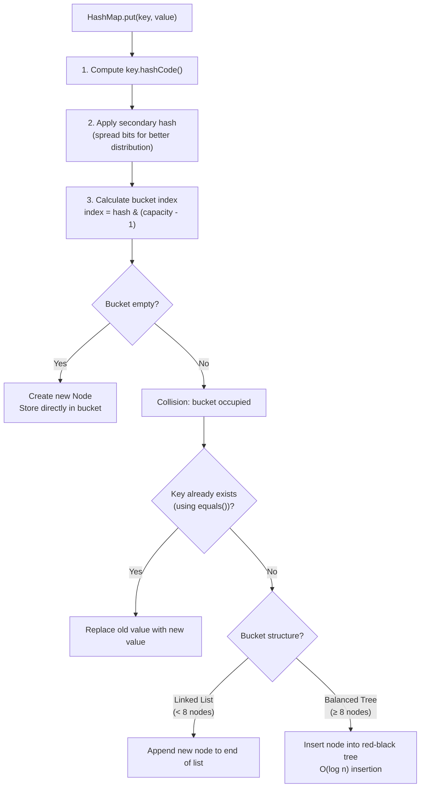
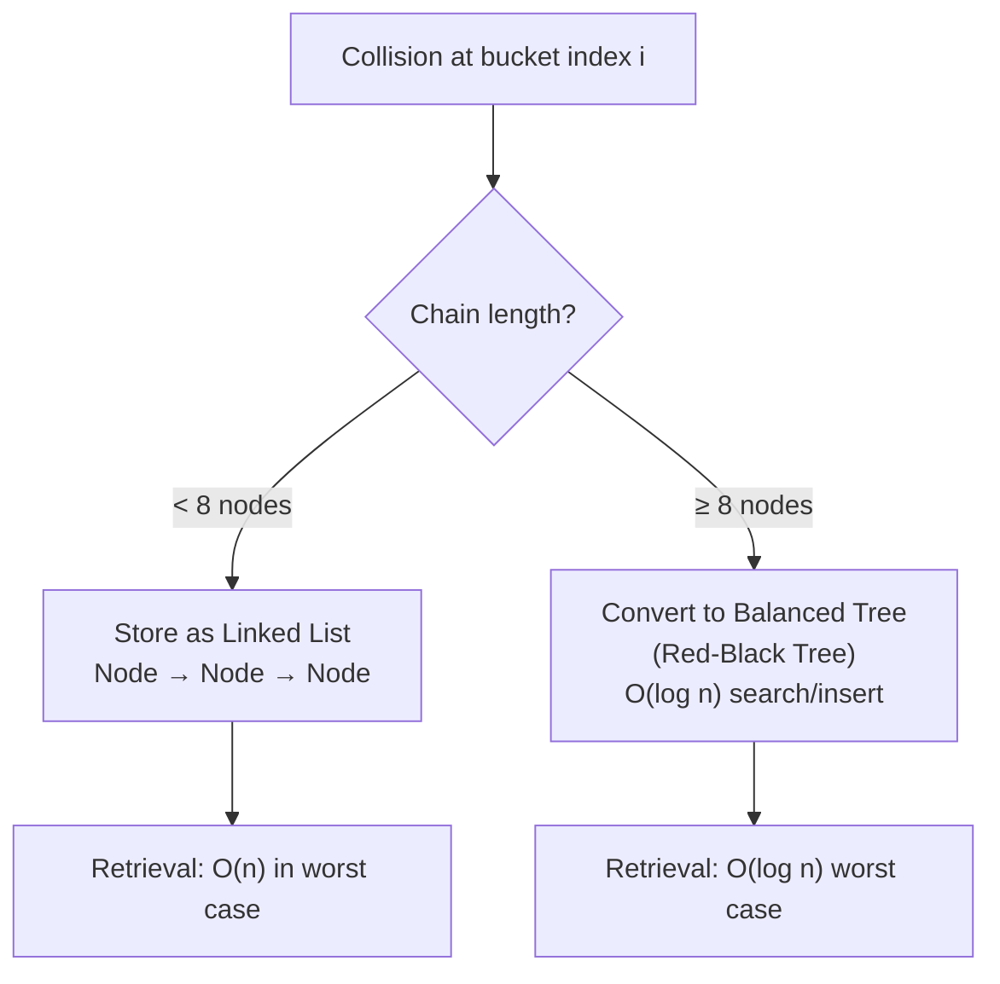
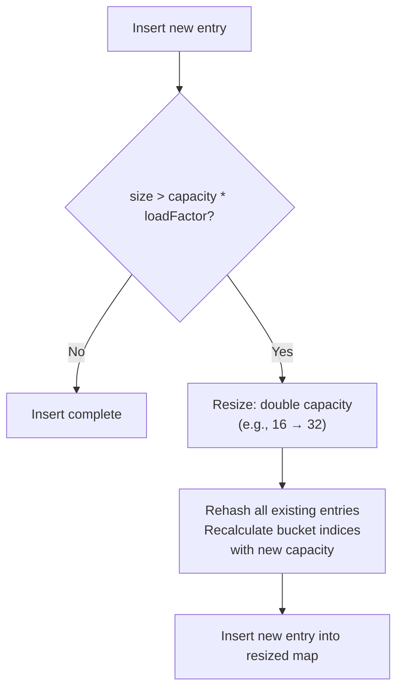

## 1. Interview-Style Opening

Sure, let me walk you through how HashMap works internally in Java, focusing on the core mechanism—hashing—and then explain its key properties like performance guarantees, collision handling, and resizing behavior.

## 2. Problem Understanding and Clarification

The question is: how does `HashMap` actually store and retrieve key-value pairs efficiently, and what are its defining characteristics?
Key aspects to cover:

- Internal data structure (array of buckets, nodes/entries).
- How keys are mapped to buckets using `hashCode()` and index calculation.
- Collision resolution (chaining with linked lists and trees).
- Load factor and dynamic resizing/rehashing.
- Time complexity for `put()`, `get()`, `remove()` operations.
Assumptions: we're discussing Java's `java.util.HashMap` (not `Hashtable` or `ConcurrentHashMap`), and we assume keys implement `hashCode()` and `equals()` correctly.[^2][^5]


## 3. High-Level Approach (Before Code)

**Core mechanism:** HashMap is an array of "buckets" (each bucket is a linked list or tree of entries/nodes).[^5][^2]
**Steps for `put(key, value)`:**

1. Compute `key.hashCode()`, then apply a secondary hash function to improve distribution.[^8]
2. Calculate bucket index: `index = hash & (capacity - 1)` (bitwise AND, equivalent to modulo for power-of-two sizes).[^7][^5]
3. If bucket is empty, insert new node; if occupied, check for duplicate key using `equals()`, replace value if duplicate, else append to chain (or tree).[^2][^5]

**Steps for `get(key)`:**

1. Compute hash → bucket index.
2. Traverse bucket (linked list or tree) comparing keys with `equals()` until match found.[^5]

**Collision handling:** Initially linked list; after 8 collisions in one bucket, Java 8+ converts to a balanced tree (red-black tree) for $O(\log n)$ worst-case instead of $O(n)$.[^8][^5]

**Resizing:** When size exceeds `capacity * loadFactor` (default 0.75), HashMap doubles capacity and rehashes all entries into the new larger array.[^4][^5]

**Time complexity:** Average $O(1)$ for `put`, `get`, `remove`; worst-case $O(\log n)$ per bucket after treeification.[^5][^8]
**Space complexity:** $O(n)$ for $n$ entries, plus overhead for array and tree nodes.

## 4. Visual Explanation (Mermaid-First, Mandatory)

### HashMap Structure and Put Operation



**How I'd explain verbally:** When you call `put`, HashMap first hashes the key—it calls `hashCode()` and then applies a bit-mixing function to spread values evenly, reducing clustering.[^8]
Then it calculates which bucket (array index) to use via bitwise AND with `(capacity - 1)`, which is efficient and works because capacity is always a power of two.[^7][^5]
If the bucket is empty, it just places the entry there; if occupied (collision), it checks whether the key already exists using `equals()`, and if not, appends to the chain—or inserts into a tree if the chain is long.[^2][^8]

### Collision Handling: Linked List → Balanced Tree



**Verbally:** Java 8 optimized HashMap by treeifying long chains—once a bucket holds 8 or more entries, the linked list converts to a balanced tree, dramatically improving worst-case lookup from $O(n)$ to $O(\log n)$.[^5][^8]
When the chain shrinks back below a threshold (due to removals), it reverts to a linked list to save memory.[^8]

### Resizing and Rehashing



**Verbally:** When the number of entries exceeds the product of capacity and load factor (default 0.75), HashMap resizes—it creates a new array double the size and rehashes every entry into the new buckets, which keeps average lookup time $O(1)$.[^4][^5]
Resizing is expensive ($O(n)$), but it's amortized over many insertions.

## 5. Java Code (Production-Quality)

### Simplified HashMap Node Structure (Conceptual)

```java
// This is the internal node structure used by HashMap [web:55][web:58][web:61]
static class Node<K, V> implements Map.Entry<K, V> {
    final int hash;      // Cached hash to avoid recomputation [web:61]
    final K key;
    V value;
    Node<K, V> next;     // Next node in bucket (for chaining) [web:55]

    Node(int hash, K key, V value, Node<K, V> next) {
        this.hash = hash;
        this.key = key;
        this.value = value;
        this.next = next;
    }

    public final K getKey()   { return key; }
    public final V getValue() { return value; }
    public final V setValue(V newValue) {
        V oldValue = value;
        value = newValue;
        return oldValue;
    }
}
```


### Simplified Put Logic (Conceptual)

```java
import java.util.HashMap;
import java.util.Map;

public class HashMapExample {
    public static void main(String[] args) {
        Map<String, Integer> map = new HashMap<>(16, 0.75f); // initial capacity 16, load factor 0.75 [web:57]

        // Inserting key-value pairs
        map.put("Alice", 30);
        map.put("Bob", 25);
        map.put("Charlie", 35);

        // Retrieving a value
        Integer age = map.get("Alice"); // O(1) average [web:58]
        System.out.println("Alice's age: " + age); // 30

        // Updating an existing key
        map.put("Alice", 31); // Replaces old value [web:55]
        System.out.println("Alice's updated age: " + map.get("Alice")); // 31

        // Checking for a key
        boolean hasCharlie = map.containsKey("Charlie"); // true
        System.out.println("Has Charlie: " + hasCharlie);

        // Removing an entry
        map.remove("Bob");
        System.out.println("After removing Bob: " + map);
    }
}
```


### Internal Hash Calculation (Actual Java 8 Implementation)[^8]

```java
// This is the actual hash function used internally by HashMap [web:61]
static final int hash(Object key) {
    int h;
    return (key == null) ? 0 : (h = key.hashCode()) ^ (h >>> 16);
    // XOR with high 16 bits to spread entropy [web:61]
}

// Index calculation (conceptual, actual uses bitwise AND)
// index = (capacity - 1) & hash; // Equivalent to hash % capacity for power-of-2 [web:58][web:60]
```


## 6. Code Walkthrough (Line-by-Line)

**Node structure:** Each entry stores the hash (cached to avoid recomputation during collisions), key, value, and `next` pointer for chaining.[^2][^8]
**Hash calculation:** HashMap applies a secondary hash by XORing the key's `hashCode()` with its high 16 bits shifted right; this spreads entropy better and reduces clustering even if user keys have poor hash functions.[^8]
**Index calculation:** Uses bitwise AND `(capacity - 1) & hash` instead of modulo, which is faster and works because capacity is always a power of two.[^7][^5]
**Put collision handling:** If the bucket is occupied, HashMap traverses the chain (or tree), compares keys with `equals()`, and either replaces the value (if key matches) or appends a new node.[^2][^5]
**Resizing trigger:** When size exceeds `threshold = capacity * loadFactor` (default 12 for initial capacity 16), HashMap doubles capacity and rehashes.[^4][^5]

## 7. How I Would Explain This to the Interviewer

So the key idea is: HashMap achieves average $O(1)$ lookup by distributing keys across an array of buckets using a hash function, and it resolves collisions by chaining entries in linked lists or trees.[^5][^2]
The reason it's so efficient is the two-level hashing—first the user-provided `hashCode()`, then HashMap's own bit-mixing step to even out distribution, which minimizes collisions.[^8]
When collisions do happen, Java 8+ automatically converts long chains into balanced trees after 8 entries, so worst-case performance degrades only to $O(\log n)$ instead of $O(n)$.[^5][^8]
The load factor (0.75) is a sweet spot: it keeps the array reasonably sparse to avoid collisions, but not so sparse that we waste memory—when we exceed that threshold, HashMap doubles in size and rehashes everything to maintain performance.[^4][^5]

## 8. Edge Cases and Follow-Up Questions

**Edge cases**

- Null key: HashMap allows exactly one null key, stored at index 0 (hash is 0).[^4]
- Null values: Multiple null values are allowed; only keys need to be unique.[^4]
- Poor hash function: If all keys return the same `hashCode()`, all entries go into one bucket—before Java 8 this degraded to $O(n)$, but now it treeifies to $O(\log n)$.[^8]
- Concurrent modification: HashMap is not thread-safe; concurrent puts/removes can corrupt internal structure; use `ConcurrentHashMap` instead.
- Key mutability: If a key's `hashCode()` changes after insertion, retrieval fails because the bucket index is now wrong (same issue as discussed in previous question).

**Likely follow-ups (with brief answers)**

- "What's the difference between HashMap and Hashtable?" `Hashtable` is synchronized (thread-safe but slower), doesn't allow null keys/values, and is legacy; `HashMap` is unsynchronized, allows one null key and multiple null values.[^4]
- "Why is the default load factor 0.75?" It's a balance: higher load factor (e.g., 0.9) saves memory but increases collisions; lower (e.g., 0.5) reduces collisions but wastes space—0.75 is empirically optimal.[^5][^4]
- "What happens during resizing if another thread is reading?" HashMap is not thread-safe; concurrent read during resize can cause infinite loops or missed entries; use `ConcurrentHashMap` for concurrency.[^4]


## 9. Optimization and Trade-offs

**Time vs space:** A lower load factor (e.g., 0.5) keeps fewer collisions (faster lookups) but wastes memory; a higher load factor (e.g., 1.0) saves memory but increases collision chains and resizing frequency.[^5][^4]
**Alternative data structures:** If you need sorted keys, use `TreeMap` ($O(\log n)$ operations, maintains order); if you need thread-safety, use `ConcurrentHashMap` (lock-striping for concurrent access without blocking all threads).
**When HashMap isn't ideal:** If keys are already integers in a small range (e.g., 0–1000), a simple array is faster and uses less memory; if you need insertion-order preservation, use `LinkedHashMap` (slight overhead to maintain doubly-linked list).[^4]

## 10. Real-World Application and Engineering Methodology

**Production use case:** Caching user sessions in a web server—`HashMap<String, Session>` keyed by session ID for $O(1)$ lookup; when session count grows, automatic resizing maintains performance without manual intervention.[^5]

**Engineering constraints at scale:**

- **Concurrency:** In multi-threaded services, use `ConcurrentHashMap` with lock-striping to avoid contention; resizing in `ConcurrentHashMap` is incremental (doesn't block all readers).[^4]
- **Memory overhead:** Each entry in HashMap carries a `Node` object with hash, key, value, and next pointer; for millions of entries, this overhead (typically ~32 bytes per entry on 64-bit JVM) matters—consider off-heap storage or specialized caches like Caffeine.
- **GC pressure:** Frequent resizing creates temporary arrays and triggers GC; if you know the expected size, initialize with appropriate capacity (e.g., `new HashMap<>(expectedSize / 0.75)`) to avoid mid-operation resizing.[^4]
- **Hash DoS attacks:** If an attacker crafts keys with identical hash codes, all entries collide in one bucket—Java 8's treeification mitigates this to $O(\log n)$, but it's still slower than distributed keys; consider using salted hashing for user-controlled keys.[^8]

**Engineering patterns involved:**

- **Amortized cost:** Resizing is $O(n)$ but happens infrequently, so the cost is "amortized" over many insertions, keeping average insertion $O(1)$.[^5]
- **Lazy initialization:** HashMap buckets are created on-demand; the array is allocated only when the first entry is inserted, saving memory for empty or rarely-used maps.
- **Adaptive data structures:** The linked list → tree conversion is a classic adaptive optimization—start simple (list) for common cases, upgrade (tree) for pathological cases.[^8]

**Key Properties Summary Table:**


| Property | Value/Behavior |
| :-- | :-- |
| Average time complexity (put/get/remove) | $O(1)$ [^5] |
| Worst-case time (before Java 8) | $O(n)$ (long collision chain) [^8] |
| Worst-case time (Java 8+) | $O(\log n)$ (treeified bucket) [^8] |
| Space complexity | $O(n)$ for $n$ entries [^5] |
| Default initial capacity | 16 buckets [^4] |
| Default load factor | 0.75 (resize when 75% full) [^4][^5] |
| Null keys allowed | Yes, exactly one (stored at index 0) [^4] |
| Null values allowed | Yes, multiple [^4] |
| Thread-safe | No (use `ConcurrentHashMap` instead) [^4] |
| Maintains insertion order | No (use `LinkedHashMap` for order) [^4] |
| Collision resolution (< 8 entries) | Linked list (separate chaining) [^2][^5] |
| Collision resolution (≥ 8 entries) | Balanced tree (red-black tree) [^8][^5] |

<span style="display:none">[^1][^10][^3][^6][^9]</span>

<div align="center">⁂</div>

[^1]: https://www.freecodecamp.org/news/how-java-hashmaps-work-internal-mechanics-explained/

[^2]: https://www.geeksforgeeks.org/java/internal-working-of-hashmap-java/

[^3]: https://www.youtube.com/watch?v=xKCdp0jjZAw

[^4]: https://blog.nashtechglobal.com/how-does-hashmap-works-internally/

[^5]: https://dev.to/abhishek_kumar_d9009a7ae6/internal-working-of-hashmap-2n28

[^6]: https://www.linkedin.com/pulse/understanding-hashmap-java-internal-working-conflicts-kāshān-asim-7rzrf

[^7]: https://nareshit.com/blogs/hashmap-internal-working-in-java-step-by-step-guide-nareshit

[^8]: https://howtodoinjava.com/java/collections/hashmap/how-hashmap-works-in-java/

[^9]: https://www.youtube.com/watch?v=PZcgsPyYAgM

[^10]: https://dzone.com/articles/how-hashmap-works-internally-in-java

