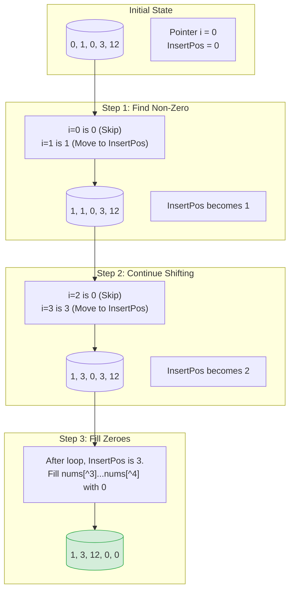

# Given an integer array nums, move all 0s to the end of the array while maintaining the relative order of the non-zero elements.

Sure, let me first clarify the problem and then walk you through my approach.

## 1. Interview-Style Opening

"This is a classic 'Two-Pointer' or 'In-Place Partitioning' problem. The goal is to separate the array into two zones: non-zero elements on the left and zeroes on the right, without allocating a new array (Space O(1)) and while keeping the non-zero elements in their original relative order (Stable Partition).

I will start with a conceptual explanation using the 'Snowball' analogy, then visualize it, and finally provide the optimal Java solution."

## 2. Problem Understanding and Clarification

**Input:** An integer array `nums`.
**Output:** The same array modified in-place.
**Constraints:**

* Move all `0`s to the end.
* **Crucial:** Maintain relative order of non-zero elements (e.g., if `1` comes before `3`, it must stay that way).
* **Space Complexity:** O(1) (In-place).
* **Time Complexity:** O(N) (One pass preferred).

**Clarification:** "I will use a `lastNonZeroFoundAt` index to track where the next non-zero element should be placed. Effectively, we will shift all non-zeroes to the left and then fill the rest with zeroes."

## 3. High-Level Approach (Before Code)

### The "Shift and Fill" Strategy (Optimized)

Instead of swapping constantly (which performs unnecessary writes), we can think of this as:

1. **Iterate** through the array with a pointer `i`.
2. **Collect** all non-zero elements. Every time `nums[i]` is non-zero, placing it at the `insertPos` index and incrementing `insertPos`.
3. **Fill** the remaining positions from `insertPos` to the end of the array with `0`.

This minimizes operations because we only write to the array when necessary.

**Time Complexity:** O(N) — We traverse the array effectively twice (once to read, once to fill zeroes).
**Space Complexity:** O(1) — No extra data structures.

## 4. Visual Explanation (Mermaid-First, Mandatory)



**Note on Visualization:** In the "Shift" phase, we don't care that `nums[^1]` (which was `1`) is duplicated temporarily. We overwrite it later or leave it if `InsertPos` has moved past it.

## 5. Java Code (Production-Quality)

```java
public class MoveZeroes {

    /**
     * Moves all zeroes to the end of the array while maintaining the relative order
     * of non-zero elements.
     * 
     * Time Complexity: O(N)
     * Space Complexity: O(1)
     */
    public void moveZeroes(int[] nums) {
        // Edge case: Empty or single-element array
        if (nums == null || nums.length <= 1) {
            return;
        }

        int insertPos = 0;

        // Phase 1: Shift non-zero elements to the front
        for (int i = 0; i < nums.length; i++) {
            if (nums[i] != 0) {
                nums[insertPos] = nums[i];
                insertPos++;
            }
        }

        // Phase 2: Fill the remaining positions with zero
        while (insertPos < nums.length) {
            nums[insertPos] = 0;
            insertPos++;
        }
    }

    public static void main(String[] args) {
        MoveZeroes solution = new MoveZeroes();
        
        int[] input = {0, 1, 0, 3, 12};
        System.out.println("Before: " + java.util.Arrays.toString(input));
        
        solution.moveZeroes(input);
        
        System.out.println("After:  " + java.util.Arrays.toString(input));
    }
}
```


## 6. Code Walkthrough (Line-by-Line)

1. `if (nums == null || nums.length <= 1)`: Defensive coding. If there's nothing to move, return immediately.
2. `int insertPos = 0`: This is our "Write Pointer". It tracks the position where the *next* non-zero number belongs.
3. `for (int i = 0...`: This is our "Read Pointer". It scans every element.
4. `if (nums[i] != 0)`: We ignore zeroes. We only care about saving valid numbers.
5. `nums[insertPos] = nums[i]`: We copy the valid number to the "safe zone" at the left.
6. `insertPos++`: We advance the safe zone.
7. `while (insertPos < nums.length)`: Once we've moved all valid numbers (say, 3 numbers), indices `0`, `1`, and `2` are correct. But indices `3` and `4` still contain old garbage data.
8. `nums[insertPos] = 0`: We wipe the garbage data with `0`s to fulfill the requirement.

## 7. How I Would Explain This to the Interviewer

"I used the **Two-Pointer technique**. One pointer (`i`) iterates through the array reading elements, while the second pointer (`insertPos`) keeps track of the boundary of the 'non-zero' subarray.

Effectively, I am compressing the array by moving all valid numbers to the left. Once I've verified that all non-zero numbers are safely at the start of the array (from index `0` to `insertPos - 1`), I know that the rest of the array *must* be zeroes. So, I simply fill the remaining slots with `0`.

This approach is optimal because it performs exactly N reads and N writes in the worst case, with zero extra space allocated."

## 8. Edge Cases and Follow-Up Questions

* **Edge Case 1:** `[0, 0, 0]` -> Code handles this. `insertPos` stays 0. Phase 2 fills everything with 0. Correct.
* **Edge Case 2:** `[1, 2, 3]` -> Code handles this. `insertPos` increments with `i`. Phase 2 loop condition `3 < 3` fails immediately. Correct.
* **Edge Case 3:** `[^1]` -> Handled by the initial check.

**Follow-Up:** "Can you minimize the number of writes?"

* **Answer:** "Yes. In the current solution, if the array is `[1, 1, 1]`, we technically assign `nums[^0] = nums[^0]`, which is a useless write. We could add `if (i != insertPos)` before assigning. However, branch prediction overhead might outweigh the write savings depending on the CPU."


## 9. Optimization and Trade-offs

| Approach | Time Complexity | Space Complexity | Pros | Cons |
| :-- | :-- | :-- | :-- | :-- |
| **New Array** | O(N) | O(N) | Simple logic | Wastes memory |
| **Bubble Sort (Swap)** | O(N^2) | O(1) | Intuitive | Too slow |
| **Shift \& Fill (My Solution)** | O(N) | O(1) | Optimal speed/space | - |
| **Swap Non-Zero** | O(N) | O(1) | Minimizes writes for sparse arrays | More complex logic inside loop |

**Swap Non-Zero Approach (Alternative):**
Instead of "Fill later", you can `swap(nums[i], nums[insertPos])` immediately. This avoids the second loop but adds swap overhead (3 ops) inside the main loop. My provided solution ("Shift \& Fill") is generally preferred for readability and batch-write efficiency.

## 10. Real-World Application and Engineering Methodology

This pattern (Array Compaction / Partitioning) is used frequently in:

* **Garbage Collection:** Compacting memory by moving live objects to one contiguous block and freeing the rest.
* **Log Processing:** Filtering "Keep-Alive" or "Debug" logs (Zeroes) out of a stream to retain only "Error" logs (Non-Zeroes) for storage efficiency.
* **Graphics:** Compressing sparse matrices where `0` represents empty pixels.
<span style="display:none">[^10][^11][^12][^13][^14][^15][^2][^5][^6][^7][^8][^9]</span>

<div align="center">⁂</div>

[^1]: https://www.geeksforgeeks.org/dsa/move-zeroes-end-array/

[^2]: https://takeuforward.org/data-structure/move-all-zeros-to-the-end-of-the-array/

[^3]: https://www.enjoyalgorithms.com/blog/move-all-the-zeroes-to-the-end/

[^4]: https://algo.monster/liteproblems/283

[^5]: https://www.geeksforgeeks.org/dsa/potd-solutions-31-oct-23-move-all-zeroes-to-end-of-array/

[^6]: https://www.geeksforgeeks.org/java/java-program-to-move-all-zeroes-to-end-of-array/

[^7]: https://www.geeksforgeeks.org/dsa/move-all-zeroes-to-end-of-array-using-two-pointers/

[^8]: https://dev.to/rk042/move-zeroes-to-the-end-of-an-array-a-practical-guide-2bfl

[^9]: https://studyalgorithms.com/array/leetcode-move-zeroes/

[^10]: https://www.youtube.com/watch?v=dVPzHCP4cy0

[^11]: https://stackoverflow.com/questions/15750288/move-0s-to-end-of-array

[^12]: https://www.baeldung.com/java-array-sort-move-zeros-end

[^13]: https://www.youtube.com/watch?v=uGTzt5oN1eA

[^14]: https://stackoverflow.com/questions/54871337/performance-of-moving-zeros-to-the-end-of-an-array-programming-exercise

[^15]: https://www.youtube.com/watch?v=k5lIW5XxC7g

