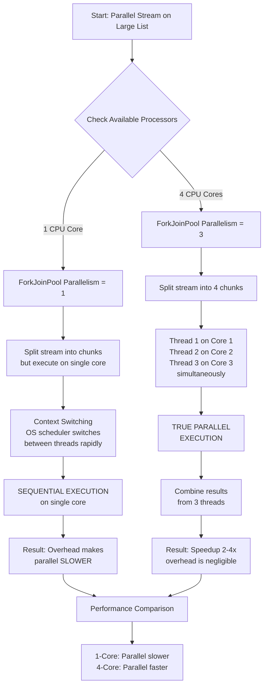

# How does parallel Streams work if your system has just 1 CPU and 4 CPU ? how will the behavior be ?


---

## **Interview-Style Opening**

Sure, let me walk you through how parallel Streams behave on single-core versus multi-core systems. This is actually a critical distinction that many developers miss, so let me clarify the execution model first, then we'll compare the two scenarios with concrete examples.

***

## **Problem Understanding and Clarification**

When you ask about parallel Streams behavior on different CPU architectures, we need to be precise about what "parallel" means:

**Assumptions:**

- We're using the default `ForkJoinPool.commonPool()` that parallel streams rely on
- The JVM can correctly detect available processors via `Runtime.getRuntime().availableProcessors()`
- We're processing independent, stateless operations (no shared state)
- The dataset is large enough that overhead matters less than speedup

**Key distinction:**

- **1-core system** → No true parallelism, only concurrency via context switching
- **4-core system** → True parallelism with simultaneous thread execution

***

## **High-Level Approach (Before Code)**

### **Single-Core CPU (1 Processor)**

**What happens:**

1. `Runtime.getRuntime().availableProcessors()` returns 1
2. `ForkJoinPool.commonPool()` is created with `max(1 - 1, 1)` = 1 thread
3. The stream is split into chunks, but all chunks execute sequentially on the single core
4. Execution happens through **OS-level context switching**, not true parallelism
5. The OS scheduler rapidly switches between threads, giving each a time slice

**Performance impact:**

- Parallel stream is **SLOWER** than sequential stream
- Overhead: thread creation, task queue management, context switching
- This overhead is NOT amortized because there's no parallelism benefit

**Complexity:**

- **Time complexity**: Same as sequential O(n), but with overhead multiplier
- **Space complexity**: Higher (multiple thread stacks, task queues)

***

### **4-Core CPU**

**What happens:**

1. `Runtime.getRuntime().availableProcessors()` returns 4
2. `ForkJoinPool.commonPool()` is created with `4 - 1` = 3 threads (by design, leaves one for caller)
3. Stream is split into 4+ chunks
4. Up to 3 chunks execute **simultaneously** on 3 different cores
5. The 4th core can run the main thread or OS tasks

**Performance impact:**

- Parallel stream is **FASTER** than sequential stream (on large datasets)
- Speedup: approximately 2x-3x (not 4x, because overhead exists)
- The overhead is amortized across many elements
- Speedup increases with dataset size and operation complexity

**Complexity:**

- **Time complexity**: O(n/p + overhead) where p = parallelism (3)
- **Space complexity**: Higher (3 thread stacks + queues)

***

## **Visual Explanation (Mermaid Diagram)**

Here's how execution differs between the two scenarios:




***

## **Java Code (Production-Quality)**

Here's a practical demonstration comparing both scenarios:

```java
import java.util.Arrays;
import java.util.List;
import java.util.stream.IntStream;
import java.util.concurrent.ForkJoinPool;

public class ParallelStreamComparison {
    
    // Simulate a CPU-bound operation (find primes)
    static boolean isPrime(int n) {
        if (n < 2) return false;
        if (n == 2) return true;
        if (n % 2 == 0) return false;
        for (int i = 3; i * i <= n; i += 2) {
            if (n % i == 0) return false;
        }
        return true;
    }
    
    public static void main(String[] args) {
        // Print system info
        int cores = Runtime.getRuntime().availableProcessors();
        int parallelism = ForkJoinPool.commonPool().getParallelism();
        
        System.out.println("=== System Information ===");
        System.out.println("Available Processors: " + cores);
        System.out.println("ForkJoinPool Parallelism: " + parallelism);
        System.out.println("Formula: (cores - 1) = (" + cores + " - 1) = " + parallelism);
        System.out.println();
        
        // Large dataset that benefits from parallelization
        List<Integer> largeDataset = IntStream.rangeClosed(1, 1_000_000)
            .boxed()
            .toList();
        
        // Small dataset where overhead dominates
        List<Integer> smallDataset = IntStream.rangeClosed(1, 100)
            .boxed()
            .toList();
        
        // Test 1: Large dataset
        System.out.println("=== Large Dataset (1 million elements) ===");
        testPerformance("Sequential", () -> 
            largeDataset.stream()
                .filter(ParallelStreamComparison::isPrime)
                .count()
        );
        
        testPerformance("Parallel", () -> 
            largeDataset.parallelStream()
                .filter(ParallelStreamComparison::isPrime)
                .count()
        );
        System.out.println();
        
        // Test 2: Small dataset
        System.out.println("=== Small Dataset (100 elements) ===");
        testPerformance("Sequential", () -> 
            smallDataset.stream()
                .filter(ParallelStreamComparison::isPrime)
                .count()
        );
        
        testPerformance("Parallel", () -> 
            smallDataset.parallelStream()
                .filter(ParallelStreamComparison::isPrime)
                .count()
        );
        System.out.println();
        
        // Demonstrate thread information
        System.out.println("=== Thread Execution Details ===");
        System.out.println("Sequential stream uses: main thread only");
        System.out.println("Parallel stream uses: " + parallelism + " ForkJoinPool worker threads");
        
        System.out.println("\nOn 1-core system:");
        System.out.println("  - Parallelism = 1");
        System.out.println("  - Threads switch rapidly via OS context switching");
        System.out.println("  - Actual execution: SEQUENTIAL with overhead");
        System.out.println("  - Result: Parallel slower than sequential");
        
        System.out.println("\nOn 4-core system:");
        System.out.println("  - Parallelism = 3");
        System.out.println("  - Up to 3 threads run SIMULTANEOUSLY on different cores");
        System.out.println("  - Actual execution: TRUE PARALLEL");
        System.out.println("  - Result: Parallel faster than sequential (2-4x speedup)");
    }
    
    static void testPerformance(String label, Runnable task) {
        long start = System.nanoTime();
        task.run();
        long duration = (System.nanoTime() - start) / 1_000_000; // Convert to ms
        System.out.println(label + ": " + duration + " ms");
    }
}
```


***

## **Code Walkthrough (Line-by-Line)**

**System Information Section:**

```java
int cores = Runtime.getRuntime().availableProcessors();
int parallelism = ForkJoinPool.commonPool().getParallelism();
```

- `availableProcessors()` returns the number of logical cores the JVM sees
- `getParallelism()` tells us how many threads ForkJoinPool will actually use
- On a 4-core system, this returns 3 (because JVM reserves one core)

**Prime-checking operation:**

```java
static boolean isPrime(int n) { ... }
```

- This is a **CPU-bound** operation (all computation, no I/O)
- CPU-bound tasks are ideal for parallel streams
- Each element's work is independent (no shared state)

**Performance test method:**

```java
static void testPerformance(String label, Runnable task) {
    long start = System.nanoTime();
    task.run();
    long duration = (System.nanoTime() - start) / 1_000_000;
}
```

- Measures elapsed time in milliseconds
- Gives us concrete before/after comparison

**Key comparison:**

```java
largeDataset.stream()
    .filter(ParallelStreamComparison::isPrime)
    .count()

largeDataset.parallelStream()
    .filter(ParallelStreamComparison::isPrime)
    .count()
```

- First version: **Sequential** - single thread processes all 1 million elements
- Second version: **Parallel** - 3 threads split the work across cores

***

## **How I Would Explain This to the Interviewer**

"Okay, so the key insight here is that parallel streams don't actually make your code parallel if you don't have multiple cores. Let me break this down.

When you call `parallelStream()`, the JVM creates a `ForkJoinPool` with a number of threads equal to `Runtime.getRuntime().availableProcessors() - 1`. That `-1` is intentional—it leaves one core free for your main thread.

On a **1-core system**: You get 0 or 1 additional thread. Since there's only one core, both the main thread and the pool thread compete for CPU time. The OS scheduler switches between them very rapidly—that's called context switching. So even though you have 'parallel' threads, they're actually executing sequentially, just with extra overhead from thread management and context switching. In this case, parallel streams are **always slower** than sequential streams because you get all the overhead with none of the benefit.

On a **4-core system**: You get 3 worker threads. Now here's the magic—these 3 threads can run **simultaneously** on cores 1, 2, and 3, while your main thread or the OS uses core 4. If you're processing a million elements, instead of one thread checking all million elements sequentially, you have 3 threads each checking about 333K elements in parallel. These are executing at the exact same time, not context switching, so you get real parallelism.

The speedup isn't exactly 3x because there's overhead: splitting the data, coordinating between threads, and merging results. But with large datasets and CPU-bound operations, you typically get 2x to 4x speedup.

The critical factor is **dataset size**. On a small dataset—say 100 elements—the overhead of creating threads and splitting data often outweighs any parallelism benefit. On a large dataset—1 million+ elements—that overhead gets amortized across many elements, and parallel wins.

So in summary: On 1-core, parallel streams are a performance penalty. On 4-core, they're a performance win if the dataset is large and the operations are CPU-bound."

***

## **Edge Cases and Follow-Up Questions**

**Edge cases to handle:**

1. **Very small datasets** (< 1,000 elements) - parallel overhead dominates
2. **LinkedList sources** - poor data locality, parallelism doesn't help
3. **Stateful operations** - not safe for parallel streams
4. **Blocking I/O in streams** - deadlocks the ForkJoinPool
5. **Expensive collectors** (e.g., `toList()`) - merge overhead kills parallelism

**Anticipated Follow-Up Questions:**

**Q1: "Can I force parallel streams to use more threads?"**
"Yes, you can override the default using `System.setProperty("java.util.concurrent.ForkJoinPool.common.parallelism", "8")` before any parallel streams run. However, this is a global setting and I'd only do it if you're certain your machine has 8+ cores and your tasks are strictly CPU-bound. The default (cores - 1) is usually optimal."

**Q2: "What happens if I use parallel streams with blocking I/O?"**
"That's a critical issue. ForkJoinPool is designed for CPU-bound, non-blocking tasks. If a thread blocks on I/O, it holds up other tasks in the queue. The pool has compensation threads to handle this, but they're not efficient. For I/O-bound work, use a regular ExecutorService with more threads than cores—like `newFixedThreadPool(100)` for 100 concurrent HTTP requests. Parallel streams are the wrong tool for I/O."

**Q3: "On Docker with a 1-core container running on a 8-core host, which behavior applies?"**
"The 1-core behavior applies. The JVM respects Docker resource limits, so `Runtime.availableProcessors()` returns 1, and parallel streams create only 1 worker thread. You get no parallelism even though the physical machine has 8 cores. This is a real gotcha in containerized environments."

***

## **Optimization and Trade-offs**

**Time vs. Space Trade-off:**

- **Sequential**: O(n) time, minimal memory (one thread's stack)
- **Parallel**: O(n/p) time (where p = thread count), higher memory (p thread stacks + task queues)
- On 1-core: You lose the time benefit but keep the space cost

**When to NOT use parallel streams:**

- I/O-bound workloads (database queries, network calls)
- Small datasets (< 10K elements)
- LinkedLists or other structures with poor cache locality
- Operations with expensive merging (e.g., `Collectors.toList()` on LinkedList)
- Already in a highly multithreaded environment (thread pool contention)

**Alternative approaches:**

- **Custom ForkJoinPool**: If you need different parallelism levels for different tasks
- **CompletableFuture**: More control over thread pool and async composition
- **Virtual Threads (Java 21+)**: Lightweight threads for I/O-bound work

***

## **Real-World Application and Engineering Methodology**

**Production Use Case: Bulk Data Processing Pipeline**

Consider a data pipeline that processes millions of customer records to calculate fraud scores:

```
Raw data (1M records) → Split into chunks → Score each record → Aggregate results
```

On a **1-core cloud function** (like AWS Lambda on single-core), using parallel streams would be a mistake. The overhead of thread management would increase cold-start latency and memory usage. Sequential processing is correct here.

On a **4-core Kubernetes pod** processing the same data, parallel streams shine. You get 3 worker threads scoring records simultaneously, cutting latency from 10 seconds to 3-4 seconds.

**Engineering Constraints in Production:**

1. **Scalability**: On 1-core, adding parallelism doesn't scale. On 4-core, moving to 8-core hardware gives proportional speedup (if overhead is amortized).
2. **Cost**: Each additional thread consumes memory. On a budget-constrained container with 512MB RAM, parallel streams on 1-core waste memory for no benefit.
3. **Reliability**: ForkJoinPool is shared globally. One badly-written parallel stream blocking on I/O can deadlock other parallel streams in the same JVM. You need to be disciplined about what goes in parallel streams.
4. **Observability**: Parallel streams make debugging harder. Thread stacks are interleaved, thread names are generic ("ForkJoinPool.commonPool-worker-3"), and timing becomes non-deterministic.

**Production Pattern:**

```java
// Only use parallel streams if ALL of these are true:
if (dataSize > 100_000 &&              // Large dataset
    operationIsCpuBound &&             // Not I/O-bound
    systemHasMultipleCores &&          // cores > 1
    !sharingForkJoinPoolWithOthers) {  // Isolated usage
    
    list.parallelStream()...
} else {
    list.stream()...
}
```

This is how senior engineers think about parallelism: as a measurable optimization backed by data and constraints, not a default choice.
<span style="display:none">[^1][^10][^11][^12][^13][^14][^15][^16][^17][^18][^19][^2][^20][^21][^22][^23][^24][^25][^26][^27][^28][^29][^3][^30][^31][^32][^33][^34][^35][^36][^37][^38][^39][^4][^40][^41][^5][^6][^7][^8][^9]</span>

<div align="center">⁂</div>

[^1]: https://www.baeldung.com/java-when-to-use-parallel-stream

[^2]: https://www.reddit.com/r/java/comments/5zel60/whats_with_the_forkjoinpoolcommonpool_default/

[^3]: https://www.infoworld.com/article/4091427/high-performance-programming-with-java-streams.html

[^4]: https://stackoverflow.com/questions/31769187/difference-between-java-8-streams-and-parallel-streams

[^5]: https://stackoverflow.com/questions/21163108/custom-thread-pool-in-java-8-parallel-stream

[^6]: https://coderanch.com/t/203110/java/Multi-Core-Single-Core-Java

[^7]: https://stackoverflow.com/questions/20375176/should-i-always-use-a-parallel-stream-when-possible

[^8]: https://stackoverflow.com/questions/71133322/how-parallel-stream-works-in-java-after-increasing-forkjoinpool

[^9]: https://www.databasesandlife.com/java-docker-aws-ecs-multicore/

[^10]: https://www.youtube.com/watch?v=CB1x1hnh1aE

[^11]: https://www.reddit.com/r/java/comments/11ykqm4/is_it_possible_to_use_virtual_threads_with/

[^12]: https://www.linkedin.com/pulse/understanding-cores-processors-threads-optimizing-java-reddy-eo15c

[^13]: https://www.geeksforgeeks.org/java/parallel-vs-sequential-stream-in-java/

[^14]: https://dzone.com/articles/a-look-at-forkjoinpool

[^15]: https://www.reddit.com/r/javahelp/comments/5vmjdg/java_multicpu_programming_not_multicore/

[^16]: https://moi.vonos.net/java/forkjoin/

[^17]: https://www.geeksforgeeks.org/operating-systems/context-switch-in-operating-system/

[^18]: https://blog.risingstack.com/concurrency-and-parallelism-understanding-i-o/

[^19]: https://stackoverflow.com/questions/19384928/using-java-fork-join-framework-on-single-processor

[^20]: https://algomaster.io/learn/system-design/concurrency-vs-parallelism

[^21]: https://coderanch.com/t/658737/java/Single-core-Quad-core

[^22]: https://www.geeksforgeeks.org/java/java-forkjoinpool-vs-executorservice/

[^23]: https://users.rust-lang.org/t/is-multithreading-parallel-or-context-switching/82623

[^24]: https://www.geeksforgeeks.org/computer-organization-architecture/instruction-level-parallelism/

[^25]: http://java-8-tips.readthedocs.io/en/stable/forkjoin.html

[^26]: https://www.reddit.com/r/AskComputerScience/comments/suef8r/concurrency_with_a_singlecore_processor/

[^27]: https://www.tatvasoft.com/outsourcing/2025/08/java-concurrency.html

[^28]: https://softwaremill.com/threadpools-executors-and-java/

[^29]: https://www.youtube.com/watch?v=8iDsFS2nzWs

[^30]: https://developer.ibm.com/articles/j-java-streams-4-brian-goetz/

[^31]: https://www.javacodegeeks.com/2024/06/boosting-performance-with-parallel-streams.html

[^32]: https://stackoverflow.com/questions/11877947/runtime-getruntime-availableprocessors

[^33]: https://www.javaspring.net/blog/how-to-set-java-stream-parallel-stream-thread-count/

[^34]: https://www.linkedin.com/pulse/using-java-parallel-stream-container-1-cpu-core-ali-sadeghi-zmhqf

[^35]: https://www.baeldung.com/java-fork-join

[^36]: https://coderanch.com/t/657360/java/Specific-Number-Parallel-Streams

[^37]: https://stackoverflow.com/questions/44425041/will-using-a-parallel-stream-on-a-single-core-processor-be-slower-than-using-a-s

[^38]: https://stackoverflow.com/questions/37494811/why-doesnt-the-common-forkjoinpool-try-to-use-all-cores

[^39]: https://www.reddit.com/r/java/comments/3eprlb/given_a_large_number_of_tasks_are_threads_or/

[^40]: https://dzone.com/articles/be-aware-of-forkjoinpoolcommonpool

[^41]: https://jakarta.ee/specifications/platform/10/apidocs/jakarta/enterprise/concurrent/managedthreadfactory

