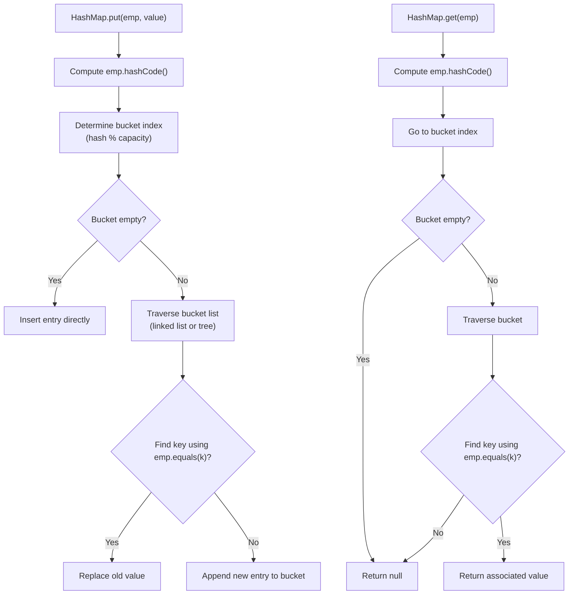

## 1. Interview-Style Opening

Absolutely, yes—you *can* keep an `Employee` object as a `HashMap` key, but to make it work correctly you must override `equals()` and `hashCode()` properly, and you should strongly consider making it immutable.
Let me clarify the contract, explain why those methods matter, and walk through a production-quality example.

## 2. Problem Understanding and Clarification

The question is: can I use a custom class (like `Employee`) as a key in `HashMap<Employee, SomeValue>`?
Constraints:

- `HashMap` relies on `hashCode()` to determine which bucket a key goes into, and `equals()` to resolve collisions.[^1]
- If `hashCode()` or `equals()` are inconsistent or change after insertion, the HashMap will fail to retrieve the value (classic memory leak or lookup failure).[^7]
- Keys should be immutable (or at least their `hashCode()` should never change) so that the hash doesn't shift after you insert the entry.[^2][^6]

Edge cases:

- Employee fields mutate after being inserted as a key (hash changes, retrieval breaks).[^7]
- Two `Employee` objects with the same logical identity (e.g., same `employeeId`) but different references—`equals()` must recognize them as equal.
- Null fields in composite keys—`hashCode()` and `equals()` must handle them gracefully.


## 3. High-Level Approach (Before Code)

Brute-force / naive approach: use the `Employee` directly without overriding `equals()`/`hashCode()`—this falls back to `Object`'s identity-based defaults (reference equality), which rarely matches business logic (two `Employee(123, "Alice")` instances would be considered different keys).
Optimized/correct approach: override `equals()` and `hashCode()` based on the fields that define logical identity (often an ID), and make the class immutable (final class, final fields, no setters) so the hash never changes.[^1][^2]
Time complexity: `HashMap.put()` and `get()` are average $O(1)$, worst-case $O(n)$ if all keys collide; space is $O(k)$ for $k$ keys.

## 4. Visual Explanation (Mermaid-First, Mandatory)



**How I'd verbally explain:** When you call `put(emp, value)`, HashMap first calls `emp.hashCode()` to decide which bucket to use—this distributes keys efficiently.[^1]
If multiple keys share the same hash (collision), HashMap stores them in a list or tree and uses `equals()` to distinguish between them during retrieval.[^1]
If `hashCode()` or `equals()` are broken or inconsistent, you can insert but never retrieve the value (or retrieve the wrong one).

## 5. Java Code (Production-Quality)

```java
import java.util.Objects;

public final class Employee {
    private final int employeeId;      // immutable field defining identity
    private final String name;         // immutable
    private final String department;   // immutable

    public Employee(int employeeId, String name, String department) {
        this.employeeId = employeeId;
        this.name = Objects.requireNonNull(name, "name cannot be null");
        this.department = Objects.requireNonNull(department, "department cannot be null");
    }

    public int getEmployeeId() {
        return employeeId;
    }

    public String getName() {
        return name;
    }

    public String getDepartment() {
        return department;
    }

    @Override
    public boolean equals(Object o) {
        if (this == o) return true;
        if (o == null || getClass() != o.getClass()) return false;
        Employee employee = (Employee) o;
        // Logical equality: same ID means same employee [web:44][web:50]
        return employeeId == employee.employeeId;
    }

    @Override
    public int hashCode() {
        // Only use fields that define identity and never change [web:44][web:50]
        return Objects.hash(employeeId);
    }

    @Override
    public String toString() {
        return String.format("Employee[id=%d, name=%s, dept=%s]", employeeId, name, department);
    }
}
```

**Usage example:**

```java
import java.util.HashMap;
import java.util.Map;

public class EmployeeMapExample {
    public static void main(String[] args) {
        Map<Employee, String> performanceMap = new HashMap<>();

        Employee emp1 = new Employee(101, "Alice", "Engineering");
        Employee emp2 = new Employee(102, "Bob", "HR");
        Employee emp3 = new Employee(101, "Alice Smith", "Engineering"); // same ID

        performanceMap.put(emp1, "Excellent");
        performanceMap.put(emp2, "Good");

        // emp3 equals emp1 (same employeeId), so retrieval works [web:44][web:50]
        System.out.println(performanceMap.get(emp3)); // "Excellent"
    }
}
```


## 6. Code Walkthrough (Line-by-Line)

`final class Employee`: Making the class final prevents subclasses from breaking `equals()` and `hashCode()` semantics.[^2][^1]
`final int employeeId`: Immutability is crucial—if `employeeId` could change after insertion, the hash bucket would be wrong and retrieval would fail.[^7]
`equals()` checks logical identity: I compare `employeeId` only, because that's the business key; if two `Employee` instances have the same ID, they're the same employee even if other fields differ.[^7][^1]
`hashCode()` uses only immutable identity fields: this ensures the hash stays constant for the object's lifetime, which is critical for HashMap correctness.[^2][^1]
Defensive null checks: I use `Objects.requireNonNull()` to avoid silent nulls that could break `equals()` or `hashCode()`.

## 7. How I Would Explain This to the Interviewer

So the key idea is: HashMap fundamentally relies on a contract between `hashCode()` and `equals()`—equal objects must produce the same hash code.[^1]
The reason we need immutability is that if the hash changes after insertion, HashMap looks in the wrong bucket and can't find the key anymore, which causes a silent memory leak or lookup failure.[^7]
In practice, I'd choose the minimal set of fields that define business identity (like `employeeId`), make them final, and base both `equals()` and `hashCode()` exclusively on those fields to guarantee consistency.[^2][^1]

## 8. Edge Cases and Follow-Up Questions

**Edge cases**

- Mutable keys: If you expose a setter for `employeeId` and call it after insertion, retrieval will break because the hash bucket is now stale.[^7]
- Null fields: If `employeeId` could be null, `hashCode()` must handle it gracefully (e.g., `Objects.hash()` does this automatically).
- Inconsistent `equals()` / `hashCode()`: If `equals()` considers two objects equal but `hashCode()` returns different values, HashMap will store them in different buckets and treat them as distinct keys (violates the contract).[^1]

**Likely follow-ups (with brief answers)**

- "What happens if I don't override `hashCode()` / `equals()`?" You get identity-based comparison (reference equality), so two `Employee` objects with the same data would be treated as different keys.[^6]
- "Why must keys be immutable?" Because any mutation that changes the hash after insertion moves the logical bucket, making the entry unretrievable.[^2][^7]
- "Can I use a mutable key if I don't mutate it?" Technically yes, but it's fragile—best practice is to enforce immutability at the language level (final fields) to prevent accidental mutations.[^6][^2]


## 9. Optimization and Trade-offs

**Time vs space:** Using a good hash function (like `Objects.hash()`) distributes keys evenly, keeping collisions low and maintaining $O(1)$ average lookup; a poor hash function (e.g., always returning `0`) degrades to $O(n)$.[^1]
**Alternative approaches:** You could use a unique identifier (like `employeeId` alone) as the key directly (e.g., `HashMap<Integer, EmployeeData>`) and avoid the custom class as key altogether—simpler and less error-prone if you don't need composite keys.[^2]
**When this solution isn't ideal:** If `Employee` is mutable by design (e.g., it's an ORM entity with setters), using it directly as a key is dangerous; consider extracting an immutable value object (like `EmployeeId`) or using a composite key DTO instead.[^6][^2]

## 10. Real-World Application and Engineering Methodology

**Production use case:** Maintaining an in-memory cache of employee permissions keyed by `Employee` (or more commonly by an immutable `EmployeeId` value object) for fast authorization checks in a high-throughput web service.
**Engineering constraints at scale:**

- Concurrency: If multiple threads mutate the same `Employee` instance (even if it's supposed to be immutable), race conditions can corrupt the HashMap; I'd use `ConcurrentHashMap` and ensure keys are truly immutable.
- Cache consistency: If the source of truth (DB) updates an employee's data, the cached key's hash must remain stable—hence why ID-based keys (never changing once assigned) are preferred over full object snapshots.
- Memory overhead: Storing heavyweight `Employee` objects as keys can bloat memory; often I'd use a lightweight immutable key (like `EmployeeId`) and store the full `Employee` as the value.

**Engineering patterns involved:** This is closely related to the Value Object pattern (DDD)—an immutable object whose identity is defined by its fields, not a database-generated ID.[^2][^1]
In distributed systems, if you serialize keys for partitioning (e.g., consistent hashing in a cache cluster), you must guarantee that `hashCode()` is consistent across JVM restarts and serialization/deserialization, which often means using a deterministic hash of stable fields.[^1]
<span style="display:none">[^10][^3][^4][^5][^8][^9]</span>

<div align="center">⁂</div>

[^1]: https://www.baeldung.com/java-custom-class-map-key

[^2]: https://javatrainingschool.com/hashmap-with-custom-keys/

[^3]: https://stackoverflow.com/questions/9440380/using-an-instance-of-an-object-as-a-key-in-hashmap-and-then-access-it-with-exac

[^4]: https://dzone.com/articles/things-to-keep-in-mind-while-using-custom-classes

[^5]: https://www.geeksforgeeks.org/java/implement-a-custom-hash-function-for-keys-in-a-hashmap-in-java/

[^6]: https://stackoverflow.com/questions/45831828/can-we-use-object-as-a-key-in-hashmap-in-java

[^7]: https://www.geeksforgeeks.org/java/how-to-create-a-java-hashmap-of-user-defined-class-type/

[^8]: https://howtodoinjava.com/java/collections/hashmap/design-good-key-for-hashmap/

[^9]: https://www.reddit.com/r/javahelp/comments/jrw8no/using_a_custom_object_as_key_in_hashmap/

[^10]: https://www.javamadesoeasy.com/2015/02/hashmap-custom-implementation-put-get.html

