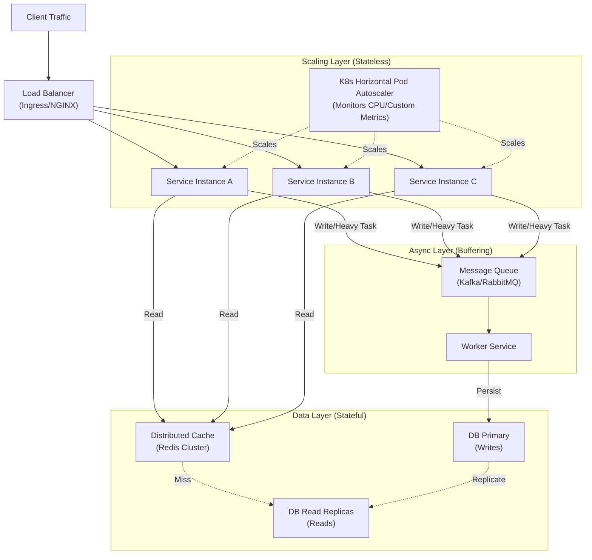

## 1. Interview-Style Opening

"Scaling microservices is one of the most critical aspects of system design. It’s not just about adding more servers; it’s about identifying bottlenecks and applying the right strategy for the specific constraint.

Let me break down my approach using the **Scale Cube** framework (X, Y, and Z axes) and how we handle this in a production Java environment."

## 2. Problem Understanding and Clarification

The goal is to increase the throughput and availability of a microservice system to handle higher load.

**Clarifications \& Constraints:**

* **Target:** Are we scaling stateless business logic, or stateful data layers? (Approach differs).
* **Bottlenecks:** Is the limitation CPU, Memory, I/O, or Database connections?
* **Infrastructure:** I assume we are running in a containerized environment (like Kubernetes) on the cloud.
* **Consistency:** We must ensure scaling doesn't violate data consistency requirements (CAP theorem).

**Key Metrics to Watch:**

* Latency (p99)
* Throughput (RPS)
* Error Rates
* Resource Utilization (CPU/RAM)


## 3. High-Level Approach (The Scale Cube)

I approach scaling using the **AKF Scale Cube** model:

1. **X-Axis (Horizontal Scaling):**
    * Running multiple copies (replicas) of the same service behind a Load Balancer.
    * *Enabler:* Statelessness. We must not store session data locally.
    * *Mechanism:* Kubernetes HPA (Horizontal Pod Autoscaler).
2. **Y-Axis (Functional Decomposition):**
    * Splitting a monolithic service into smaller, domain-specific microservices (e.g., separating `CheckoutService` from `InventoryService`).
    * *Benefit:* Allows scaling "hot" services independently of "cold" ones.
3. **Z-Axis (Data Partitioning/Sharding):**
    * Running identical code but on different subsets of data (Sharding based on User ID or Region).
    * *Use Case:* When the Database is the bottleneck, not the Application.

**Optimization Strategy:**

* **Caching (Layer 1):** Redis/Hazelcast to reduce DB hits.
* **Asynchronous Processing (Layer 2):** Offload write-heavy or slow tasks to Kafka/RabbitMQ.
* **Autoscaling (Layer 3):** Dynamic replica management.


## 4. Visual Explanation (Mermaid-First)

Here is how we architect a scalable flow, moving from the Load Balancer down to the Data Layer.



**Diagram Explanation:**

* **HPA:** Monitors the service instances. If CPU usage > 70%, it spins up new pods (X-Axis scaling).
* **Queue:** Acts as a buffer/shock absorber. If traffic spikes 10x, the queue fills up, but the system doesn't crash (Load Leveling).
* **Read Replicas:** We scale the database by separating Reads from Writes.


## 5. Java Code (Production-Quality)

While scaling is largely infrastructural (Kubernetes), the **Java application must be written to support it**. Specifically, we need efficient **Thread Pool management** for vertical scaling within the JVM, and **Async** handling to release threads.

Here is a Spring Boot configuration for optimized Async task execution, allowing the service to handle more concurrent requests without blocking.

```java
import org.springframework.context.annotation.Bean;
import org.springframework.context.annotation.Configuration;
import org.springframework.scheduling.annotation.EnableAsync;
import org.springframework.scheduling.concurrent.ThreadPoolTaskExecutor;
import java.util.concurrent.Executor;
import java.util.concurrent.ThreadPoolExecutor;

@Configuration
@EnableAsync
public class ScalingConfig {

    /**
     * Define a custom ThreadPool to handle async processing.
     * This prevents the main HTTP thread pool (Tomcat) from being exhausted
     * during high load.
     */
    @Bean(name = "scalingTaskExecutor")
    public Executor taskExecutor() {
        ThreadPoolTaskExecutor executor = new ThreadPoolTaskExecutor();
        
        // Core Pool Size: The minimum number of threads to keep alive
        executor.setCorePoolSize(50);
        
        // Max Pool Size: Maximum threads to allow during heavy spikes
        executor.setMaxPoolSize(200);
        
        // Queue Capacity: Buffer for tasks when all threads are busy
        // Crucial for handling bursts without dropping requests immediately
        executor.setQueueCapacity(500);
        
        // Thread Name Prefix for easier debugging in logs/profilers
        executor.setThreadNamePrefix("AsyncWorker-");
        
        // Rejection Policy: What to do when Queue + Max Pool is full?
        // CallerRunsPolicy throttles the client by making the calling thread execute the task
        executor.setRejectedExecutionHandler(new ThreadPoolExecutor.CallerRunsPolicy());
        
        executor.initialize();
        return executor;
    }
}
```

**Service Layer Usage:**

```java
import org.springframework.scheduling.annotation.Async;
import org.springframework.stereotype.Service;
import java.util.concurrent.CompletableFuture;

@Service
public class OrderService {

    @Async("scalingTaskExecutor")
    public CompletableFuture<String> processHeavyOrder(Order order) {
        // Simulating heavy processing (e.g., payment gateway, inventory check)
        // This runs in a separate thread, freeing up the Tomcat Request Thread
        // to accept new incoming connections immediately.
        try {
            Thread.sleep(200); // Simulate latency
            return CompletableFuture.completedFuture("Processed " + order.getId());
        } catch (InterruptedException e) {
            Thread.currentThread().interrupt();
            return CompletableFuture.completedFuture("Failed");
        }
    }
}
```


## 6. Code Walkthrough (Line-by-Line)

* `@EnableAsync`: Activates Spring's background processing capabilities.
* `setCorePoolSize(50)`: We keep 50 threads ready. Creating threads is expensive, so we pool them.
* `setMaxPoolSize(200)`: If traffic spikes, we allow the pool to burst up to 200 threads. This effectively scales the application *vertically* within the single container before K8s adds more containers.
* `setQueueCapacity(500)`: This acts like a mini-backlog. If 200 threads are busy, we queue the next 500 requests. This prevents `503 Service Unavailable` errors during momentary spikes.
* `CallerRunsPolicy`: This is a backpressure mechanism. If the queue is full and threads are maxed, we force the *calling* thread to do the work. This slows down the ingestion rate naturally, preventing an `OutOfMemoryError` or crash.


## 7. How I Would Explain This to the Interviewer

"To explain my scaling strategy, I look at the system as a pipeline.

First, I ensure the **application code is non-blocking**. I use Async patterns (as shown in the code) so that a single instance can handle high concurrency without thread starvation.

Next, I look at **Infrastructure Scaling (X-Axis)**. I rely on Kubernetes HPA to add more pods based on CPU or Request metrics. However, adding app instances is useless if the Database is the bottleneck.

That’s why I introduce **Caching** (Redis) to protect the DB and **Read Replicas** to scale read operations.

Finally, for write-heavy loads that we can't scale synchronously, I use **Event-Driven Architecture**. I decouple the producer from the consumer using Kafka. This allows the ingestion layer to accept millions of requests, while the processing layer catches up at its own pace."

## 8. Edge Cases and Follow-Up Questions

**Edge Cases:**

* **Thundering Herd:** When a cache key expires, thousands of requests hit the DB simultaneously. *Solution:* Implement "Cache Stampede" protection (mutex locking or probabilistic early expiration).
* **Database Connection Exhaustion:** Scaling app instances to 1000 pods might open 10,000 connections to the DB, crashing it. *Solution:* Use a connection pooler like **HikariCP** (internal) or **PgBouncer** (external).
* **Stateful Scaling:** Scaling WebSockets or Sessions is hard. *Solution:* Store session state in Redis (external store) so any pod can handle any user (Statelessness).

**Likely Follow-Up Questions:**

* *Q: How do you handle scaling writes if the Primary DB is full?*
    * *A:* We move to **Z-Axis scaling (Sharding)**. We partition data by UserID so users 1-1M go to DB Shard A, and 1M-2M go to DB Shard B.
* *Q: What metric do you use for Autoscaling?*
    * *A:* CPU is standard, but often misleading. I prefer **Request Queue Depth** or **Custom Latency Metrics**. If latency spikes, we scale up, even if CPU is low.


## 9. Optimization and Trade-offs

* **Cost vs. Latency:** Keeping many idle instances (High Min Replicas) ensures low latency during spikes but costs money. We usually compromise with aggressive scale-up and conservative scale-down policies.
* **Consistency vs. Availability:** Using Read Replicas introduces **Eventual Consistency**. A user might update their profile and not see the change immediately. We must decide if this business domain allows that trade-off.
* **Cold Starts:** In Serverless or aggressive autoscaling, a new Java pod might take 30 seconds to start (JVM warm-up). To optimize this, we use GraalVM native images or keep a buffer of warm instances.


## 10. Real-World Application and Engineering Methodology

**Scenario:** An E-commerce Flash Sale (Black Friday).

**Architecture:**

1. **Queue-Based Load Leveling:** The "Buy Now" button doesn't call the Inventory Service directly. It drops a message into Kafka.
2. **Rate Limiting:** We apply Rate Limiting at the API Gateway (e.g., 100 req/sec per user) to prevent DDoS or abuse.
3. **Circuit Breakers:** If the Payment Service starts failing due to load, the Order Service opens the circuit (Resilience4j) to fail fast, rather than waiting for timeouts and exhausting threads.
4. **CQRS (Command Query Responsibility Segregation):** We separate the "Product View" service (Read-heavy, scaled to 100 pods, cached) from the "Order" service (Write-heavy, transactional, scaled carefully).

This approach ensures that even if the payment system slows down, the product browsing experience remains fast for other users.

