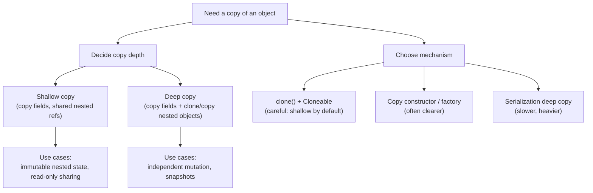

## 1. Interview-Style Opening

Sure—let me define cloning precisely in an OOP/Java context, and then I’ll explain when and why we use it in real systems.

## 2. Problem Understanding and Clarification

Cloning means creating a new object instance that starts with the *same state* (field values) as an existing object, so you can work with a copy instead of the original.
Assumptions: we’re talking about software object cloning (not biological cloning), and in Java specifically this commonly refers to `Object.clone()`/`Cloneable`, or equivalent copy mechanisms.
Edge cases to keep in mind: shallow vs deep copy (shared nested references), immutability (copy may be unnecessary), cyclic object graphs (deep copy can be tricky), and “copying” objects holding external resources like DB connections or file handles (often not meaningfully cloneable).

## 3. High-Level Approach (Before Code)

Brute-force way: manually create a new object and assign every field one by one—works, but it’s verbose and error-prone as the class evolves.
Optimized/idiomatic ways: (a) shallow clone + selectively deep-copy mutable references, (b) copy constructor / static factory like `User(User other)`, (c) serialization-based deep copy (rarely ideal for performance).
Why cloning at all: Java’s `Object.clone()` creates a new instance and copies fields “as if by assignment,” meaning it’s a shallow copy by default (references are copied, not the referenced objects).[^1]
Complexities: shallow clone is typically $O(n)$ in number of fields (constant-ish in practice), deep copy becomes $O(size\ of\ object\ graph)$; space is similar to the amount you copy.

## 4. Visual Explanation (Mermaid-First, Mandatory)



How I’d explain this diagram verbally: first I decide whether I need independence from the original (deep copy) or I’m okay sharing nested objects (shallow copy).
Then I pick an implementation mechanism; in Java, `clone()` is shallow by default and needs extra work for deep copy of mutable fields.[^1]

## 5. Java Code (Production-Quality)

```java
import java.util.ArrayList;
import java.util.List;
import java.util.Objects;

public class Order implements Cloneable {
    private final String orderId;          // immutable
    private final List<String> lineItems;  // mutable

    public Order(String orderId, List<String> lineItems) {
        this.orderId = Objects.requireNonNull(orderId, "orderId");
        this.lineItems = new ArrayList<>(Objects.requireNonNull(lineItems, "lineItems"));
    }

    public String getOrderId() {
        return orderId;
    }

    public List<String> getLineItems() {
        // defensive copy to preserve encapsulation
        return new ArrayList<>(lineItems);
    }

    @Override
    public Order clone() {
        try {
            Order copy = (Order) super.clone(); // shallow copy [web:17]
            // Deep-copy mutable fields to avoid shared state.
            return new Order(copy.orderId, copy.lineItems);
        } catch (CloneNotSupportedException e) {
            // Shouldn't happen if we implement Cloneable, convert to unchecked for simplicity.
            throw new IllegalStateException("Cloning not supported", e);
        }
    }
}
```


## 6. Code Walkthrough (Line-by-Line)

`implements Cloneable`: This is the Java convention to indicate that `Object.clone()` is allowed; otherwise cloning may fail with `CloneNotSupportedException`.[^2][^1]
`super.clone()`: This gives me the baseline “field-by-field” shallow copy behavior—primitives are duplicated, references are copied (so nested mutable objects would be shared).[^1]
Deep-copy step: I create a new `Order` using the copied state and explicitly copy the mutable list so the clone can be modified without impacting the original.

## 7. How I Would Explain This to the Interviewer

So the key idea is: cloning is about getting a second object with the same starting state so we can safely modify one without surprising side effects.
The reason this matters is that passing around references is cheap, but it couples callers through shared mutable state; cloning (especially deep cloning of mutable parts) breaks that coupling.
In Java specifically, `Object.clone()` is shallow by default—so you only get true independence if you also copy the mutable referenced fields yourself.[^1]

## 8. Edge Cases and Follow-Up Questions

Edge cases

- Object contains nested mutable objects (lists, maps, custom objects): shallow clone will share them unless you deep-copy them.[^1]
- Object graph has cycles (A -> B -> A): naive deep cloning can infinite-loop without a visited map.
- External resources (threads, sockets, DB connections): “cloning” is usually undefined; you typically create a new resource or disallow cloning.
- Immutable objects: cloning is often unnecessary; you can safely share the same instance.

Likely follow-ups (with brief answers)

- “What happens if I call `clone()` without `Cloneable`?” It can throw `CloneNotSupportedException`.[^2][^1]
- “Is `clone()` deep copy?” No, by default it’s shallow; the fields are copied as if assigned and referenced objects are not cloned.[^1]
- “When would you prefer cloning over constructors?” When you want Prototype-style duplication of preconfigured objects, especially if construction/configuration is expensive.[^3]


## 9. Optimization and Trade-offs

Time vs space: deep cloning costs more CPU and memory but prevents shared-state bugs; shallow cloning is cheaper but risks aliasing issues when references are mutable.[^1]
Alternative approach: copy constructors/factories are often clearer, safer, and give you compile-time control over what “copy” means (whereas `clone()` has historical design warts in Java).
When this solution isn’t ideal: very large object graphs, cyclic references, or objects that represent external resources—then you may want explicit “snapshot DTOs” or immutable designs instead.

## 10. Real-World Application and Engineering Methodology

Production use case: creating a snapshot of a request/context object before enriching it in multiple pipeline stages (so each stage can mutate its own copy without racey shared-state bugs).
In real systems, cloning is closely related to the Prototype pattern—keeping prebuilt “templates” and duplicating them quickly instead of reconstructing expensive configurations from scratch.[^3]
Engineering constraints: at scale, deep copies can hurt latency and GC pressure; I’d measure allocations, consider immutability, and use defensive copying at module boundaries to keep reliability high under concurrency.
<span style="display:none">[^10][^11][^12][^13][^14][^15][^16][^17][^18][^19][^20][^21][^22][^23][^24][^25][^26][^27][^28][^29][^30][^31][^32][^33][^34][^35][^36][^37][^38][^39][^4][^40][^41][^42][^43][^5][^6][^7][^8][^9]</span>

<div align="center">⁂</div>

[^1]: https://docs.oracle.com/javase/8/docs/api/java/lang/Object.html

[^2]: https://docs.oracle.com/javase/8/docs/api/java/lang/CloneNotSupportedException.html

[^3]: https://refactoring.guru/design-patterns/prototype

[^4]: https://mermaid.ai/open-source/intro/getting-started.html

[^5]: https://www.digitalocean.com/community/tutorials/java-clone-object-cloning-java

[^6]: https://en.wikipedia.org/wiki/Clone_(Java_method)

[^7]: https://www.geeksforgeeks.org/java/clone-method-in-java-2/

[^8]: https://docs.oracle.com/javase/8/docs/api/java/lang/Cloneable.html

[^9]: https://www.programiz.com/java-programming/library/object/clone

[^10]: https://www.edureka.co/blog/shallow-and-deep-copy-java/

[^11]: https://iamjeremie.me/post/2025-05/what-is-the-prototype-pattern/

[^12]: https://docs.vultr.com/java/standard-library/java/lang/Object/clone

[^13]: https://www.reddit.com/r/javahelp/comments/17x3b4s/does_clone_create_a_deep_or_shallow_copy/

[^14]: https://dev.to/bilelsalemdev/understanding-the-prototype-pattern-1g12

[^15]: https://stackoverflow.com/questions/7579913/how-to-clone-a-java-object-with-the-clone-method

[^16]: https://www.geeksforgeeks.org/java/deep-shallow-lazy-copy-java-examples/

[^17]: https://www.geeksforgeeks.org/system-design/prototype-design-pattern/

[^18]: https://www.geeksforgeeks.org/java/cloning-in-java/

[^19]: https://thekiranacademy.com/tutorials/java-technical-tutorials/shallow-copy-and-deep-copy-in-java.php

[^20]: https://docs.oracle.com/javase/8/docs/api/java/util/ArrayList.html

[^21]: https://docs.oracle.com/javase/8/docs/api/java/util/HashMap.html

[^22]: https://docs.oracle.com/en/java/javase/21/docs/api/java.base/java/lang/Object.html

[^23]: https://stackoverflow.com/questions/1175620/in-java-what-is-a-shallow-copy

[^24]: https://www.tutorialspoint.com/java/lang/java_clone_not_supported_exception.htm

[^25]: https://docs.oracle.com/javase/8/docs/api/java/util/LinkedList.html

[^26]: https://manjul.wordpress.com/2013/10/13/why-objects-clone-method-is-protected/

[^27]: https://docs.oracle.com/javase/8/docs/api/java/lang/class-use/CloneNotSupportedException.html

[^28]: https://stackoverflow.com/questions/2890340/what-is-this-field-by-field-copy-done-by-object-clone

[^29]: https://blog.frankel.ch/cloneable-java-design-gotcha/

[^30]: https://docs.oracle.com/javase/8/docs/api/java/util/HashSet.html

[^31]: https://javarevisited.blogspot.com/2015/01/java-clone-tutorial-part-2-overriding-with-mutable-field-example.html

[^32]: https://refactoring.guru/design-patterns/prototype/java/example

[^33]: https://refactoring-is-my-business.com/guides/design-patterns/creational/prototype/

[^34]: https://stackoverflow.com/questions/13887704/whats-the-point-of-the-prototype-design-pattern

[^35]: https://dev.to/srishtikprasad/prototype-design-pattern-4c2i

[^36]: https://dzone.com/articles/design-patterns-prototype

[^37]: https://softwareparticles.com/design-patterns-prototype/

[^38]: https://java-design-patterns.com/patterns/prototype/

[^39]: https://stackoverflow.com/questions/17203493/prototype-pattern-in-java-the-clone-method

[^40]: https://ismailharik.hashnode.dev/the-prototype-design-pattern-a-guide-to-object-cloning-in-java

[^41]: https://www.youtube.com/watch?v=KuMOkbVaNsw

[^42]: https://en.wikipedia.org/wiki/Prototype_pattern

[^43]: https://www.momentslog.com/development/design-pattern/using-the-prototype-pattern-in-resource-management-for-efficient-object-creation

