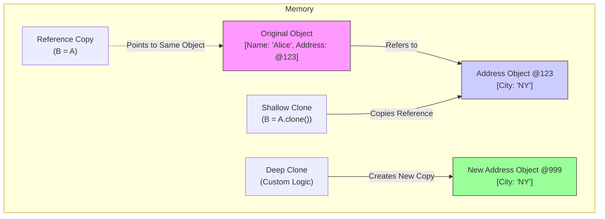

## **Interview-Style Opening**

"Sure, let me explain object cloning in Java. This is a fundamental concept regarding how we manage object state and memory. I’ll clarify the difference between a simple reference copy and actual cloning, and then I'll explain why we generally prefer Deep Cloning over the default behavior to ensure data integrity."

## **Problem Understanding and Clarification**

**What is Cloning?**
Cloning is the process of creating an exact, independent copy of an object in memory, rather than just creating a new reference to the existing object.

**Key Clarifications:**

* **Reference Copy (`B = A`):** We just create a new pointer `B` to the *same* object `A`. No new memory is allocated for the object.
* **Object Cloning:** We explicitly create a new object `B` that has the same state as `A`.
* **The Trap:** Java's default `clone()` performs a **Shallow Copy**, which creates a new "shell" but shares mutable internal objects (like Lists or other Objects). We usually need a **Deep Copy** to ensure total independence.

***

## **High-Level Approach (Why do we go for it?)**

We use cloning primarily for:

1. **Data Protection (Defensive Copying):** When passing a mutable object to a client or receiving one in a constructor, we clone it so the external code cannot modify our internal state.
2. **Performance (Prototype Pattern):** Creating a complex object from scratch (e.g., database loading, parsing) can be expensive. It is often faster to `clone()` an existing "template" object in memory.
3. **Transactional State:** We clone an object to preserve its state before applying changes. If the operation fails, we can discard the modified clone and revert to the original.

**Trade-off:**

* **Validation Bypass:** The `clone()` method bypasses the constructor, meaning initialization logic and validation checks are skipped. This requires careful handling.

***

## **Visual Explanation (Mermaid Diagram)**

Here is the corrected diagram illustrating the critical difference between Reference Copy, Shallow Clone, and Deep Clone:



**Diagram Explanation:**

* **Reference Copy:** `RefCopy` points directly to the `Original` object. Modifying one modifies the other.
* **Shallow Clone:** `Shallow` is a *new* object (new box), but it points to the *shared* `Address Object @123`. If you change the City in the clone, the Original's city changes too.
* **Deep Clone:** `Deep` is a new object pointing to a completely new `Address Object @999`. They are fully independent.

***

## **Java Code (Production-Quality)**

Here is how to implement robust cloning that handles the "Shallow Copy" pitfall using the `Cloneable` interface.

```java
import java.util.ArrayList;
import java.util.List;

// 1. Implement Cloneable (Marker Interface)
// Without this, super.clone() throws CloneNotSupportedException
class Employee implements Cloneable {
    private String name;           // Immutable (Safe for shallow copy)
    private List<String> skills;   // Mutable (Dangerous for shallow copy)

    public Employee(String name, List<String> skills) {
        this.name = name;
        this.skills = new ArrayList<>(skills); // Defensive copy in constructor
    }

    // Getters and Mutators
    public List<String> getSkills() { return skills; }
    public void addSkill(String skill) { this.skills.add(skill); }

    // 2. Override clone() and increase visibility to public
    @Override
    public Employee clone() {
        try {
            // A. Perform the default Shallow Copy first (Native memory copy)
            Employee cloned = (Employee) super.clone();

            // B. Fix the Mutable Fields (Deep Copy Logic)
            // CRITICAL: Create a new list containing the same data
            if (this.skills != null) {
                cloned.skills = new ArrayList<>(this.skills);
            }

            return cloned;
        } catch (CloneNotSupportedException e) {
            // Should not happen since we implement Cloneable
            throw new AssertionError(); 
        }
    }

    @Override
    public String toString() {
        return "Employee{name='" + name + "', skills=" + skills + '}';
    }
}

public class CloningDemo {
    public static void main(String[] args) {
        List<String> initialSkills = new ArrayList<>();
        initialSkills.add("Java");
        
        Employee original = new Employee("John", initialSkills);
        
        // Create the clone
        Employee clone = original.clone();
        
        // Modify the clone - verify independence
        clone.addSkill("System Design");
        
        System.out.println("Original: " + original); // Should strictly have "Java"
        System.out.println("Clone:    " + clone);    // Should have "Java", "System Design"
        
        // Verification logic
        if (original.getSkills().size() != clone.getSkills().size()) {
            System.out.println("SUCCESS: Deep Copy worked. Objects are independent.");
        }
    }
}
```


***

## **Code Walkthrough (Line-by-Line)**

**`implements Cloneable`:**
This is a marker interface. It doesn't contain the `clone` method itself (that's on `Object`), but it authorizes the use of `super.clone()`. Without it, the JVM throws an exception.

**`super.clone()`:**

```java
Employee cloned = (Employee) super.clone();
```

This invokes the native JVM code. It allocates new memory and copies the bitwise values of the fields. For `name` (String), it copies the reference. For `skills` (List), it copies the reference to the *same* list. This is the **Shallow Copy**.

**The Deep Copy Fix:**

```java
cloned.skills = new ArrayList<>(this.skills);
```

Here, we manually intervene. We create a fresh `ArrayList` for the clone and populate it with the original's data. Now, `cloned.skills` points to a different memory address (like `@999` in the diagram), ensuring true isolation.

***

## **How I Would Explain This to the Interviewer**

"So, `cloning` is essentially creating a duplicate of an object to ensure we have an independent copy to work with.

The default behavior in Java, `super.clone()`, performs a **Shallow Copy**. This is fast, but risky because it copies references for objects like Lists or Dates. If I clone an Employee object using just shallow copy, both employees would point to the exact same list of skills. Modifying the clone would accidentally corrupt the original.

To fix this, we override the `clone()` method to perform a **Deep Copy**. As I showed in the code, we first call `super.clone()` to get the structure, and then we manually re-initialize the mutable fields—like creating a `new ArrayList` for the skills. This ensures that the clone is completely decoupled from the original, which is critical for thread safety and data integrity."

***

## **Edge Cases and Follow-Up Questions**

**Edge Cases:**

1. **Final Mutable Fields:** If `skills` were declared as `final List<String>`, we **cannot** implement deep cloning using `clone()` because we cannot reassign a final field after `super.clone()` returns. We would be forced to use a Copy Constructor instead.
2. **Singleton Pattern:** Singletons should strictly throw `CloneNotSupportedException` to prevent creating a second instance, which would violate the pattern.
3. **Circular References:** If Object A has a reference to B, and B has a reference back to A, a naive deep clone implementation can cause a `StackOverflowError` (infinite recursion).

**Follow-Up Questions:**

* **Q: Why not just use serialization for deep cloning?**
    * *A: We can (e.g., convert to JSON and back), but it is significantly slower than manual cloning due to the overhead of reflection and parsing.*
* **Q: What is the Copy Constructor approach?**
    * *A: Instead of `clone()`, we define `public Employee(Employee other)`. This is often cleaner because it uses the `new` keyword, runs constructor validation logic, and handles final fields correctly.*

***

## **Optimization and Trade-offs**

* **Clone() vs Copy Constructor:**
    * **Clone()**: Faster (native memory copy). Bypasses constructor (security risk). Harder to implement correctly (casting, exceptions).
    * **Copy Constructor**: Slower (field-by-field copy). Safer (runs validation). Easier to read.
* **Recommendation:** Use `clone()` only for arrays or performance-critical loops. For standard business logic, prefer Copy Constructors or static factory methods like `Employee.copyOf(original)`.

***

## **Real-World Application and Engineering Methodology**

**Production Scenario: Audit Logs**
In a banking application, before updating a `Account` balance, we capture a snapshot:

```java
Account snapshot = account.clone(); 
// Perform risky calculation...
if (failure) {
    // Audit log the snapshot state for debugging
    auditService.logFailure(snapshot);
}
```

If we didn't clone, and the account object continued to change later in the request, our audit log would record the *current* (wrong) state instead of the state *at the time of failure*.

**Engineering Standard:**
In distributed systems, we often use libraries like **MapStruct** or **Lombok** (`@Builder(toBuilder=true)`) to generate copy logic rather than writing error-prone manual `clone()` methods. This reduces boilerplate and bugs.
<span style="display:none">[^1]</span>

<div align="center">⁂</div>

[^1]: Untitled-diagram-2026-01-30-101845.jpg

