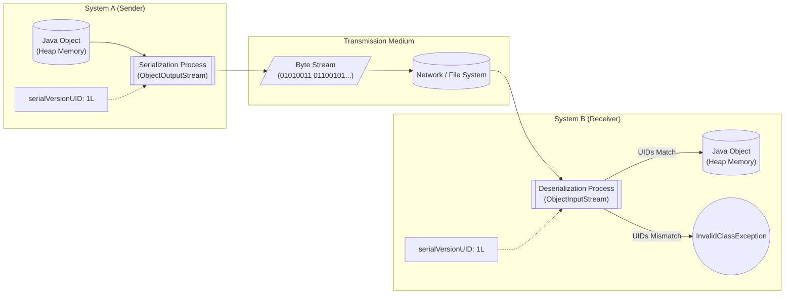

# What is serialization , why do we use it ? What is the use of serialVersionUID ?

Sure, I can explain serialization and the importance of `serialVersionUID`. Let me walk you through the concept, the implementation, and the engineering trade-offs involved.

### Interview-Style Opening

"Sure, let me clarify the concepts of serialization and `serialVersionUID`, and then I will walk you through how we use them in production systems. This is a fundamental concept for distributed systems where objects need to travel across the wire."

### Problem Understanding and Clarification

To define this precisely:
**Serialization** is the process of converting an object's state (its instance variables) into a byte stream. This allows the object to be stored in a file, saved to a database, or transmitted over a network.
**Deserialization** is the reverse process: reconstructing the object from that byte stream.

**Key constraints and assumptions in Java:**

* Only classes implementing the `java.io.Serializable` interface can be serialized.
* `static` fields are not serialized (they belong to the class, not the object).
* `transient` fields are skipped during serialization.
* `serialVersionUID` is used to verify that the sender and receiver are using compatible versions of the class.


### High-Level Approach (Before Code)

The core problem serialization solves is **portability and persistence**. Objects live in the heap memory, which is volatile. To move an object from one JVM to another (or one run to another), we need a platform-neutral format.

**Why do we use it?**

1. **Persistence:** Saving the state of an application (e.g., game progress) to a disk.
2. **Network Communication:** Sending objects via RPC or RMI between microservices.
3. **Caching:** Storing objects in off-heap caches like Redis (often converting to byte arrays first).

**The Role of `serialVersionUID`**
This is a version control stamp.

* **Without it:** The JVM computes a hash based on the class structure. If you add a single function or field, the hash changes, and deserialization fails with an `InvalidClassException`.
* **With it:** We manually assert, "This class version 1.0 is compatible with the serialized data," preventing runtime crashes due to minor class changes.


### Visual Explanation (Mermaid-First, Mandatory)

The following flowchart illustrates the lifecycle of a serialized object moving between two systems.




### Java Code (Production-Quality)

Here is a robust implementation showing how to properly define a serializable class and handle the serialization process safely.

```java
import java.io.*;

/**
 * A production-ready example of a Serializable class.
 * We explicitly define serialVersionUID to ensure backward compatibility.
 */
class UserSession implements Serializable {
    // 1. Explicitly define serialVersionUID to prevent InvalidClassException
    //    if the class structure changes slightly in the future.
    private static final long serialVersionUID = 1L;

    private String userId;
    private String username;
    
    // 2. 'transient' keyword prevents this sensitive field from being serialized.
    //    It will be null upon deserialization.
    private transient String password; 
    
    private long lastLoginTimestamp;

    public UserSession(String userId, String username, String password) {
        this.userId = userId;
        this.username = username;
        this.password = password;
        this.lastLoginTimestamp = System.currentTimeMillis();
    }

    @Override
    public String toString() {
        return "UserSession{id='" + userId + "', user='" + username + "', pwd='" + password + "'}";
    }
}

public class SerializationDemo {

    private static final String FILE_NAME = "session_data.ser";

    public static void main(String[] args) {
        UserSession originalSession = new UserSession("U101", "john_doe", "secret123");

        // Step 1: Serialize
        serializeObject(originalSession);

        // Step 2: Deserialize
        UserSession restoredSession = deserializeObject();

        System.out.println("\nOriginal: " + originalSession);
        System.out.println("Restored: " + restoredSession);
        // Notice 'password' is null in the restored object
    }

    private static void serializeObject(UserSession session) {
        // Try-with-resources ensures the stream is closed automatically
        try (FileOutputStream fos = new FileOutputStream(FILE_NAME);
             ObjectOutputStream oos = new ObjectOutputStream(fos)) {
            
            oos.writeObject(session);
            System.out.println("Serialization successful. Data stored in " + FILE_NAME);
            
        } catch (IOException e) {
            System.err.println("Serialization failed: " + e.getMessage());
        }
    }

    private static UserSession deserializeObject() {
        try (FileInputStream fis = new FileInputStream(FILE_NAME);
             ObjectInputStream ois = new ObjectInputStream(fis)) {
            
            return (UserSession) ois.readObject();
            
        } catch (IOException | ClassNotFoundException e) {
            System.err.println("Deserialization failed: " + e.getMessage());
            return null;
        }
    }
}
```


### Code Walkthrough (Line-by-Line)

1. **`implements Serializable`**: This is a marker interface. It has no methods but tells the JVM, "It is safe to convert this class to bytes."
2. **`private static final long serialVersionUID = 1L;`**: This is the critical piece. I explicitly set this to `1L`. If I later add a field like `email` to this class but keep the ID as `1L`, the JVM will allow me to deserialize old objects (ignoring the missing `email` field) instead of crashing.[^6][^12]
3. **`transient String password;`**: Here I’m doing this to avoid a security risk. Sensitive data should never be serialized to disk or sent over the wire in plain text. The `transient` keyword ensures this field is skipped.[^2]
4. **`ObjectOutputStream` \& `try-with-resources`**: I use `try-with-resources` to prevent memory leaks by ensuring the I/O streams are closed even if an exception occurs.

### How I Would Explain This to the Interviewer

"So the key idea here is to think of serialization like flat-packing furniture. When an object is in memory, it's like a fully assembled chair—functional but hard to transport. Serialization takes that chair apart and puts it into a flat box (the byte stream) so we can ship it easily.

Now, `serialVersionUID` is like the instruction manual version number included in that box. If the person receiving the box (the deserializer) tries to build it using a manual for a *table* instead of a *chair* (a mismatched class definition), they'll fail. By hardcoding the `serialVersionUID`, we are essentially saying, 'Trust me, even if the instructions look slightly different, this is still the same chair,' allowing for smoother upgrades without breaking existing data."

### Edge Cases and Follow-Up Questions

**Edge Cases:**

1. **Reference Cycles:** If Object A references Object B, and B references A, standard Java serialization handles this graph correctly. However, JSON libraries (like Jackson) might throw a `StackOverflowError` if not configured properly.
2. **Parent Not Serializable:** If a superclass does not implement `Serializable` but the subclass does, the superclass must have a no-arg constructor so the JVM can initialize its fields during deserialization. If it doesn't, you get a `InvalidClassException`.

**Potential Follow-up Questions:**

* **Interviewer:** "Is Java Serialization secure?"
    * **Me:** "No, it is notoriously insecure. Deserializing untrusted data can lead to Remote Code Execution (RCE) attacks. In modern systems, we prefer JSON or Protobuf which are safer and language-agnostic."
* **Interviewer:** "What happens if you don't define `serialVersionUID`?"
    * **Me:** "The compiler generates one based on the class structure. If you recompile the code using a different compiler or change even a comment or whitespace in some cases (depending on compiler aggression), the ID might change, breaking compatibility with previously serialized data."[^8][^14]


### Optimization and Trade-offs

**Time vs. Space:**

* **Java Native Serialization:** Very easy to implement (just add `implements Serializable`), but the serialized byte stream is bloated (contains metadata, full class names) and slow.
* **External Libraries (Protobuf/Avro):** Much faster and produces smaller payloads. They require a strict schema definition (`.proto` files), which adds development overhead but saves significant bandwidth and CPU at scale.[^13]

**Singleton Pattern:**

* Standard serialization breaks the Singleton pattern. When you deserialize a Singleton, you get a *new instance*. To fix this, you must implement the `readResolve()` method to return the existing instance.


### Real-World Application and Engineering Methodology

In the real world, we rarely use raw Java serialization (`ObjectOutputStream`) anymore due to the security and performance issues mentioned.

**Real-world Use Case: Session Clustering**
In a distributed backend (like Tomcat clustering or Spring Session with Redis), user session objects are serialized and stored in a central Redis instance.

* If one server crashes, the user's next request goes to a different server.
* That server pulls the serialized session from Redis, deserializes it, and the user remains logged in without interruption.

**Engineering Constraint:**
When using this pattern, we must ensure that all microservices sharing this data use the exact same `serialVersionUID`. If we deploy a new version of the app that changes the `UserSession` class structure, we must either handle the version migration carefully or risk logging out all active users due to deserialization errors.
<span style="display:none">[^1][^10][^11][^15][^3][^4][^5][^7][^9]</span>

<div align="center">⁂</div>

[^1]: https://en.wikipedia.org/wiki/Serialization

[^2]: https://hazelcast.com/foundations/distributed-computing/serialization/

[^3]: https://www.reddit.com/r/learnprogramming/comments/ydhn09/can_someone_please_explain_what_serialization_is/?tl=es-es

[^4]: https://www.freecodecamp.org/news/what-is-serialization/

[^5]: https://www.coursera.org/articles/serialization

[^6]: https://stackoverflow.com/questions/285793/what-is-a-serialversionuid-and-why-should-i-use-it

[^7]: https://stackoverflow.com/questions/3042665/what-is-the-meaning-of-serialization-in-programming-languages

[^8]: https://sourcebae.com/blog/what-is-a-serialversionuid-and-why-should-i-use-it/

[^9]: https://www.geeksforgeeks.org/java/serialization-and-deserialization-in-java/

[^10]: https://www.guvi.in/blog/guide-for-serialization-in-java/

[^11]: https://www.baeldung.com/cs/serialization-deserialization

[^12]: https://www.geeksforgeeks.org/java/serialversionuid-in-java/

[^13]: https://www.confluent.io/learn/data-serialization/

[^14]: https://www.reddit.com/r/java/comments/26lqdg/why_use_serialversionuid_inside_serializable/

[^15]: https://developer.mozilla.org/en-US/docs/Glossary/Serialization

