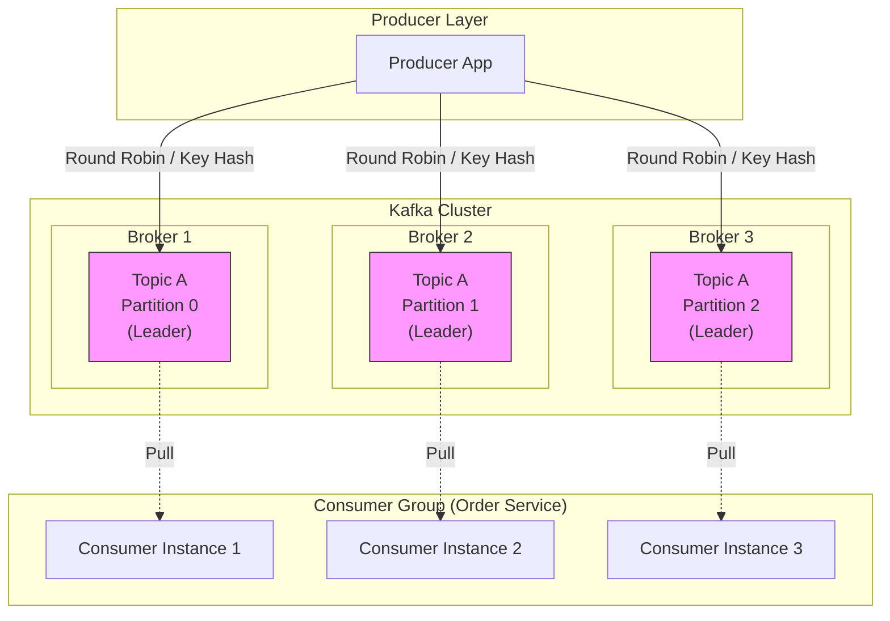

# fix this error and send me full correct response ?

Unable to render rich display
Parse error on line 8:
...A<br>Partition 0<br>(Leader)] en
-----------------------^
Expecting 'SQE', 'DOUBLECIRCLEEND', 'PE', '-)', 'STADIUMEND', 'SUBROUTINEEND', 'PIPE', 'CYLINDEREND', 'DIAMOND_STOP', 'TAGEND', 'TRAPEND', 'INVTRAPEND', 'UNICODE_TEXT', 'TEXT', 'TAGSTART', got 'PS'

For more information, see [https://docs.github.com/get-started/writing-on-github/working-with-advanced-formatting/creating-diagrams\#creating-mermaid-diagrams](https://docs.github.com/get-started/writing-on-github/working-with-advanced-formatting/creating-diagrams#creating-mermaid-diagrams)

Sure, let me first clarify the problem and then walk you through my approach.

## 1. Interview-Style Opening

"Sure, I can explain that. Apache Kafka is often misunderstood as just a 'message queue' like RabbitMQ, but in a distributed system, I treat it as a **Distributed Commit Log**.

It’s an event streaming platform designed for high throughput and fault tolerance. Instead of just passing ephemeral messages, it stores streams of records in categories called topics, allowing different parts of a system to process data asynchronously and independently. Its core architecture is built around the concept of an **append-only log**."

## 2. Problem Understanding and Clarification

The interviewer is asking for a fundamental definition of Apache Kafka and its components.
To answer this at a senior level, I shouldn't just list definitions. I need to explain *how* they work together to achieve scalability.

**Key Concepts to Cover:**

* **The Log:** The fundamental storage mechanism.
* **Decoupling:** Producers vs. Consumers.
* **Scalability:** Partitions and Consumer Groups.
* **Durability:** Replication and Brokers.
* **Coordination:** Zookeeper (or KRaft in newer versions).

**Clarification:** "I will explain the architecture using the standard Producer/Consumer model and include the role of partitions, which is the secret sauce for Kafka's parallelism."

## 3. High-Level Approach (Before Code)

I will break the architecture down into four logical layers:

1. **The Compute Layer (Clients):**
    * **Producers:** Push data.
    * **Consumers:** Pull data.
    * **Consumer Groups:** The mechanism that allows parallel processing.
2. **The Storage Layer (Server):**
    * **Broker:** The physical server.
    * **Topic:** The logical category (e.g., "orders").
    * **Partition:** The physical split of the topic. This is the unit of parallelism.
3. **The Metadata Layer:**
    * **Zookeeper / KRaft:** The brain that knows where everything is.
4. **The Data Structure:**
    * **Offset:** The unique ID of a message within a partition.

## 4. Visual Explanation (Mermaid-First, Mandatory)

This diagram shows how a **Topic** is split into **Partitions** across multiple **Brokers**, and how a **Consumer Group** divides the work.



**Explanation:**

* **Partitions are key:** Notice `Topic A` isn't in one place. It's split into `P0`, `P1`, `P2`.
* **Parallelism:** Because there are 3 partitions, we can have 3 consumers (`C1`, `C2`, `C3`) reading simultaneously. If `Topic A` had only 1 partition, `C2` and `C3` would sit idle.
* **Broker Distribution:** Ideally, partitions are spread across different brokers to prevent a single server failure from taking down the whole topic.


## 5. Java Code (Production-Quality)

While Kafka is infrastructure, knowing how to configure the **Producer** correctly is an engineering task. Here is a configuration class that highlights the critical components.

```java
import org.apache.kafka.clients.producer.KafkaProducer;
import org.apache.kafka.clients.producer.ProducerConfig;
import org.apache.kafka.clients.producer.ProducerRecord;
import org.apache.kafka.common.serialization.StringSerializer;

import java.util.Properties;

public class KafkaComponentsDemo {

    public static void main(String[] args) {
        // 1. Broker Configuration (Where is the cluster?)
        Properties props = new Properties();
        props.put(ProducerConfig.BOOTSTRAP_SERVERS_CONFIG, "broker1:9092,broker2:9092");

        // 2. Serialization (Converting Objects to Byte Arrays)
        // Kafka only understands bytes. We must tell it how to convert our keys/values.
        props.put(ProducerConfig.KEY_SERIALIZER_CLASS_CONFIG, StringSerializer.class.getName());
        props.put(ProducerConfig.VALUE_SERIALIZER_CLASS_CONFIG, StringSerializer.class.getName());

        // 3. Reliability vs Latency (The "Ack" setting)
        // acks=all: Strongest guarantee. Leader + Followers must acknowledge.
        props.put(ProducerConfig.ACKS_CONFIG, "all");

        KafkaProducer<String, String> producer = new KafkaProducer<>(props);

        // 4. The Record (Topic + Key + Value)
        String topic = "orders";
        String key = "order-101"; // Key determines the Partition!
        String value = "{\"amount\": 500}";

        // If we send the same Key ("order-101"), it ALWAYS goes to the same Partition.
        // This guarantees ordering for that specific order.
        ProducerRecord<String, String> record = new ProducerRecord<>(topic, key, value);

        producer.send(record, (metadata, exception) -> {
            if (exception == null) {
                System.out.printf("Sent to Partition: %d | Offset: %d%n", 
                    metadata.partition(), metadata.offset());
            } else {
                exception.printStackTrace();
            }
        });

        producer.close();
    }
}
```


## 6. Code Walkthrough (Line-by-Line)

* `BOOTSTRAP_SERVERS_CONFIG`: We list multiple brokers. The client connects to one, discovers the full cluster metadata (which broker holds which partition), and then connects directly to the correct leaders.
* `StringSerializer`: Kafka is agnostic to data types. It stores byte arrays. The component responsible for this translation is the Serializer.
* `ACKS_CONFIG`: This setting dictates durability. `acks=0` (fire and forget), `acks=1` (leader only), `acks=all` (quorum).
* `ProducerRecord(topic, key, value)`: The **Key** is crucial. Kafka uses the formula `hash(key) % num_partitions` to decide which partition gets the message. This ensures all events for `order-101` land in the same partition and are processed in order.


## 7. How I Would Explain This to the Interviewer

"So, the way I visualize Kafka is as a massive, distributed file system dedicated to logs.

When I explain 'Components', I always start with the **Topic**. It's the logical bucket. But the physical reality is the **Partition**.
The **Partition** is the unit of scalability. If I want to double my throughput, I double my partitions.
The **Broker** is just the hardware that holds these partitions.
The **Producer** decides *which* partition gets data (usually via a Key).
And the **Consumer Group** is the mechanism that allows us to have 50 instances of a microservice reading from a topic without stepping on each other's toes—Kafka assigns each instance a unique slice of the partitions.

Finally, there's **Zookeeper** (or KRaft now), which is the traffic cop keeping track of who is the 'Leader' for each partition."

## 8. Edge Cases and Follow-Up Questions

**Edge Case 1: Consumer Lag**

* *Scenario:* Producers are writing 10k msg/sec, but consumers can only process 5k msg/sec.
* *Impact:* "Lag" increases. Data is stored on disk, so it's not lost, but real-time processing is delayed.
* *Fix:* Add more Consumer instances (up to the number of partitions).

**Edge Case 2: One Hot Partition**

* *Scenario:* You use `User_ID` as a key, but one user (e.g., a bot) generates 90% of traffic.
* *Impact:* One partition becomes huge. One consumer gets overloaded while others sit idle.
* *Fix:* Use a better keying strategy or "salt" the key to distribute the hot user across partitions.

**Follow-Up Q: "What happens if a Broker dies?"**

* *Answer:* "One of the **Follower** replicas on a different broker is instantly promoted to **Leader** by the Controller. The clients (Producers/Consumers) automatically detect this metadata change and reconnect to the new leader. This happens in seconds."


## 9. Optimization and Trade-offs

| Component | Choice | Trade-off |
| :-- | :-- | :-- |
| **Partitions** | High Count (e.g., 100) | **Pros:** High parallelism. **Cons:** More open file handles, higher unavailability time during leader election. |
| **Replication** | Factor 3 (Standard) | **Pros:** Can survive 2 broker failures. **Cons:** 3x storage cost, higher network traffic (latency) for `acks=all`. |
| **Retention** | Time-based vs. Compacted | **Time:** Delete old logs (standard). **Compacted:** Keep only the *latest* value for each key (great for caches/state tables). |

## 10. Real-World Application and Engineering Methodology

In a **Log Aggregation System** (ELK Stack pipeline):

* **The Problem:** During Black Friday, our logging service (Logstash) crashed because the HTTP traffic spiked 50x.
* **The Kafka Fix:** We put Kafka in the middle. The Application Servers pushed logs to Kafka (fast, async). Logstash pulled from Kafka.
* **Result:** When traffic spiked, Kafka absorbed the 1GB/sec write load (Store-and-Forward). Logstash continued indexing at its max speed of 100MB/sec. The logs were delayed by 10 minutes, but **no logs were lost** and the app servers didn't crash. This is "Backpressure" in action.

