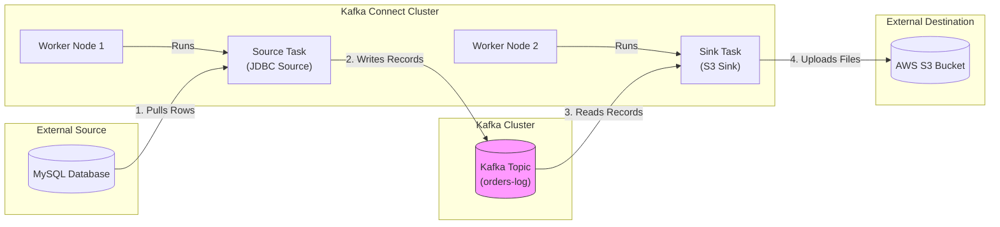

# What is Kafka Connect, and how is it used for integrating with external systems?

Sure, let me first clarify the problem and then walk you through my approach.

## 1. Interview-Style Opening

"Integrating Kafka with external systems is a classic problem. If we were writing custom producer/consumer code for every database or S3 bucket we needed to talk to, we'd be drowning in maintenance debt.

**Kafka Connect** is the framework designed specifically to solve this. It decouples the 'pipeline plumbing' from your business logic. Instead of writing code, you write configuration. It treats data integration as a first-class citizen with built-in fault tolerance, scaling, and offset management. I consider it the standard way to move data *in* and *out* of Kafka without reinventing the wheel."

## 2. Problem Understanding and Clarification

The question asks for a definition of Kafka Connect and its usage for integration.

**Core Definition:** Kafka Connect is a free, open-source framework (part of Apache Kafka) for connecting Kafka with external systems such as databases, key-value stores, search indexes, and file systems.

**Key Components I must explain:**

* **Connectors (Source vs Sink):** The "drivers" for specific technologies (JDBC, S3, Elasticsearch).
* **Tasks \& Workers:** The runtime execution model.
* **Converters:** Handling data serialization (Avro, JSON, Protobuf).
* **Standalone vs. Distributed Mode:** How it runs in production.

**Clarification:** "I will explain this using the standard Source/Sink model, showing how it removes the need for custom glue code."

## 3. High-Level Approach (Before Code)

The architecture is plugin-based.

1. **The Source (Ingest):**
    * A **Source Connector** (e.g., Debezium for MySQL) monitors an upstream system.
    * It captures changes (CDC) or polls for new rows.
    * It writes these as standard Kafka records to a topic.
2. **The Hub (Kafka):**
    * Data sits in the topic, decoupled from the destination.
3. **The Sink (Egress):**
    * A **Sink Connector** (e.g., Elasticsearch Sink) reads from the topic.
    * It batches the records and writes them to the downstream system.

**Why use it?**

* **No Code:** defined via JSON config.
* **Offset Management:** It automatically tracks what has been read/written. If a worker crashes, it resumes exactly where it left off.


## 4. Visual Explanation (Mermaid-First, Mandatory)



**Explanation:**

* **Workers** are the generic processes (JVMs) running the software.
* **Connectors/Tasks** are the logic plugins running *inside* the workers.
* Note how the MySQL DB and S3 Bucket never talk to each other directly. They only talk to Kafka Connect.


## 5. JSON Configuration (Production-Quality)

Kafka Connect "code" is actually **JSON Configuration** sent to the Connect REST API.

Here is how you would configure a **Source Connector** to pull user data from Postgres.

### Step 1: The Source (Postgres via JDBC)

```json
{
  "name": "postgres-users-source",
  "config": {
    "connector.class": "io.confluent.connect.jdbc.JdbcSourceConnector",
    "tasks.max": "1",
    "connection.url": "jdbc:postgresql://db-server:5432/myapp",
    "connection.user": "kafka_user",
    "connection.password": "secret",
    
    // Logic: Poll for new rows based on a timestamp column
    "mode": "timestamp",
    "timestamp.column.name": "updated_at",
    "table.whitelist": "users",
    
    // Output Topic
    "topic.prefix": "pg-",
    
    // Converters: Use Avro for strong typing (Best Practice)
    "key.converter": "io.confluent.connect.avro.AvroConverter",
    "value.converter": "io.confluent.connect.avro.AvroConverter",
    "value.converter.schema.registry.url": "http://schema-registry:8081"
  }
}
```


### Step 2: The Sink (Elasticsearch)

And here is how you dump that same data into Elasticsearch for searching.

```json
{
  "name": "elastic-users-sink",
  "config": {
    "connector.class": "io.confluent.connect.elasticsearch.ElasticsearchSinkConnector",
    "tasks.max": "2",
    "topics": "pg-users",
    "connection.url": "http://elastic-server:9200",
    
    // Logic: Treat the Kafka Key as the Document ID
    "key.ignore": "false",
    "schema.ignore": "true",
    
    // Dead Letter Queue: If parsing fails, don't crash, send to error topic
    "errors.tolerance": "all",
    "errors.deadletterqueue.topic.name": "dlq-elastic-sink",
    "errors.deadletterqueue.context.headers.enable": "true"
  }
}
```


## 6. Code Walkthrough (Line-by-Line)

**Source Config:**

* `connector.class`: Tells the worker which jar file to load.
* `mode`: "timestamp" means "SELECT * FROM users WHERE updated_at > last_offset". This is how it simulates a stream from a static table.[^5]
* `topic.prefix`: The data will land in `pg-users`.

**Sink Config:**

* `tasks.max`: "2" means we can run parallel threads. If the topic has 2 partitions, both threads will work.[^5]
* `errors.tolerance`: "all". This is critical in production. Without this, one bad JSON record (e.g., a schema mismatch) will crash the connector and stop the pipeline. This setting sends bad data to a separate `dlq` topic so you can fix it later.


## 7. How I Would Explain This to the Interviewer

"If I were architecting a data platform, I would ban writing custom producers for standard databases.

Kafka Connect is the **integration layer**. It consists of a cluster of 'Workers'. These workers are just empty containers waiting for instructions.
We send them a JSON payload via REST API that says 'Start a MySQL Source Task'.
The worker spawns that task, which begins polling MySQL and writing to Kafka.[^3]

The beauty is that Kafka Connect handles the hard parts of distributed systems:

1. **Scale:** If I need more throughput, I just change `"tasks.max": "10"` and the cluster spreads the load.[^3]
2. **Resilience:** If a worker node dies, the cluster detects it and moves the tasks to a healthy node automatically.[^6]
3. **Schema Evolution:** By plugging in the Avro Converter, we ensure that if the DB schema changes, the downstream consumers don't break immediately."

## 8. Edge Cases and Follow-Up Questions

**Edge Case 1: The "Transformation" Need**

* *Scenario:* The DB has a `credit_card` column we must not send to Kafka.
* *Solution:* We use **SMT (Single Message Transforms)**. We add a config line: `"transforms": "MaskCC", "transforms.MaskCC.type": "org.apache.kafka.connect.transforms.MaskField$Value", "transforms.MaskCC.fields": "credit_card"`. This strips the field *before* it hits the topic.

**Edge Case 2: One Huge Table**

* *Scenario:* Initial snapshot of a 1TB table takes forever.
* *Solution:* While JDBC source is single-threaded for one table, modern connectors (like Debezium) use **Snapshotting** mechanisms or we can partition the table logic manually across multiple connectors.


## 9. Optimization and Trade-offs

| Feature | Custom Code (Producer) | Kafka Connect |
| :-- | :-- | :-- |
| **Development Time** | High (Days/Weeks) | Low (Minutes) [^5] |
| **Maintenance** | High (Libraries, Bugs) | Low (Config only) |
| **Flexibility** | 100% (Do anything) | constrained by Plugin logic |
| **Deployment** | Embedded in App | Separate Cluster infrastructure |

**Trade-off:** Running a dedicated Connect Cluster (Infrastructure) vs. just adding a library to your app. For simple, one-off tasks, a custom producer is fine. For enterprise data pipelines, Connect is mandatory.

## 10. Real-World Application and Engineering Methodology

**Use Case: Mainframe Offloading**

* **Scenario:** A bank had a legacy Mainframe (AS/400). Reads were expensive (\$\$\$).
*   **Solution:** We used the **Debezium Source Connector** for DB2.
*   **Flow:** The connector read the transaction logs (CDC) and pushed changes to Kafka.
*   **Result:** All new microservices (Fraud Detection, Mobile App) consumed from Kafka. They never touched the Mainframe. We reduced MIPS costs by 40% and enabled real-time fraud alerts.
<span style="display:none">[^1][^10][^2][^4][^7][^8][^9]</span>

<div align="center">⁂</div>

[^1]: https://docs.confluent.io/platform/current/connect/design.html

[^2]: https://www.instaclustr.com/blog/apache-kafka-connect-architecture-overview/

[^3]: https://www.instaclustr.com/education/apache-kafka/apache-kafka-connect-the-basics-and-a-quick-tutorial/

[^4]: https://www.openlogic.com/blog/exploring-kafka-connect

[^5]: https://www.automq.com/blog/kafka-connect-architecture-concepts-best-practices

[^6]: https://kafka.apache.org/41/kafka-connect/overview/

[^7]: https://docs.confluent.io/platform/current/connect/index.html

[^8]: https://docs.redhat.com/en/documentation/red_hat_streams_for_apache_kafka/2.7/html/streams_for_apache_kafka_on_openshift_overview/kafka-connect-components_str

[^9]: https://www.redpanda.com/guides/kafka-tutorial-what-is-kafka-connect

[^10]: https://developers.redhat.com/articles/2023/12/27/introduction-kafka-connect

