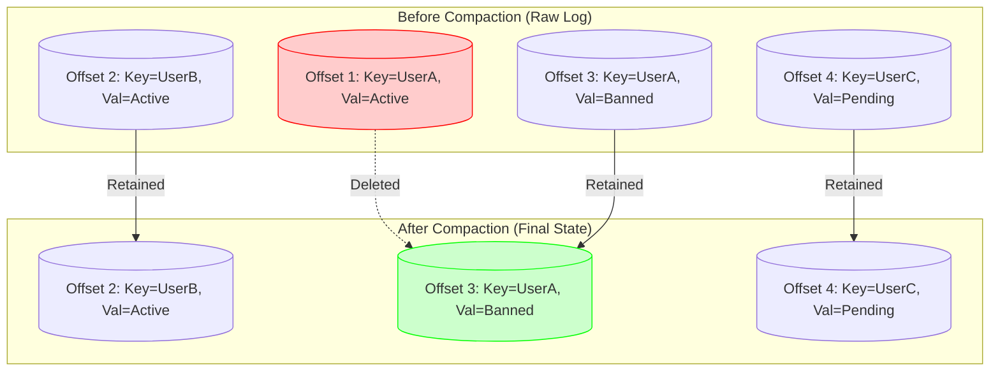

# What is log compaction in Kafka, and when would you use it?

Sure, let me first clarify the problem and then walk you through my approach.

## 1. Interview-Style Opening

"This is an essential concept for understanding how Kafka can act as a **database of record** rather than just a message queue.

Normally, Kafka cleans up old data based on time (e.g., delete after 7 days). **Log Compaction** flips this model: instead of time, it uses **Keys**. It guarantees that for every unique key, the log will retain at least the **latest value**, effectively turning the topic into a key-value store or a persistent table."

## 2. Problem Understanding and Clarification

The interviewer wants to know:

1. **What** log compaction is (mechanism).
2. **When** to use it (use cases).

**Key Concepts:**

* **Standard Retention:** Delete old logs when they get too big (size) or too old (time).
* **Compaction:** Delete old logs only if a *newer* message exists with the same key.
* **Tombstones:** How to strictly delete a key.

**Clarification:** "I'll explain this by comparing a 'standard' topic (event stream) with a 'compacted' topic (state table) to make the distinction clear."

## 3. High-Level Approach

I will break this down into three parts:

1. **The Mechanism:** How the `LogCleaner` thread scans the log segments and removes obsolete records.
2. **The "Table" Analogy:** Explaining how this enables the "Kafka as a Database" pattern (KTable).
3. **Use Cases:** Specific scenarios like Database Replication (CDC) and System Configuration where history doesn't matter, only the final state does.

## 4. Visual Explanation (Mermaid-First, Mandatory)



**Explanation:**

* **UserA** appeared twice (Offsets 1 and 3).
* Offset 1 is now **obsolete** because Offset 3 has a newer value ("Banned") for the same key.
* The Log Cleaner deletes Offset 1 to save space.
* **UserB** and **UserC** only appeared once, so they are kept.


## 5. Technical Details \& Configuration

To enable this, you don't change code. You change topic configuration.

**Command:**

```bash
kafka-configs.sh --bootstrap-server localhost:9092 \
  --entity-type topics --entity-name user-profiles \
  --alter --add-config cleanup.policy=compact
```

**Key Parameters:**

* `cleanup.policy=compact`: The master switch.
* `min.cleanable.dirty.ratio`: (Default 0.5). Compaction triggers only when 50% of the log is "dirty" (uncompacted).
* `delete.retention.ms`: How long a "tombstone" (delete marker) stays alive to ensure consumers see the deletion.

**Tombstone Message:**
To delete `UserB` forever, you don't call a delete API. You send a message: `Key="UserB", Value=null`. Kafka treats this `null` payload as a "Tombstone". After compaction, `UserB` vanishes entirely.

## 6. When would you use it? (Use Cases)

1. **Database Change Data Capture (CDC):**
    * *Scenario:* You are streaming changes from a MySQL `Users` table into Kafka.
    * *Why Compaction?* If a user updates their address 50 times in 5 years, a new consumer (e.g., a caching service) starting today doesn't need to process 49 obsolete addresses. It just needs the latest one. Compaction ensures the consumer loads the snapshot instantly.
2. **KTable (Kafka Streams):**
    * *Scenario:* You want to join a stream of "Clicks" with a table of "User Metadata".
    * *Why Compaction?* The "User Metadata" topic must be compacted. If it used time-based retention, user data would expire after 7 days, and your join would fail for older users. Compaction keeps the user data "forever" (until deleted).
3. **Dynamic Configuration:**
    * *Scenario:* Microservices listen to a `app-config` topic to toggle feature flags.
    * *Why Compaction?* When a new instance spins up, it reads this topic to get the current state. It doesn't care about the toggle history from last year.

## 7. How I Would Explain This to the Interviewer

"Think of a standard Kafka topic as a **Log File**—it records *history*.
Think of a Compacted topic as a **HashMap**—it holds *state*.

If I use `cleanup.policy=delete` (standard), I am saying: 'I care about what happened in the last 7 days.'
If I use `cleanup.policy=compact`, I am saying: 'I care about the current value of every key, no matter how old it is.'

I use compaction specifically when I need to **restore state** to an application. If my 'Inventory Service' crashes and restarts, it can replay the `inventory-topic` to rebuild its in-memory cache. With compaction, this replay is fast because it doesn't process old, overwritten inventory counts."

## 8. Edge Cases and Follow-Up Questions

**Q: Does compaction happen instantly?**

* *A:* No. It runs in the background. The "Head" of the log (active segment) is never compacted. Only the "Tail" (closed segments) is compacted. This means you might temporarily see duplicates for recent updates.

**Q: What happens if I produce a message without a Key to a compacted topic?**

* *A:* It will never be compacted (except by time/size if you have hybrid policy). Log compaction *requires* keys to identify duplicates. Sending null keys to a compacted topic is basically a configuration error.

**Q: Can I combine standard retention and compaction?**

* *A:* Yes. `cleanup.policy=compact,delete`. This keeps the latest value (compaction) but *also* enforces a hard Time-To-Live (TTL). This is rare but useful for GDPR compliance (e.g., "Keep latest state, but strictly delete everything older than 2 years").
<span style="display:none">[^1][^10][^2][^3][^4][^5][^6][^7][^8][^9]</span>

<div align="center">⁂</div>

[^1]: https://www.redpanda.com/guides/kafka-performance-kafka-log-compaction

[^2]: https://docs.confluent.io/kafka/design/log_compaction.html

[^3]: https://www.getorchestra.io/guides/apache-kafka-log-compaction

[^4]: https://hevodata.com/learn/what-is-kafka-log-compaction/

[^5]: https://biztalktechie.com/kafka-compaction-and-retention/

[^6]: https://www.crowdstrike.com/en-us/guides/kafka-logging/advanced-concepts/

[^7]: https://community.getorchestra.io/apache-foundation/apache-kafka-concepts-log-compaction-explained/

[^8]: https://developer.confluent.io/courses/architecture/compaction/

[^9]: https://www.baeldung.com/ops/kafka-topics-compaction

[^10]: https://learn.microsoft.com/en-us/azure/event-hubs/log-compaction

