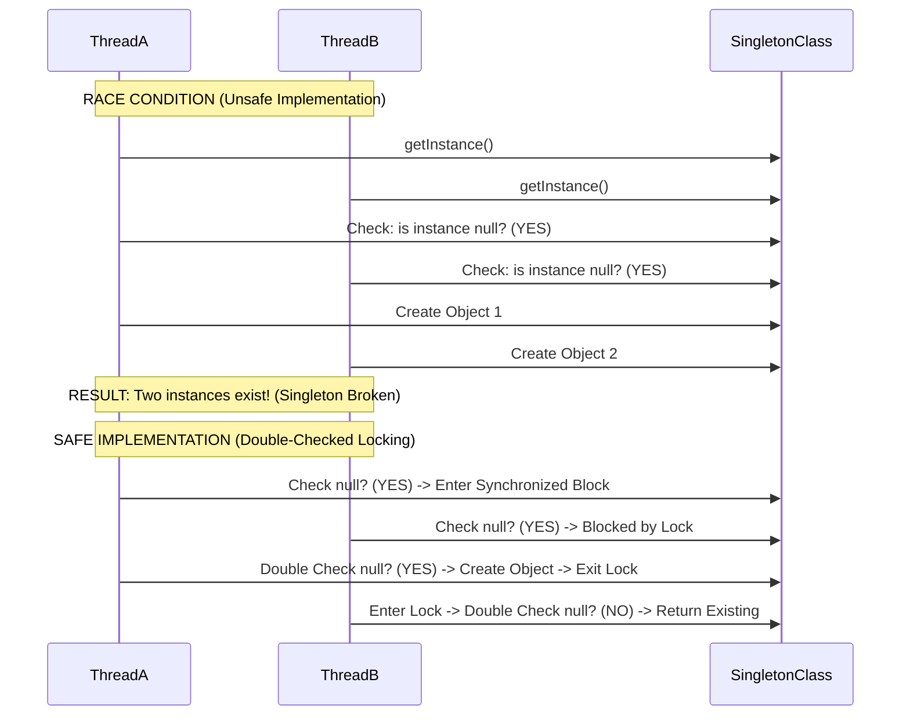

# What is the Singleton design pattern, and how do you implement it safely in a multithreaded environment?

Sure, let me first clarify the problem and then walk you through my approach.

## 1. Interview-Style Opening

"The **Singleton pattern** ensures that a class has only one instance and provides a global point of access to it. It’s a Creational pattern used for things like connection pools, logging services, or configuration managers.

In a multithreaded environment, the challenge is ensuring that two threads don't accidentally create two different instances at the same time. While there are multiple ways to implement it (like Eager Initialization or Synchronized blocks), the industry standard for safe and efficient lazy loading is the **Bill Pugh Singleton (Static Inner Class)** or using an **Enum**."

## 2. Problem Understanding and Clarification

The user is asking two things:

1. **Definition:** What is the Singleton pattern?
2. **Implementation:** How to do it safely in a multithreaded environment.

**Key Implementation Challenges:**

* **Race Conditions:** Two threads checking `if (instance == null)` at the exact same nanosecond.
* **Performance:** Avoiding `synchronized` on every call (which is slow).
* **Serialization/Reflection:** Preventing hackers from creating a second instance via hacks.

**Clarification:** "I will explain the 'Double-Checked Locking' mechanism (the classic interview answer) and the 'Bill Pugh' approach (the modern best practice)."

## 3. High-Level Approach

I will walk through the evolution of the solution:

1. **Brute Force (Synchronized Method):** Safe but slow.
2. **Double-Checked Locking:** The optimization using `volatile`.
3. **Bill Pugh (Static Holder):** The most elegant solution leveraging Java's ClassLoader.
4. **Enum:** The "hacker-proof" solution.

## 4. Visual Explanation (Mermaid-First, Mandatory)

This sequence diagram shows the race condition in a **Non-Safe** Singleton and how locking solves it.




## 5. Java Code (Production-Quality)

Here are the two most robust implementations.

### Approach 1: Bill Pugh Singleton (Recommended)

This relies on the fact that inner static classes are not loaded until they are referenced. This is effectively lazy loading without explicit synchronization logic.

```java
public class BillPughSingleton {

    // 1. Private Constructor
    private BillPughSingleton() {
        // Prevent reflection attack
        if (SingletonHelper.INSTANCE != null) {
            throw new RuntimeException("Instance already exists!");
        }
    }

    // 2. Static Inner Class - Loaded ONLY when referenced
    private static class SingletonHelper {
        private static final BillPughSingleton INSTANCE = new BillPughSingleton();
    }

    // 3. Global Access Point
    public static BillPughSingleton getInstance() {
        return SingletonHelper.INSTANCE;
    }
}
```


### Approach 2: Double-Checked Locking (Classic)

This is the standard answer if the interviewer specifically asks about `volatile` and `synchronized`.

```java
public class DoubleCheckedSingleton {

    // volatile is CRITICAL: it prevents CPU instruction reordering
    private static volatile DoubleCheckedSingleton instance;

    private DoubleCheckedSingleton() {}

    public static DoubleCheckedSingleton getInstance() {
        // First check (No locking) - Performance optimization
        if (instance == null) {
            
            // Locking
            synchronized (DoubleCheckedSingleton.class) {
                
                // Second check (Inside lock) - Safety
                if (instance == null) {
                    instance = new DoubleCheckedSingleton();
                }
            }
        }
        return instance;
    }
}
```


## 6. Code Walkthrough (Line-by-Line)

**For Double-Checked Locking:**

* `volatile`: This keyword is the MVP. Without it, Thread A might allocate memory for the object *before* fully initializing it. Thread B sees `instance != null` and grabs a half-baked object. `volatile` ensures the write finishes before anyone reads it.
* `First if (instance == null)`: This makes the method fast. Once the object is created, we never enter the slow `synchronized` block again.
* `Second if (instance == null)`: This handles the race condition. If Thread A and B both passed the first check, one will wait. When Thread A finishes and leaves, Thread B enters and *must* check again to realize "Oh, Thread A just created it."


## 7. How I Would Explain This to the Interviewer

"To implement this safely, I prefer the **Bill Pugh Static Holder** pattern. It exploits the Java ClassLoader's guarantee that classes are loaded lazily and thread-safely. We put the instance inside a private static inner class. It’s clean, efficient, and doesn’t need `synchronized` blocks.

However, if we must use lazy initialization explicitly, I use **Double-Checked Locking**. The key here is marking the `instance` variable as `volatile`. This prevents the 'Instruction Reordering' problem where another thread might see a non-null but partially constructed object.

Finally, if I need absolute protection against Serialization and Reflection attacks, I would simply use a Java **Enum**, which is natively a Singleton handled by the JVM."

## 8. Edge Cases and Follow-Up Questions

**Edge Case 1: Serialization**

* *Issue:* If you serialize a Singleton to a file and deserialize it, Java creates a *new* instance.
* *Fix:* Implement `readResolve()` and return the existing instance.

```java
protected Object readResolve() { return getInstance(); }
```


**Edge Case 2: Reflection Attack**

* *Issue:* A hacker can use `Accessible(true)` to call the private constructor.
* *Fix:* Throw an exception inside the constructor if `instance != null` (as shown in my Bill Pugh example).

**Follow-Up Q: "Why is `volatile` needed in Double-Checked Locking?"**

* *Answer:* "Because object creation isn't atomic. It involves 3 steps: (1) Allocate memory, (2) Init object, (3) Assign reference. The CPU might reorder this to 1-3-2. `volatile` enforces a 'happens-before' relationship so step 3 never happens before step 2."


## 9. Optimization and Trade-offs

| Implementation | Thread Safety | Performance | Lazy Loading | Complexity |
| :-- | :-- | :-- | :-- | :-- |
| **Eager (Static Final)** | Yes | High | No (Memory waste) | Low |
| **Synchronized Method** | Yes | Low (Bottleneck) | Yes | Low |
| **Double-Checked** | Yes | High | Yes | High (`volatile` complexity) |
| **Bill Pugh (Holder)** | Yes | High | Yes | Medium |
| **Enum** | Yes | High | No (Eager) | Very Low |

**Trade-off:**

* Use **Enum** for simplicity and security.
* Use **Bill Pugh** for performance-critical lazy loading.


## 10. Real-World Application and Engineering Methodology

**Use Case: Application Configuration Manager**

* **Scenario:** In a Spring Boot app, we often read properties from `application.yml`.
* **Why Singleton?** We don't want to parse the YAML file 100 times for 100 requests. We parse it once, store it in a `ConfigurationManager` Singleton, and share it.
* **Real World Note:** In Spring, all beans are Singletons **by default**. You rarely write `getInstance()` logic manually because the Spring Container (`ApplicationContext`) acts as the registry that holds the single instance and injects it everywhere. We only write manual Singletons when working outside a container or writing library code.
<span style="display:none">[^1][^10][^2][^3][^4][^5][^6][^7][^8][^9]</span>

<div align="center">⁂</div>

[^1]: https://www.digitalocean.com/community/tutorials/java-singleton-design-pattern-best-practices-examples

[^2]: https://refactoring.guru/design-patterns/singleton/java/example

[^3]: https://stackoverflow.com/questions/70689/what-is-an-efficient-way-to-implement-a-singleton-pattern-in-java

[^4]: https://www.geeksforgeeks.org/java/singleton-class-java/

[^5]: https://howtodoinjava.com/design-patterns/creational/singleton-design-pattern-in-java/

[^6]: https://www.geeksforgeeks.org/java/java-singleton-design-pattern-practices-examples/

[^7]: https://www.baeldung.com/java-singleton

[^8]: https://blog.algomaster.io/p/singleton-design-pattern

[^9]: https://dev.to/zeeshanali0704/mastering-the-singleton-design-pattern-in-java-a-complete-guide-13nn

[^10]: https://www.youtube.com/watch?v=KUTqnWswPV4\&vl=en

