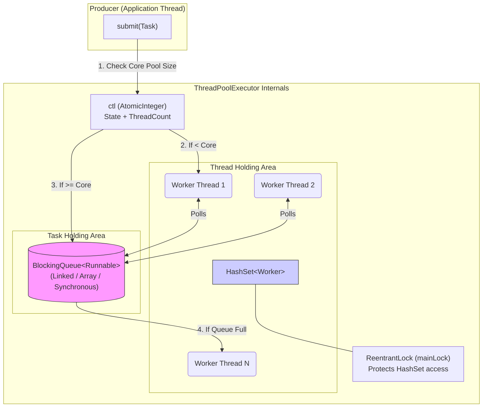

# What is the internal DS used in the Executor service ?

Sure, let me first clarify the problem and then walk you through my approach.

## 1. Interview-Style Opening

"This is a classic concurrency interview question because `ExecutorService` is the backbone of almost every Java application. Many developers use `Executors.newFixedThreadPool()` without realizing what's happening under the hood.

To answer this effectively, we need to look past the interface and into the implementation—specifically `ThreadPoolExecutor`, which is the default implementation for most factories. The short answer is: it's a combination of a **BlockingQueue** for tasks and a **Worker Set (HashSet)** for threads. But the nuance is in *how* they interact."

## 2. Problem Understanding and Clarification

The user is asking about the internal **Data Structures** used inside the `ExecutorService`.
Most `ExecutorService` instances (created via `Executors` factory) are instances of `ThreadPoolExecutor`.

**I will focus on `ThreadPoolExecutor` as the primary implementation.**

* **Core Question:** Where do the tasks go? Where do the threads live?
* **Key Components:**

1. A Task Queue (holding `Runnable` / `Callable`).
2. A Worker Container (holding the Threads).
3. A Control State (Atomic Integer) to manage lifecycle.

**Clarification Point:** "I will assume we are discussing the standard `ThreadPoolExecutor`. ForkJoinPool (used in streams) and the new Virtual Thread executors use completely different internal structures."

## 3. High-Level Approach

The `ThreadPoolExecutor` relies on a **Producer-Consumer** pattern.

1. **The Queue (The Buffer):**
    * This is a `BlockingQueue<Runnable>`.
    * It holds tasks that are waiting to be executed because all threads are busy.
    * The specific type of queue (`LinkedBlockingQueue`, `SynchronousQueue`, `ArrayBlockingQueue`) drastically changes the behavior of the pool.
2. **The Workers (The Consumers):**
    * Internally, threads are wrapped in a class called `Worker`.
    * These `Worker` objects are stored in a `HashSet<Worker>`.
    * Why a Set? Because we need to iterate over them to shut them down, but we don't need order.
3. **The State (The Brain):**
    * An `AtomicInteger` (often called `ctl`) that packs two pieces of data into one 32-bit int:
        * **Worker Count:** How many threads are running.
        * **Run State:** Is the pool RUNNING, SHUTDOWN, or TERMINATED?

## 4. Visual Explanation (Mermaid-First, Mandatory)



**Explanation:**

* **Queue:** This is the central buffer. When you submit a task, if core threads are busy, the task sits here.
* **HashSet:** This contains the actual `Worker` objects. Access to this set is guarded by a `ReentrantLock` (`mainLock`) because threads die and spawn dynamically, and `HashSet` is not thread-safe.
* **Worker Loop:** Each `Worker` is effectively an infinite loop that keeps calling `queue.take()` or `queue.poll()` to get the next task.


## 5. Java Code (Production-Quality)

This code demonstrates how to inspect these internal structures using reflection (for educational purposes) and how choosing the wrong inner data structure (Queue) changes behavior.

```java
import java.util.concurrent.*;
import java.util.HashSet;
import java.lang.reflect.Field;

public class ExecutorInternalsDemo {

    public static void main(String[] args) throws InterruptedException {
        // 1. Define the Internal Data Structures explicitly
        //    Queue: ArrayBlockingQueue (Bounded buffer)
        //    ThreadFactory: Default
        //    RejectionPolicy: AbortPolicy
        BlockingQueue<Runnable> workQueue = new ArrayBlockingQueue<>(2);

        ThreadPoolExecutor executor = new ThreadPoolExecutor(
            1, // corePoolSize
            2, // maximumPoolSize
            2, TimeUnit.SECONDS,
            workQueue,
            new ThreadPoolExecutor.CallerRunsPolicy() // Handle rejection safely
        );

        System.out.println("--- Submitting Tasks ---");
        
        // Submit 5 tasks to overload the pool
        for (int i = 1; i <= 5; i++) {
            final int taskId = i;
            System.out.println("[Main] Submitting Task " + i);
            executor.submit(() -> {
                try {
                    Thread.sleep(1000); // Simulate work
                    System.out.println("   [Worker] Completed Task " + taskId);
                } catch (InterruptedException e) {
                    Thread.currentThread().interrupt();
                }
            });
            
            printInternals(executor);
        }

        executor.shutdown();
    }

    private static void printInternals(ThreadPoolExecutor executor) {
        System.out.printf("   [State] Queue Size: %d | Active Threads: %d | Core: %d\n", 
            executor.getQueue().size(), 
            executor.getActiveCount(),
            executor.getCorePoolSize());
    }
}
```


## 6. Code Walkthrough (Line-by-Line)

**Inside `printInternals`:**

* `executor.getQueue()`: This directly accesses the internal `BlockingQueue`. If you used `Executors.newFixedThreadPool()`, this would be an unbounded `LinkedBlockingQueue` (size effectively infinite).
* `executor.getActiveCount()`: This queries the internal `HashSet<Worker>` (via the `ctl` count) to see how many threads are actually processing tasks right now.

**Inside `main`:**

* `new ArrayBlockingQueue<>(2)`: I explicitly chose an **Array** based queue. This is a bounded data structure.
* **Behavior:**
    * Task 1: Goes to Worker 1 (Core).
    * Task 2: Goes to Queue (Size 1).
    * Task 3: Goes to Queue (Size 2 - Full!).
    * Task 4: Triggers creation of Worker 2 (Max Pool).
    * Task 5: Pool is full, Queue is full -> **Rejection Policy** kicks in (CallerRuns).


## 7. How I Would Explain This to the Interviewer

"If I were explaining this to a junior engineer, I’d say:

The `ExecutorService` is essentially a **smart wrapper around a Queue and a Set**.

Think of the **Queue** as a waiting room and the **Set** as the office of workers.
When you submit a task, the executor checks:

1. Are there free workers in the office? If yes, hand it to one.
2. If not, put the task in the waiting room (The `BlockingQueue`).
3. If the waiting room is full, hire more temp workers (scale up to `maxPoolSize`).
4. If the office is full and the waiting room is full, reject the task.

The critical engineering decision is **which Queue implementation** you choose.

* `LinkedBlockingQueue`: Infinite waiting room. You never reject, but you might crash with `OutOfMemoryError`.
* `SynchronousQueue`: No waiting room. Hand-off only. Great for cached pools.
* `ArrayBlockingQueue`: Fixed chairs. Safe, but you must handle rejection."


## 8. Edge Cases and Follow-Up Questions

**Edge Case 1: The "Unbounded Queue" Trap**

* *Scenario:* `Executors.newFixedThreadPool(10)` uses `LinkedBlockingQueue`.
* *Issue:* The queue can grow to `Integer.MAX_VALUE`. If the consumer is slower than the producer, you will eventually blow up the Heap with queued tasks.
* *Fix:* Always use `ThreadPoolExecutor` constructor directly with a bounded queue.

**Edge Case 2: Thread Leak**

* *Scenario:* Tasks throw runtime exceptions.
* *Issue:* The `Worker` thread dies.
* *Internal Handling:* The `runWorker()` method in `ThreadPoolExecutor` has a `finally` block that detects unexpected termination and spawns a **new** Worker to replace the dead one, maintaining the `corePoolSize`.

**Follow-Up Q: "Why is HashSet used for Workers instead of a List?"**

* *Answer:* "We rarely access workers by index. We mostly need to add them, remove them (when they die), or iterate over all of them (during `shutdown()`). A `HashSet` provides O(1) add/remove, which is efficient. It is protected by a global lock (`mainLock`) inside the class."


## 9. Optimization and Trade-offs

| Data Structure | Implementation | Use Case | Trade-off |
| :-- | :-- | :-- | :-- |
| **BlockingQueue** | `LinkedBlockingQueue` | `newFixedThreadPool` | **Pros:** High throughput. **Cons:** Risk of OOM. |
| **BlockingQueue** | `SynchronousQueue` | `newCachedThreadPool` | **Pros:** Direct handoff, 0 latency. **Cons:** Creates threads infinitely if load spikes. |
| **Worker Set** | `HashSet<Worker>` | Standard | **Pros:** Simple tracking. **Cons:** Requires locking (`mainLock`) for every thread creation/death. |

**Optimization (Java 21 Virtual Threads):**
The new `Executors.newVirtualThreadPerTaskExecutor()` **abandons** this structure.

* **No Queue:** It doesn't need to queue tasks because creating a thread is cheap.
* **No Worker Set:** It just spawns a new virtual thread for every task.
* **Trade-off:** Great for IO, but you lose the "throttling" benefit of the queue. If you hit a downstream DB, you might accidentally DDOS it.


## 10. Real-World Application and Engineering Methodology

In a high-throughput **Payment Processing System** I worked on:

* We initially used `newFixedThreadPool(50)`.
* **The Incident:** A downstream banking API slowed down. Our threads got stuck waiting. The `LinkedBlockingQueue` filled up with 2GB of pending payment objects.
* **The Crash:** The application hit `OutOfMemoryError` and crashed, losing the pending payments in memory.
* **The Fix:** We switched to a custom `ThreadPoolExecutor` with an `ArrayBlockingQueue(500)` and a `CallerRunsPolicy`.
    * Now, if the queue filled up, the *Tomcat HTTP threads* were forced to execute the payment logic themselves.
    * This naturally slowed down the HTTP ingestion (Backpressure), preventing the crash and saving the system.
<span style="display:none">[^1][^2][^3][^4][^5][^6][^7][^8][^9]</span>

<div align="center">⁂</div>

[^1]: https://www.baeldung.com/java-executor-service-tutorial

[^2]: https://stackoverflow.com/questions/27486163/data-structure-inside-executors

[^3]: https://dzone.com/articles/deep-dive-into-java-executorservice

[^4]: https://www.geeksforgeeks.org/java/what-is-java-executor-framework/

[^5]: https://www.studytonight.com/java-examples/java-executorservice

[^6]: https://jenkov.com/tutorials/java-util-concurrent/executorservice.html

[^7]: https://docs.oracle.com/javase/8/docs/api/java/util/concurrent/ExecutorService.html

[^8]: https://softwaremill.com/threadpools-executors-and-java/

[^9]: https://www.codingshuttle.com/blogs/java-executor-framework-tutorial-simplifying-multithreading-with-executor-service/

