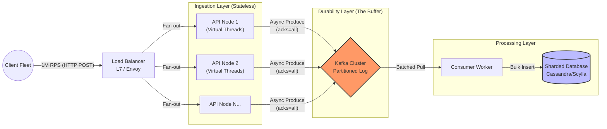

# I am getting millions of requests in a second through the REST APi, how to handle it safely to avoid any data loss.

Sure, let me first clarify the problem and then walk you through my approach.

## 1. Interview-Style Opening

"Handling millions of requests per second (1M+ RPS) without data loss is a massive engineering challenge. At this scale, we are likely dealing with an ingestion pipeline similar to what Twitter or a major IoT platform handles.

My approach shifts from a standard synchronous Request-Response model to an **Asynchronous Store-and-Forward** architecture. The core principle here is to decouple 'Ingestion' from 'Processing'. The API layer becomes a thin, stateless proxy whose only job is to durability-check the data into a write-optimized buffer (like Kafka) and immediately acknowledge the client."

## 2. Problem Understanding and Clarification

We need to design an API capable of ingesting 1M+ RPS.

**Key constraints \& Assumptions:**

* **Scale:** 1,000,000 RPS is huge. A single server (even a strong one) typically caps at 50k-100k RPS for non-trivial logic. We need a distributed fleet.
* **Safety (No Data Loss):** This is the hard constraint. We cannot just drop requests if the database is slow. We need **Backpressure** handling and **Durability** guarantees at the edge.
* **Workload:** Write-heavy (Ingestion).
* **Latency:** The client expects a fast HTTP 202 (Accepted), not a synchronous result.

**Clarification Point:** "I am assuming the client does not need the *final result* immediately (synchronous processing), but just an acknowledgement that the data is safely received. If they needed a synchronous computation at 1M RPS, we would need a radically different compute grid."

## 3. High-Level Approach (Before Code)

The database (Postgres/MySQL) will effectively instantly die at 1M WPS (Writes Per Second). We must protect it.

### The Architecture: "Queue-Based Load Leveling"

1. **Global Traffic Manager (DNS/Anycast):** Distribute 1M RPS across multiple regions/availability zones.
2. **L7 Load Balancer:** Nginx/Envoy to terminate SSL and fan out to the API fleet.
3. **Stateless API (The Producer):**
    * **Logic:** Validate payload → Serialize → Push to Kafka → Return 202.
    * **Technology:** **Java 21 Virtual Threads** or **Spring WebFlux**. Virtual threads allow us to handle massive connection concurrency without the "thread-per-request" memory overhead.
4. **The Buffer (Kafka/Pulsar):**
    * This is where "No Data Loss" happens.
    * Config: `acks=all`, `min.insync.replicas=2`.
5. **The Consumer:** Slow, reliable workers that pull from Kafka and write to the DB in optimized batches (e.g., bulk insert 10,000 records at once).

### Why this works?

* **Shock Absorber:** The queue absorbs the 1M RPS spike, allowing the DB to write at a steady 100k WPS (or whatever it can handle).
* **Durability:** Once Kafka acknowledges the write, the data is replicated to disk on multiple brokers.


## 4. Visual Explanation (Mermaid-First, Mandatory)



**Explanation:**
The critical path for the client is `Client -> LB -> API -> Kafka`. The request ends there. The rest (`Kafka -> DB`) happens asynchronously. This ensures the API latency is minimal (just network RTT + Kafka append time) and independent of Database load.

## 5. Java Code (Production-Quality)

We will use **Spring Boot 3.2+ with Virtual Threads** to handle the massive I/O concurrency of 1M connections, and the Kafka Producer for durability.

```java
import org.springframework.kafka.core.KafkaTemplate;
import org.springframework.kafka.support.SendResult;
import org.springframework.web.bind.annotation.PostMapping;
import org.springframework.web.bind.annotation.RequestBody;
import org.springframework.web.bind.annotation.RestController;
import org.springframework.http.ResponseEntity;
import org.springframework.http.HttpStatus;
import java.util.concurrent.CompletableFuture;

@RestController
public class IngestionController {

    private final KafkaTemplate<String, String> kafkaTemplate;

    public IngestionController(KafkaTemplate<String, String> kafkaTemplate) {
        this.kafkaTemplate = kafkaTemplate;
    }

    /**
     * Non-blocking ingestion endpoint.
     * Uses Virtual Threads (implicitly in Spring Boot 3.2+) to handle high concurrency.
     */
    @PostMapping("/ingest")
    public ResponseEntity<Void> ingestData(@RequestBody String payload) {
        // 1. Basic Validation (Fail fast)
        if (payload == null || payload.isEmpty()) {
            return ResponseEntity.badRequest().build();
        }

        // 2. Async Write to Kafka (The "Safety" Guarantee)
        // We do NOT wait for the DB, but we DO wait for Kafka acknowledgement.
        try {
            // send() returns a Future. getting it ensures we wait for 'acks=all'
            CompletableFuture<SendResult<String, String>> future = kafkaTemplate.send("events-topic", payload);
            
            // In a virtual thread world, blocking here is cheap and safe.
            // This ensures we don't return 202 until Kafka physically has the data.
            future.get(); 
            
            return ResponseEntity.accepted().build();
        } catch (Exception e) {
            // 3. Fallback / Circuit Breaker
            // If Kafka is down, log to local disk or return 503 so LB can retry elsewhere.
            // Do NOT silently drop.
            return ResponseEntity.status(HttpStatus.SERVICE_UNAVAILABLE).build();
        }
    }
}
```

**Kafka Configuration (Critical for Safety):**

```properties
# Reliability Settings
spring.kafka.producer.acks=all
spring.kafka.producer.retries=3
spring.kafka.producer.properties.min.insync.replicas=2
spring.kafka.producer.properties.enable.idempotence=true

# Throughput Settings (Batching)
spring.kafka.producer.batch-size=32768
spring.kafka.producer.linger-ms=5
spring.kafka.producer.compression-type=snappy
```


## 6. Code Walkthrough (Line-by-Line)

**Controller Logic:**

* `CompletableFuture ... future.get()`: With **Virtual Threads**, blocking `future.get()` is no longer an anti-pattern. The virtual thread unmounts, releasing the carrier OS thread to handle other requests. This allows us to write simple, linear code that scales like reactive code.
* `ResponseEntity.accepted()`: We return HTTP 202, explicitly telling the client "We have it, but we haven't processed it yet."
* `catch (Exception e)`: If Kafka is unreachable (network partition), we return 503. The Load Balancer will see this and retry the request on a different node. This prevents data loss during partial outages.

**Configuration Logic:**

* `acks=all`: The producer waits until the Leader AND at least one Follower confirm the write. This guarantees data survives a broker crash.
* `linger-ms=5`: Instead of sending every packet immediately (chatty network), we wait 5ms to group requests into a batch. At 1M RPS, this 5ms wait might group 5,000 messages into one network packet, massively increasing throughput.


## 7. How I Would Explain This to the Interviewer

"To handle 1 million requests per second safely, we have to respect the physics of persistence. A single database disk simply cannot rotate fast enough to write 1 million rows per second randomly.

So, my strategy is 'Queue-Based Load Leveling'. I treat the API tier as a high-speed funnel that pours requests into a distributed log—Kafka.

I’d configure Kafka with `acks=all` to ensure that once we send a '202 Accepted' to the client, the data is physically replicated on disk in at least two different failure domains. This satisfies the 'No Data Loss' requirement.

For the API implementation, I’ve chosen Java 21 Virtual Threads. In the past, I might have used Netty/WebFlux, but Virtual Threads allow me to write clean, blocking-style code—where I wait for the Kafka acknowledgement—without the massive memory overhead of OS threads. This gives us the high throughput of reactive streams with the maintainability of standard Java."

## 8. Edge Cases and Follow-Up Questions

**Edge Case 1: Kafka is Down (The "Buffer Full" scenario)**

* *Response:* We must implement a "Spillover" mechanism. If the Producer cannot write to Kafka, it appends the log to a local SSD file (fast sequential write) or a secondary region's queue. A separate background agent retries these files later.

**Edge Case 2: Poison Pill (Malicious Payload)**

* *Response:* A huge or malformed payload could crash the Consumer. We implement strict input validation at the API (Producer) level (Schema Registry check) to reject bad data *before* it enters the system.

**Follow-Up Q: "Why not write to Redis first for speed?"**

* *Answer:* "Redis is fast but it’s memory-based. If the node loses power before the snapshot (RDB/AOF) runs, we lose data. Since you explicitly asked for 'Safe' handling, Kafka's disk-based replication is the correct trade-off."


## 9. Optimization and Trade-offs

**Throughput vs. Latency:**

* *Optimization:* We set `linger.ms=5`.
* *Trade-off:* This adds 5ms of latency to every single request. At 1M RPS, this is a brilliant trade because it reduces network IOPS by orders of magnitude (batching).

**Compression:**

* *Optimization:* Use `Snappy` or `LZ4` compression on the producer.
* *Trade-off:* Increases CPU usage on the API nodes but drastically reduces network bandwidth, which is often the bottleneck at 1M RPS.


## 10. Real-World Application and Engineering Methodology

I saw this pattern used in **Telemetry Systems (Clickstream tracking)**.
We had to ingest user clicks from millions of mobile devices.

* **Scale:** Spiky traffic (push notifications went out, 5M users opened the app).
* **Engineering Constraint:** We couldn't scale our SQL database fast enough for these spikes.
* **Solution:** We placed a **Kafka** cluster between the API and the DB. During the spike, the "Lag" on the consumer group would jump to 30 minutes (meaning data was 30 mins behind real-time), but the API stayed up, returning 202s, and **zero data was lost**. The consumers simply crunched through the backlog at their own steady pace once the spike subsided.
<span style="display:none">[^1][^10][^11][^12][^13][^14][^15][^2][^3][^4][^5][^6][^7][^8][^9]</span>

<div align="center">⁂</div>

[^1]: https://www.reddit.com/r/aws/comments/1emb3no/how_to_make_an_api_that_can_handle_100k/

[^2]: https://www.youtube.com/watch?v=OB01ATeFkpE

[^3]: https://stackoverflow.com/questions/49241373/design-of-rest-api-that-can-handle-million-of-request

[^4]: https://benjamindickman.com/blog/system-design-interview-api-architecture-to-handle-1-million-requests-per-second/

[^5]: https://www.restonyc.com/how-to-handle-1000-requests-per-second-in-rest-api/

[^6]: https://stackoverflow.com/questions/78318131/do-java-21-virtual-threads-address-the-main-reason-to-switch-to-reactive-single

[^7]: https://dev.to/zoolatech/optimizing-kafka-performance-best-practices-for-high-throughput-and-low-latency-5eoc

[^8]: https://dev.to/neelp03/throttlex-scaling-to-a-million-requests-per-second-without-breaking-a-sweat-39n0

[^9]: https://onecubestaffing.com/articles/java-virtual-threads-vs-reactive-programming/

[^10]: https://stackoverflow.com/questions/50227472/how-kafka-guarantees-zero-downtime-and-zero-data-loss

[^11]: https://www.linkedin.com/posts/maheralaqil_a-storm-of-requests-facing-the-1m-rps-challenge-activity-7302657656874323969-38lc

[^12]: https://www.reddit.com/r/java/comments/1d43rbh/how_can_java_21_virtual_thread_replace_reactive/

[^13]: https://risingwave.com/blog/maximizing-kafka-throughput-a-comprehensive-guide/

[^14]: https://suddo.io/designing-apis-for-millions-requests-per-second-when-your-coffee-break-isnt-long-enough/

[^15]: https://dzone.com/articles/java-concurrency-evolution-virtual-threads-java21

