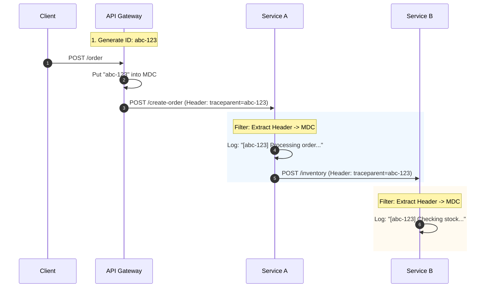

# In microservices, tracing a single request across multiple services is difficult. How would you implement correlation IDs in logs? Have you ever implemented distributed logging? If yes, explain?

Sure, let me first clarify the problem and then walk you through my approach.

## 1. Interview-Style Opening

"Distributed tracing is effectively the 'stack trace' of microservices. Without it, a failure in a downstream service like 'Inventory' looks like a generic timeout to the upstream 'Order' service, making debugging a nightmare.

For implementation, I prioritize standards. While we used to manually hack `X-Correlation-ID` headers, I now strictly align with the **W3C Trace Context** standard (`traceparent`). My approach focuses on **zero-touch propagation** for developers—meaning the infrastructure (filters, interceptors) handles the ID, not the business logic."

## 2. Problem Understanding and Clarification

We need to track a single user request as it hops across multiple microservices (e.g., A → B → C).

**Key Requirements:**

* **Uniqueness:** Generate a unique ID at the edge (API Gateway).
* **Propagation:** Pass this ID to downstream services via HTTP headers.
* **Context:** Ensure logs *within* a service (DB queries, calculations) automatically include this ID.
* **Threads:** It must survive thread switches (async processing).

**Clarification:** "I will assume a standard Spring Boot/Java ecosystem. I’ll show the manual implementation using SLF4J MDC (Mapped Diagnostic Context) to demonstrate the low-level mechanics, but I will also mention how modern tools automate this."

## 3. High-Level Approach (Before Code)

The solution has three lifecycle phases:

1. **Ingress (The "Catch"):**
    * An HTTP Filter intercepts every incoming request.
    * It checks for an existing `traceparent` header. If missing, it generates a new UUID.
    * It places this ID into the **MDC (Mapped Diagnostic Context)**. This is a ThreadLocal map that logging frameworks (Logback/Log4j2) inspect before writing any log line.
2. **Process (The "Hold"):**
    * The logger pattern is configured to print `%X{traceId}`.
    * **Crucially**, if we spawn new threads (e.g., `CompletableFuture`), we must copy the MDC map to the new thread, otherwise, the trace is broken.
3. **Egress (The "Throw"):**
    * An HTTP Client Interceptor (for `RestClient`, `Feign`, or `WebClient`) reads the ID from the MDC.
    * It injects the ID into the outbound headers of downstream requests.

**Trade-off:**

* *Approach:* Manual Filter vs. Agent (OpenTelemetry).
* *Decision:* For this answer, I will write the Manual Filter logic to prove I understand the internals, but in production, I would use the OpenTelemetry agent or Micrometer Tracing.


## 4. Visual Explanation (Mermaid-First, Mandatory)




## 5. Java Code (Production-Quality)

Here is the robust "manual" implementation. This creates a filter that works for both the initial entry and propagation.

```java
import org.slf4j.MDC;
import org.springframework.stereotype.Component;
import jakarta.servlet.*;
import jakarta.servlet.http.HttpServletRequest;
import jakarta.servlet.http.HttpServletResponse;
import java.io.IOException;
import java.util.UUID;

/**
 * Filter to handle W3C Trace Context propagation.
 * Captures 'traceparent' from headers or generates a new one.
 */
@Component
public class CorrelationIdFilter implements Filter {

    private static final String TRACE_HEADER = "traceparent";
    private static final String MDC_KEY = "traceId";

    @Override
    public void doFilter(ServletRequest request, ServletResponse response, FilterChain chain)
            throws IOException, ServletException {
        
        HttpServletRequest httpServletRequest = (HttpServletRequest) request;
        HttpServletResponse httpServletResponse = (HttpServletResponse) response;

        // 1. Extract or Generate ID
        // Format: 00-{traceId}-{spanId}-{flags} (Simplified for this example to just ID)
        String traceId = httpServletRequest.getHeader(TRACE_HEADER);
        
        if (traceId == null || traceId.isBlank()) {
            traceId = generateTraceId();
        }

        // 2. Put in MDC (Thread Local)
        MDC.put(MDC_KEY, traceId);

        // 3. Add to Response (Useful for debugging from client side)
        httpServletResponse.addHeader(TRACE_HEADER, traceId);

        try {
            // 4. Continue Request Processing
            chain.doFilter(request, response);
        } finally {
            // 5. Cleanup (Mandatory to prevent memory leaks in thread pools)
            MDC.remove(MDC_KEY);
        }
    }

    private String generateTraceId() {
        // In real W3C impl, this follows specific hex format
        return UUID.randomUUID().toString();
    }
}
```


### Propagator (Feign Client Interceptor)

This ensures the ID leaves the service to the next one.

```java
import feign.RequestInterceptor;
import feign.RequestTemplate;
import org.slf4j.MDC;
import org.springframework.stereotype.Component;

@Component
public class FeignTraceInterceptor implements RequestInterceptor {

    @Override
    public void apply(RequestTemplate template) {
        String traceId = MDC.get("traceId");
        if (traceId != null) {
            template.header("traceparent", traceId);
        }
    }
}
```


## 6. Code Walkthrough (Line-by-Line)

**In `CorrelationIdFilter`:**

* `traceId == null`: This check is vital. It determines if we are the **Root** of the trace (Edge) or a **Node** (Downstream).
* `MDC.put(MDC_KEY, traceId)`: This is the magic line. It attaches the string ID to the current thread. Logback will look for this key when writing logs.
* `finally { MDC.remove(MDC_KEY) }`: This is **critical**. Tomcat/Jetty use thread pools. If you don't clear the MDC, a subsequent request reusing this thread might inherit the *previous* request's ID, causing "ghost logs" where data leaks between users.

**In `FeignTraceInterceptor`:**

* `MDC.get("traceId")`: We pull the value *out* of the ThreadLocal storage to inject it into the outgoing HTTP request. This ensures the chain continues to Service B.


## 7. How I Would Explain This to the Interviewer

"The core concept here is **Context Propagation**. We need to carry metadata along with the execution flow, similar to how we carry a Transaction ID in a database.

In a blocking architecture, `ThreadLocal` (via MDC) is perfect because a request stays on one thread. However, the moment we introduce `CompletableFuture` or `@Async`, `ThreadLocal` breaks because the new thread starts empty.

So, when I implement this, I usually wrap the `TaskDecorator` in Spring to explicitly copy the MDC map from the parent thread to the child thread. In Java 21, we are moving toward **Scoped Values**, which are immutable and automatically inherited by child threads, solving this copy-overhead problem elegantly. But for now, MDC with careful cleanup is the production standard."

## 8. Edge Cases and Follow-Up Questions

**Edge Case 1: Asynchronous Processing (@Async)**

* *Issue:* The child thread created by `@Async` does not see the parent's MDC.
* *Fix:* Implement a custom `TaskDecorator` that calls `MDC.getCopyOfContextMap()` before execution and `MDC.setContextMap()` inside the new thread.

**Edge Case 2: Message Queues (Kafka/RabbitMQ)**

* *Issue:* HTTP headers don't exist here.
* *Fix:* You must put the Correlation ID in the **Message Headers** (metadata), not the payload. The consumer must read this header and populate its own MDC before processing the message.

**Follow-Up Q: "What if the logs are arriving out of order in the aggregator?"**

* *Answer:* "Distributed clocks are unreliable. We rely on the Aggregator's ingestion timestamp or a logical clock, but for strict ordering, we use the `SpanID` (parent-child relationship) within the trace, not just the timestamp."


## 9. Optimization and Trade-offs

* **Standardization (W3C vs Custom):**
    * *Trade-off:* Using `X-Correlation-ID` is simple but breaks interoperability with external vendors (e.g., AWS LB, Datadog).
    * *Decision:* Adopt **W3C Trace Context** (`traceparent`). It’s a bit more complex (version-traceid-parentid-flags) but ensures our traces work across cloud boundaries.
* **Log Volume:**
    * *Trade-off:* Logging *everything* with IDs is expensive (\$\$\$ in Splunk/Datadog).
*   *Optimization:* Implement **Head-Based Sampling**. Determine at the Gateway "We will only trace 1% of requests" and propagate a `sampled=1` flag. Downstream services respect this flag and only log if sampled.


## 10. Real-World Application and Engineering Methodology

**"Have you ever implemented distributed logging? If yes, explain?"**

"Yes, I have. In a previous payment reconciliation system, we had a 'Ghost Transaction' issue where 0.1% of payments were debited but not credited.

We used the **ELK Stack (Elasticsearch, Logstash, Kibana)**.
I configured **Filebeat** as a sidecar agent on our Kubernetes pods.

1. **Structured Logging:** I forced all apps to log in JSON format (`{"level": "INFO", "traceId": "abc", "msg": "..."}`). This avoided expensive regex parsing in Logstash.
2. **The Fix:** We realized our `traceId` was dropping when requests hit our legacy RabbitMQ consumer. The consumer wasn't reading the header.
3. **Result:** I wrote a simple AOP aspect around the `@RabbitListener` to hydrate the MDC from the message headers. Once deployed, we could search Kibana for `traceId="failed_tx_id"` and see the *exact* millisecond the database lock failed in the consumer."

This moved our Mean-Time-To-Resolution (MTTR) for these bugs from **2 days to 5 minutes**.
<span style="display:none">[^1][^10][^11][^12][^13][^14][^15][^2][^3][^4][^5][^6][^7][^8][^9]</span>

<div align="center">⁂</div>

[^1]: https://stackoverflow.com/questions/78142173/logback-availability-of-mdcs-in-forks-created-inside-a-structuredtaskscope

[^2]: https://github.com/resilience4j/resilience4j/issues/742

[^3]: https://dzone.com/articles/end-to-end-distributed-logging-traceability-with-c

[^4]: https://foojay.io/today/an-introduction-to-scoped-values-in-java/

[^5]: https://stackoverflow.com/questions/77937111/utilizing-logging-mdc-with-virtual-threads

[^6]: https://last9.io/blog/a-guide-to-spring-boot-logging/

[^7]: https://stackoverflow.com/questions/72462575/difference-between-the-headers-x-correlation-id-request-id-request-context-and

[^8]: https://docs.oracle.com/en/java/javase/21/docs/api/java.base/java/lang/ScopedValue.html

[^9]: https://stackoverflow.com/questions/78746378/spring-boot-3-micrometer-tracing-in-mdc

[^10]: https://cloud.google.com/trace/docs/trace-context

[^11]: https://scalex.dev/blog/simplifying-code-journey-from-reactive-to-virtual-threads/

[^12]: https://foojay.io/today/couch-to-fully-observed-code-with-spring-boot-3-2-micrometer-tracing-and-digma/

[^13]: https://www.dynatrace.com/knowledge-base/w3c-trace-context/

[^14]: https://groups.google.com/g/vertx/c/tUkZuX8mPOU

[^15]: https://spring.io/blog/2022/10/12/observability-with-spring-boot-3

