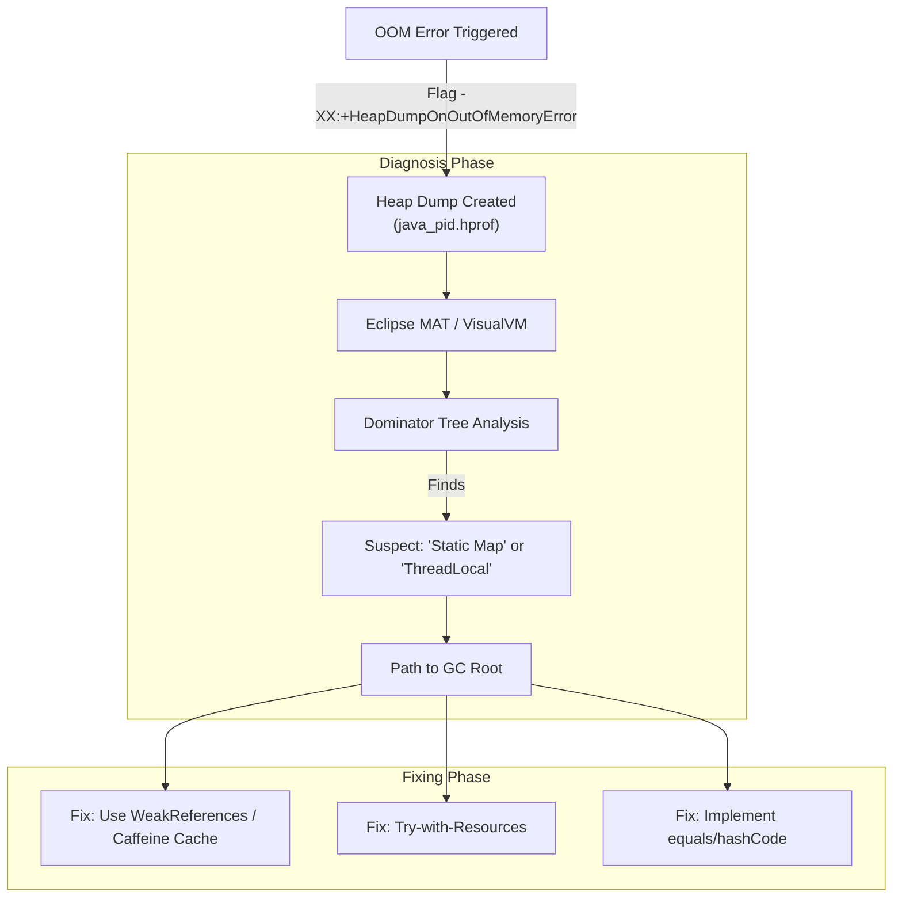

## 1. Interview-Style Opening

"This is a classic production scenario. Simply increasing the heap size is usually just a band-aid; we need to find the root cause. My approach focuses on **identifying the source** using heap analysis tools and **preventing it** through specific coding patterns like bounded caches and proper resource management."

## 2. Problem Understanding and Clarification

The error `OutOfMemoryError: Java Heap Space` means the JVM cannot allocate new objects because the heap is full, and the Garbage Collector (GC) cannot reclaim enough space.

* **Symptoms:** App becomes unresponsive, high CPU (GC thrashing), eventually crashes.
* **Real Issue:** "Memory Leak"—objects are no longer needed by the business logic but are still referenced (usually by static fields or active threads), preventing GC.


## 3. High-Level Approach

1. **Capture:** We need a snapshot of the memory at the moment of failure (`.hprof` file).
2. **Analyze:** We use tools to find the "Dominators"—the objects holding the most memory.
3. **Fix:** We refactor the code to remove unintentional strong references.

## 4. Visual Explanation (Mermaid-First)




## 5. Real-Time Tools

In a production environment, you can't always attach a debugger. Here is the toolset I rely on:

1. **Automated Heap Dump (Pre-emptive):**
    * **Flag:** `-XX:+HeapDumpOnOutOfMemoryError -XX:HeapDumpPath=/logs/`
    * **Why:** This captures the "crime scene" exactly when the app dies. Essential for post-mortem analysis.
2. **Eclipse Memory Analyzer (MAT):**
    * **Why:** The industry standard for parsing large heap dumps. It generates a "Leak Suspects" report that usually points directly to the problem (e.g., *"One instance of `XYZ` loaded by `system class loader` occupies 85% of heap"*).
3. **VisualVM / JConsole:**
    * **Why:** Good for monitoring *live* apps. You can watch the heap usage graph. If it looks like a "staircase" (usage goes up, GC runs, usage drops but *not all the way back down*), you have a leak.
4. **Prometheus + Grafana:**
    * **Why:** For tracking JVM metrics (Heap Used vs. Committed) over time to predict OOMs before they happen.

## 6. Java Coding Practices to Fix Leaks

### A. Fix Unbounded Caches (The \#1 Cause)

**Bad Pattern:** Using a static `HashMap` as a cache without a removal strategy.
**Fix:** Use a library like Caffeine or Guava with eviction policies.

```java
import com.github.benmanes.caffeine.cache.Cache;
import com.github.benmanes.caffeine.cache.Caffeine;
import java.util.concurrent.TimeUnit;

public class UserDataService {

    // BAD: This map grows forever until OOM
    // private static final Map<String, User> cache = new HashMap<>();

    // GOOD: Bounded size and time-based eviction
    private static final Cache<String, User> cache = Caffeine.newBuilder()
            .maximumSize(10_000)                  // Max 10k entries
            .expireAfterWrite(10, TimeUnit.MINUTES) // Remove old data
            .build();

    public void cacheUser(String id, User user) {
        cache.put(id, user);
    }
}
```


### B. Fix Unclosed Resources

**Bad Pattern:** Forgetting to close streams or connections keeps OS buffers allocated.
**Fix:** Use `try-with-resources`.

```java
public void readFile(File file) {
    // GOOD: Automatically closes fis even if exception occurs
    try (FileInputStream fis = new FileInputStream(file)) {
        // Read logic
    } catch (IOException e) {
        log.error("Error reading file", e);
    }
}
```


### C. Fix Incorrect `equals()` and `hashCode()`

**Bad Pattern:** Putting custom objects into a `Map` or `Set` without overriding these methods.
**Result:** Duplicate objects fill the memory because the Map thinks they are different keys.
**Fix:** Always override them (using IDE generation or Lombok `@Data`).

## 7. How I Would Explain This to the Interviewer

"To solve an OOM issue, I start by enabling `-XX:+HeapDumpOnOutOfMemoryError` to ensure we capture the state during the next crash.

Once I have the dump, I analyze it with **Eclipse MAT**. I look for the **Dominator Tree** to identify which objects are retaining the most heap.

Common culprits I look for are:

1. **Static Collections** acting as unbounded caches.
2. **ThreadLocal** variables that aren't cleaned up in thread pools.
3. **Unclosed InputStreams/Connections**.

To fix these, I replace raw Maps with **Bounded Caches** (like Caffeine), ensure **Try-With-Resources** is used everywhere, and verify that Map keys have proper **hashCode/equals** implementations."

## 8. Edge Cases \& Follow-Ups

* **Q: Can a memory leak happen in the Young Generation?**
    * A: Technically, no. Leaks eventually get promoted to the **Old Generation** because they survive multiple GC cycles. That's where the OOM usually happens.
* **Q: What is a "Memory Leak" vs. "Memory Exhaustion"?**
    * A: Exhaustion is when you just need more RAM for valid traffic (fix: increase heap). Leak is when garbage isn't collected (fix: code change).


## 9. Real-World Application

**Scenario:** An analytics service processing large CSVs.
**Issue:** We were reading the entire file into memory (`Files.readAllLines()`), causing OOM on 500MB files.
**Fix:** Switched to **Stream API** (`Files.lines()`) to process line-by-line, reducing memory footprint from 1GB to ~10MB.
<span style="display:none">[^1]</span>

<div align="center">⁂</div>

[^1]: image.jpg

