# You see GC pauses in a low-latency trading system. How would you tune the Garbage Collector (G1:ZGC) for minimum stop-the-world pauses?

Sure, let me first clarify the problem and then walk you through my approach.

## 1. Interview-Style Opening

"In a low-latency trading environment, 'pause spikes' are effectively lost money. If the JVM freezes for 50 milliseconds to collect garbage during a market burst, we could miss hundreds of order fills or stale out our pricing models.

My goal isn't just 'tuning'; it's about choosing the right collector for the SLA. For strict low-latency requirements (sub-millisecond), I would immediately look at **Generational ZGC** on JDK 21+. However, if we are constrained to G1, I will focus on bounding the Young Generation and optimizing the concurrent marking cycle. Let’s break this down."

## 2. Problem Understanding and Clarification

We are dealing with a **Low-Latency Trading System** suffering from GC pauses.
To ensure I tackle this correctly, I'm assuming the following context:

* **SLA:** We likely need P99 pause times under **1ms** or **5ms**.
* **Workload:** High allocation rate (transient objects like market data events, order requests).
* **Environment:** We are running on a modern JDK (JDK 21+) where **Generational ZGC** is available.
* **Constraint:** Throughput is secondary to Latency. We are willing to spend more CPU to reduce pauses.

**Clarification Point:** "Are we strictly bound to G1 due to legacy JDK versions (8/11), or can we upgrade to use ZGC? I will provide the optimal path (ZGC) and the fallback tuning (G1) assuming we want the absolute minimum pause."

## 3. High-Level Approach (Before Code)

The brute-force approach would be to simply increase the heap size (`-Xmx`), which delays the GC but results in massive "Stop-The-World" (STW) pauses when it finally runs. This is unacceptable for trading.

### Optimized Approach: Generational ZGC

For "minimum pauses" in 2026, **Generational ZGC** is the correct engineering choice.

* **Mechanism:** It is fully concurrent. It uses **Colored Pointers** and **Load Barriers** to move memory without stopping application threads.
* **Generational Twist:** Unlike original ZGC, Generational ZGC separates Young and Old generations. This is critical for trading systems where most objects (market ticks) die young. It allows the GC to collect young objects cheaply without scanning the whole heap.
* **Complexity:** Pause times are **O(root_set)** (microseconds), independent of heap size.


### Fallback Approach: Tuned G1GC

If we must use G1:

* We must aggressively tune `-XX:MaxGCPauseMillis`.
* We must sacrifice throughput by running Concurrent Marking earlier (`-XX:InitiatingHeapOccupancyPercent`).
* We must Pre-Touch memory to avoid OS-level page fault latency.

**Decision:** I will implement the **Generational ZGC** configuration as the primary solution, as it solves the root problem architecturally rather than just delaying it.

## 4. Visual Explanation (Mermaid-First, Mandatory)

This Gantt chart visualizes the difference in "Application Stall" (Stop-The-World) between G1 and ZGC.

```mermaid
gantt
    dateFormat  X
    axisFormat %s ms
    title GC Pause Comparison: G1 vs ZGC (Time in Microseconds)

    section G1 GC (Traditional)
    App Running           :active, a1, 0, 1000
    STW Evacuation (Pause):crit, p1, 1000, 1500
    App Running           :active, a2, 1500, 2500
    STW Evacuation (Pause):crit, p2, 2500, 3000

    section Generational ZGC
    App Running           :active, z1, 0, 3000
    Concurrent GC (No Pause) :z2, 1000, 1200
    Root Scan (Micro Pause)  :crit, z3, 1000, 1001
```



**Explanation:**

* **Top (G1):** The red `STW Evacuation` blocks represent time where the trading application is **completely frozen**. In a volatile market, a 500-unit pause (0.5ms or 50ms depending on scale) is fatal.
* **Bottom (ZGC):** The GC runs in parallel (blue bar). The only "Pause" is the `Root Scan` (tiny red sliver), which is typically **10-50 microseconds** regardless of heap size. The application continues processing orders *while* memory is being cleaned.


## 5. Java Code (Production-Quality)

This is not just "code" but the **Infrastructure Configuration** required to achieve the result. I will provide a simulation class and the exact JVM arguments to run it.

```java
import java.util.ArrayList;
import java.util.List;
import java.util.concurrent.ThreadLocalRandom;

/**
 * Simulates a high-frequency trading workload with transient allocation pressure.
 * Goal: Validate GC behavior under "Market Burst" conditions.
 */
public class TradingSystemSimulator {

    // Represents a Market Data Tick (short-lived)
    record MarketTick(String symbol, double price, long timestamp) {}

    // Represents an Order (longer-lived)
    static class Order {
        String orderId;
        List<MarketTick> history = new ArrayList<>();
        byte[] payload = new byte[^1024]; // 1KB payload
    }

    private static final int BATCH_SIZE = 10_000;
    private static final List<Order> orderBook = new ArrayList<>();

    public static void main(String[] args) throws InterruptedException {
        System.out.println("Starting Trading Simulator...");
        long startTime = System.currentTimeMillis();

        // Run for a fixed duration to measure behavior
        while (System.currentTimeMillis() - startTime < 30_000) {
            processMarketBurst();
            
            // Simulate 1ms network jitter/think time
            Thread.sleep(1); 
        }
    }

    private static void processMarketBurst() {
        // High allocation rate: 10k objects per millisecond burst
        for (int i = 0; i < BATCH_SIZE; i++) {
            MarketTick tick = new MarketTick("AAPL", 
                ThreadLocalRandom.current().nextDouble(150.0, 200.0), 
                System.nanoTime());
            
            // 1% of ticks result in an order (Longer lived object)
            if (i % 100 == 0) {
                addToOrderBook(tick);
            }
        }
        
        // Remove old orders to prevent OOM (Simulate filled orders)
        if (orderBook.size() > 50_000) {
            orderBook.subList(0, 10_000).clear();
        }
    }

    private static void addToOrderBook(MarketTick tick) {
        Order order = new Order();
        order.orderId = "ORD-" + tick.timestamp();
        order.history.add(tick);
        orderBook.add(order);
    }
}
```


### Production JVM Arguments (The Real "Solution")

To run this for **minimum latency**, you would use these flags.

**Option A: The Modern Standard (Generational ZGC)**

```bash
java -XX:+UseZGC \
     -XX:+ZGenerational \
     -Xms8g -Xmx8g \
     -XX:+AlwaysPreTouch \
     -XX:ConcGCThreads=4 \
     TradingSystemSimulator
```

**Option B: The Tuned Legacy (G1 GC)**

```bash
java -XX:+UseG1GC \
     -Xms8g -Xmx8g \
     -XX:MaxGCPauseMillis=10 \
     -XX:+AlwaysPreTouch \
     -XX:InitiatingHeapOccupancyPercent=40 \
     -XX:G1NewSizePercent=20 \
     -XX:G1MaxNewSizePercent=30 \
     TradingSystemSimulator
```


## 6. Code Walkthrough (Line-by-Line)

**Simulator Logic:**

* `processMarketBurst`: Simulates an incoming packet storm. It allocates 10,000 `MarketTick` objects instantly. This creates **Young Gen pressure**.
* `addToOrderBook`: Simulates "Promotion". Some objects survive. This tests the GC's ability to handle Old Gen without full pauses.
* `orderBook.subList...clear()`: Simulates memory reclamation.

**JVM Flags Explanation:**

* `-XX:+UseZGC -XX:+ZGenerational`: Enables the generational mode of ZGC. This splits the heap, allowing the collector to focus on the "Young" transient ticks without scanning the old "Order Book".[^1][^2]
* `-Xms8g -Xmx8g`: Sets heap size. We lock this to be equal to prevent OS resizing overhead during trading hours.[^3]
* `-XX:+AlwaysPreTouch`: Critical for low latency. Forces the OS to map all memory pages at startup, preventing page-fault latency during the first few trades.[^4]
* **(G1 Specific) `-XX:MaxGCPauseMillis=10`**: Tells G1 to try its hardest to pause for only 10ms. Note: This is a *soft goal*; if the allocation rate is too high, G1 *will* fail this and pause longer.[^3]
* **(G1 Specific) `-XX:G1NewSizePercent=20`**: Bounds the young gen. We force G1 to collect more frequently (keeping pauses short) rather than letting the young gen grow too large.[^3]


## 7. How I Would Explain This to the Interviewer

"So, the key decision here is architectural. In the past, with G1, we were constantly fighting a battle between throughput and latency. We'd shrink the Young Generation to keep pauses short, but that would trigger more frequent collections and hurt overall throughput.

With **Generational ZGC** in JDK 21, that trade-off largely disappears for the latency numbers we care about. By using ZGC, we move the 'heavy lifting' of compaction and reference updating to concurrent threads. The application threads—our trading logic—only see a pause for root scanning, which is typically **microsecond-level** and stable, regardless of whether our heap is 8GB or 800GB.

I’ve explicitly enabled `-XX:+ZGenerational` because in a trading system, the 'Weak Generational Hypothesis' is extremely strong—99% of our market data objects die instantly. Generational ZGC exploits this to avoid scanning the long-lived order history, keeping our CPU overhead manageable."

## 8. Edge Cases and Follow-Up Questions

**Edge Case 1: Allocation Stall**

* **Scenario:** The trading loop allocates memory faster than ZGC can reclaim it.
* **Result:** The JVM triggers a "Allocation Stall" and blocks threads until memory is free. This is worse than a G1 pause.
* **Solution:** Increase heap size (`-Xmx`) or add more concurrent GC threads (`-XX:ConcGCThreads`).

**Edge Case 2: JNI/Native Memory**

* **Scenario:** We use off-heap memory (DirectByteBuffers) for network sockets.
* **Impact:** GC might not track native memory pressure well.
* **Solution:** Monitor `-XX:MaxDirectMemorySize` and ensure we aren't leaking off-heap.

**Follow-Up Q: "Why not just use Epsilon GC?"**

* **Answer:** "Epsilon is a no-op GC. It’s great for short-lived benchmarks, but a trading system runs all day. We would eventually crash with OutOfMemoryError. We need reclamation, just without the pauses."

**Follow-Up Q: "Does ZGC lower our throughput?"**

* **Answer:** "Yes, slightly. The 'Load Barriers' (checks on every object access) add about 5-10% CPU overhead. However, in trading, we happily trade that 10% CPU for the guarantee that we won't freeze for 50ms during a volatility spike."


## 9. Optimization and Trade-offs

| Feature | G1 GC | Generational ZGC |
| :-- | :-- | :-- |
| **Pause Mechanism** | Stop-The-World (Evacuation) | Concurrent (Load Barriers) |
| **Typical Pause** | 10ms - 200ms | < 1ms (often < 50µs) [^2] |
| **Throughput** | Higher (Better for batch jobs) | Lower (Higher CPU overhead) |
| **Tuning Complexity** | High (Many knobs) | Low (Heap size + Threads) |

**Trade-off Discussion:**
If our server is CPU-bound (e.g., doing heavy Monte Carlo simulations for pricing), the overhead of ZGC's barriers might actually slow down the *processing* of a trade, even if the GC pauses are lower. In that specific CPU-starved case, a tuned G1 might ironically be faster end-to-end. However, for most IO-bound execution systems, ZGC is the superior choice.

## 10. Real-World Application and Engineering Methodology

In a production **High-Frequency Trading (HFT)** setup (e.g., NASDAQ Colocation), we don't just set flags and hope.

1. **Core Pinning:** We isolate GC threads to specific CPU cores using `taskset` or `numactl` to prevent them from stealing cache lines from the main trading thread.
2. **Safe Point Logging:** We enable `-Xlog:gc*,safepoint` to catch "non-GC" pauses (like disk flushing or synchronized locks) that look like GC pauses.
3. **Warm-up:** We rely on `-XX:+AlwaysPreTouch`. Without this, the OS lazily allocates RAM. The first time we touch the 8GB heap during a live trade, the OS pauses the process to zero out the memory page. This causes a massive latency spike at market open. Pre-touching prevents this.

By moving to Generational ZGC, companies like Netflix and various prop shops have reported reducing tail latencies (P99) from 100ms+ down to <2ms.[^5]
<span style="display:none">[^10][^11][^12][^13][^14][^15][^6][^7][^8][^9]</span>

<div align="center">⁂</div>

[^1]: https://dataintellect.com/blog/low-latency-java-optimisation-through-garbage-collector-tuning/

[^2]: https://inside.java/2023/11/28/gen-zgc-explainer/

[^3]: https://blog.gceasy.io/simple-effective-g1-gc-tuning-tips/

[^4]: https://www.reddit.com/r/feedthebeast/comments/1fb2vxp/question_about_java21_jvm_flags/

[^5]: https://netflixtechblog.com/bending-pause-times-to-your-will-with-generational-zgc-256629c9386b

[^6]: https://docs.oracle.com/en/java/javase/21/gctuning/hotspot-virtual-machine-garbage-collection-tuning-guide.pdf

[^7]: https://kstefanj.github.io/2023/12/13/jdk-21-the-gcs-keep-getting-better.html

[^8]: https://blogs.halodoc.io/enhancing-java-application-performance-transitioning-from-g1gc-to-zgc-at-halodoc/

[^9]: https://www.reddit.com/r/java/comments/g8deut/g1gc_tunning/

[^10]: https://www.datadoghq.com/blog/understanding-java-gc/

[^11]: https://l-lin.github.io/programming-languages/java/generational-ZGC

[^12]: https://www.icertglobal.com/community/optimize-java-21-garbage-collection-latency-

[^13]: https://ijsret.com/wp-content/uploads/2024/11/IJSRET_V5_issue5_478.pdf

[^14]: https://docs.oracle.com/en/java/javase/21/gctuning/garbage-first-g1-garbage-collector1.html

[^15]: https://ops.java/performance/jvm/articles/tuning-zgc/

