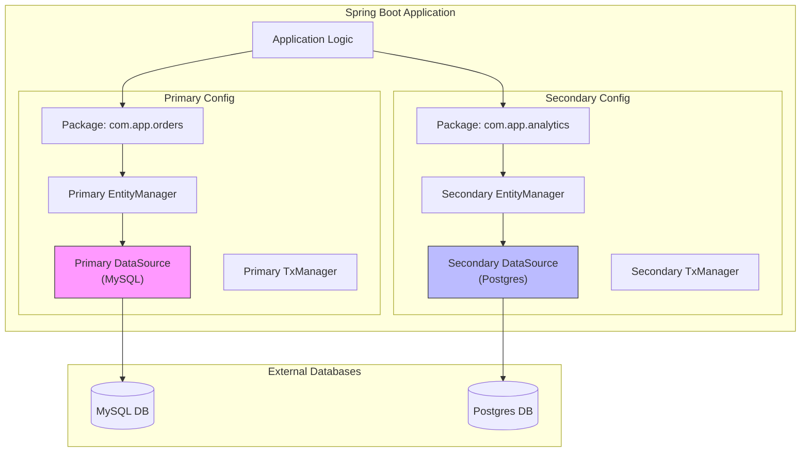

# How do you integrate your application with different databases?

Sure, let me first clarify the problem and then walk you through my approach.

## 1. Interview-Style Opening

"Integrating a single application with multiple databases is a common requirement in modern architectures, especially when separating 'write-heavy' transactional data from 'read-heavy' reporting data.

In a Spring Boot environment, the default auto-configuration handles a single DataSource seamlessly. However, to support multiple databases (like MySQL for transactions and Postgres for analytics), we need to bypass the default auto-configuration. I approach this by manually defining beans for **DataSource**, **EntityManagerFactory**, and **TransactionManager** for each database, and crucially, isolating them via package scanning."

## 2. Problem Understanding and Clarification

The user asks: "How do you integrate your application with different databases?"

**Scenarios I will cover:**

1. **Strict Separation:** One App connected to two different physical DBs (e.g., `orders_db` and `users_db`).
2. **Configuration Requirements:**
    * Separate `DataSource` beans (Connection Pools).
    * Separate `EntityManagerFactory` beans (JPA Contexts).
    * Separate `TransactionManager` beans (Atomic operations).
3. **Routing:** How Spring knows which Repository goes to which DB (Package Scanning).

**Clarification:** "I will assume we are using **Spring Data JPA** with **HikariCP** as the connection pool, as that is the industry standard."

## 3. High-Level Approach (Before Code)

The solution revolves around **Package-Level Isolation**.

1. **Properties:** We define two sets of properties in `application.yml` (e.g., `spring.datasource.primary` and `spring.datasource.secondary`).
2. **Configuration Classes:** We create two `@Configuration` classes:
    * `PrimaryDbConfig`: Scans `com.myapp.primary.repo` and `com.myapp.primary.entity`.
    * `SecondaryDbConfig`: Scans `com.myapp.secondary.repo` and `com.myapp.secondary.entity`.
3. **Bean Definition:** Inside these classes, we manually construct the `DataSource`, `EntityManager`, and `TransactionManager`.

## 4. Visual Explanation (Mermaid-First, Mandatory)



**Explanation:**

* The "Secret Sauce" is that **Repo1** is strictly tied to **EM1** because of the `@EnableJpaRepositories(basePackages = "com.app.orders")` annotation. It effectively creates two parallel JPA stacks inside one application.


## 5. Java Code (Production-Quality)

Here is how you actually configure the **Primary** database. The Secondary one would look identical, just without `@Primary`.

### Step 1: `application.yml`

```yaml
spring:
  datasource:
    primary:
      url: jdbc:mysql://localhost:3306/orders_db
      username: root
      password: password
      driver-class-name: com.mysql.cj.jdbc.Driver
    secondary:
      url: jdbc:postgresql://localhost:5432/analytics_db
      username: postgres
      password: secret
      driver-class-name: org.postgresql.Driver
```


### Step 2: Primary Configuration Class

```java
import com.zaxxer.hikari.HikariDataSource;
import jakarta.persistence.EntityManagerFactory;
import org.springframework.beans.factory.annotation.Qualifier;
import org.springframework.boot.context.properties.ConfigurationProperties;
import org.springframework.boot.jdbc.DataSourceBuilder;
import org.springframework.context.annotation.Bean;
import org.springframework.context.annotation.Configuration;
import org.springframework.context.annotation.Primary;
import org.springframework.data.jpa.repository.config.EnableJpaRepositories;
import org.springframework.orm.jpa.JpaTransactionManager;
import org.springframework.orm.jpa.LocalContainerEntityManagerFactoryBean;
import org.springframework.orm.jpa.vendor.HibernateJpaVendorAdapter;
import org.springframework.transaction.PlatformTransactionManager;
import org.springframework.transaction.annotation.EnableTransactionManagement;

import javax.sql.DataSource;
import java.util.HashMap;

@Configuration
@EnableTransactionManagement
@EnableJpaRepositories(
    basePackages = "com.myapp.orders.repo", // <--- CRITICAL: Isolate Repos
    entityManagerFactoryRef = "primaryEntityManagerFactory",
    transactionManagerRef = "primaryTransactionManager"
)
public class PrimaryDbConfig {

    // 1. DataSource (Connection Pool)
    @Primary
    @Bean(name = "primaryDataSource")
    @ConfigurationProperties(prefix = "spring.datasource.primary")
    public DataSource primaryDataSource() {
        return DataSourceBuilder.create().type(HikariDataSource.class).build();
    }

    // 2. EntityManagerFactory (JPA Context)
    @Primary
    @Bean(name = "primaryEntityManagerFactory")
    public LocalContainerEntityManagerFactoryBean primaryEntityManagerFactory(
            @Qualifier("primaryDataSource") DataSource dataSource) {
        
        LocalContainerEntityManagerFactoryBean em = new LocalContainerEntityManagerFactoryBean();
        em.setDataSource(dataSource);
        em.setPackagesToScan("com.myapp.orders.entity"); // <--- CRITICAL: Isolate Entities

        HibernateJpaVendorAdapter vendorAdapter = new HibernateJpaVendorAdapter();
        em.setJpaVendorAdapter(vendorAdapter);
        
        HashMap<String, Object> properties = new HashMap<>();
        properties.put("hibernate.hbm2ddl.auto", "update");
        properties.put("hibernate.dialect", "org.hibernate.dialect.MySQL8Dialect");
        em.setJpaPropertyMap(properties);

        return em;
    }

    // 3. TransactionManager (For @Transactional)
    @Primary
    @Bean(name = "primaryTransactionManager")
    public PlatformTransactionManager primaryTransactionManager(
            @Qualifier("primaryEntityManagerFactory") EntityManagerFactory entityManagerFactory) {
        return new JpaTransactionManager(entityManagerFactory);
    }
}
```


## 6. Code Walkthrough (Line-by-Line)

* `@EnableJpaRepositories(basePackages = ...)`: This acts as the router. It tells Spring: "Any Repository interface found in `com.myapp.orders.repo` belongs to this config."
* `@Primary`: Since we have two `DataSource` beans, Spring will be confused about which one to inject by default. `@Primary` marks this one as the default. The secondary config **must not** have this annotation.
* `setPackagesToScan("com.myapp.orders.entity")`: This ensures that the MySQL EntityManager doesn't accidentally try to map Postgres entities. Mixing them up leads to "Table not found" errors.


## 7. How I Would Explain This to the Interviewer

"To integrate multiple databases, I move away from Spring Boot's 'magic' auto-configuration and adopt a 'Manual Bean Definition' approach.

I create two separate configuration classes.
One class is for the MySQL database. It scans the `orders` package.
The other class is for the Postgres database. It scans the `analytics` package.

Inside these classes, I manually build the `DataSource`, `EntityManagerFactory`, and `TransactionManager`. This effectively creates two isolated persistence contexts within the same JVM.
When I use `@Autowired OrderRepository`, Spring knows it belongs to the MySQL config because of the package scanning rules I defined."

## 8. Edge Cases and Follow-Up Questions

**Q: How do you handle distributed transactions (saving to both DBs atomically)?**

* *A:* "Standard `@Transactional` only works for *one* TransactionManager. If I need to save to both MySQL and Postgres atomically, I would need **JTA (Java Transaction API)** with a global transaction manager like **Atomikos**. However, in microservices, I prefer using the **Saga Pattern** or **Eventual Consistency** via Kafka instead of JTA, as JTA is heavy and blocks performance."

**Q: Can I use `JdbcTemplate` instead of JPA for the second DB?**

* *A:* "Absolutely. For the second DB, instead of creating an `EntityManagerFactory`, I would just create a `JdbcTemplate` bean and inject the secondary `DataSource` into it. This is simpler if the second DB is only for read-only reporting."


## 9. Optimization and Trade-offs

| Feature | Single DB (Default) | Multiple DBs (Manual) |
| :-- | :-- | :-- |
| **Setup Time** | Instant (Auto-config) | Medium (Boilerplate code) |
| **Complexity** | Low | High (Package isolation required) |
| **Transactions** | Simple (`@Transactional`) | Complex (Requires JTA for cross-DB atomic commits) |
| **Performance** | High | High (Connections are pooled separately) |

**Trade-off:**
The main trade-off is **Distributed Transaction Complexity**. If you need strict ACID compliance across two physical databases, the complexity skyrockets. This is why we often prefer splitting the application into microservices rather than having one monolith talk to two DBs.

## 10. Real-World Application and Engineering Methodology

**Use Case: Legacy System Migration (Strangler Pattern)**

* **Scenario:** We were migrating a legacy Oracle Monolith to a modern Postgres Cloud DB.
* **Implementation:** We built a Spring Boot "Router Service".
* **Flow:**
    * Reads (90% of traffic) went to the **Postgres** DataSource for speed.
    * Writes (10%) went to the **Oracle** DataSource to maintain legacy compatibility.
    * A background Kafka job then synced Oracle -> Postgres.
* **Result:** We successfully ran both databases in parallel for 6 months using this "Multiple DataSource" configuration before finally shutting down Oracle.
<span style="display:none">[^1][^10][^11][^12][^13][^14][^15][^2][^3][^4][^5][^6][^7][^8][^9]</span>

<div align="center">⁂</div>

[^1]: https://stackoverflow.com/questions/30337582/spring-boot-configure-and-use-two-data-sources

[^2]: https://www.youtube.com/watch?v=z65J3JPbs9A

[^3]: https://www.geeksforgeeks.org/advance-java/configure-multiple-datasource-in-spring-boot-application/

[^4]: https://stackademic.com/blog/connecting-multiple-databases-in-spring-boot

[^5]: https://www.linkedin.com/pulse/connecting-using-multiple-databases-single-spring-boot-kāshān-asim-kszmf

[^6]: https://www.youtube.com/watch?v=13ffY7vI8z4

[^7]: https://www.geeksforgeeks.org/java/how-to-handle-connection-pooling-in-jdbc-in-java/

[^8]: https://www.youtube.com/watch?v=mIFIb_JE47U

[^9]: https://dev.to/antozanini/how-to-set-up-multiple-datasources-in-spring-boot-3-4089

[^10]: https://coderstea.in/post/java/how-to-create-a-multi-database-pool-in-hikaricp/

[^11]: https://www.innovationm.com/blog/managing-multiple-databases-in-a-monolithic-spring-boot-app-using-jpa-a-beginners-guide/

[^12]: https://www.codingeasypeasy.com/blog/spring-boot-configuring-multiple-data-sources-mysql-and-postgresql-complete-guide

[^13]: https://stackoverflow.com/questions/60547923/hikaricp-multiple-datasources-only-primary-datasources-pool-started-spring

[^14]: https://www.youtube.com/watch?v=mUIEM3x12es

[^15]: https://javageeksociety.blogspot.com/2024/10/configuring-multiple-datasources-in.html

