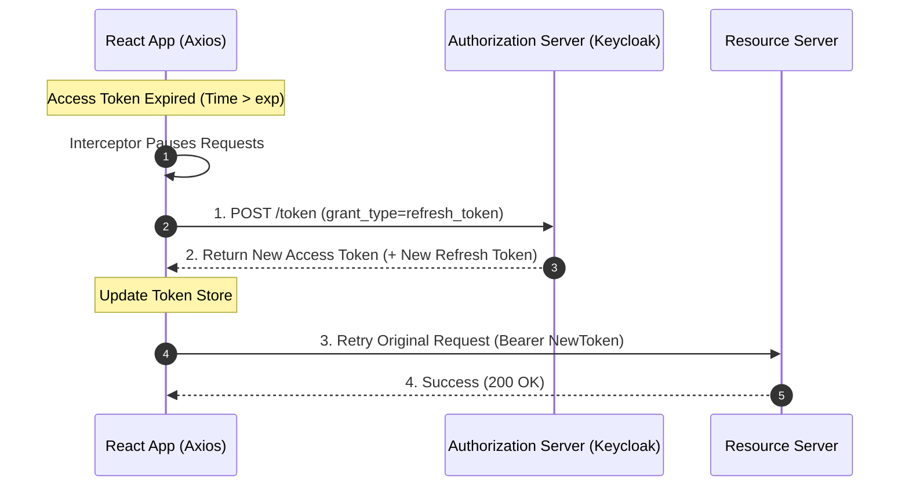
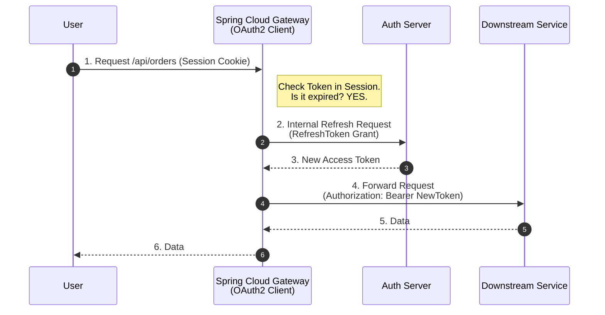

# How are you getting auth token from auth server and how does it get refreshed?

Sure, let me first clarify the problem and then walk you through my approach.

## 1. Interview-Style Opening

"Handling authentication tokens correctly is critical for both security and user experience. We cannot expect users to log in every 5 minutes when their Access Token expires.

In my architecture, I use the **OAuth2 Authorization Code Flow with PKCE** for the initial login. This gives me two things: a short-lived **Access Token** (e.g., 5 mins) and a long-lived **Refresh Token** (e.g., 30 days).

I automate the token lifecycle using two distinct strategies depending on where the token is stored:

1. **Frontend (React/SPA):** Using **Axios Interceptors** to silently refresh before 401 errors.
2. **Backend (Spring Boot/Gateway):** Using the **Token Relay Pattern** where Spring Security automatically handles the refresh behind the scenes."

## 2. Problem Understanding and Clarification

The user wants to know the mechanics of:

1. **Getting the initial token:** How do we exchange the code for the token?
2. **Refreshing the token:** How do we detect expiration and get a new one without user intervention?

**Scenario:**

* **Initial:** User logs in via Keycloak -> App gets `access_token` and `refresh_token`.
* **Usage:** App sends `access_token` in `Authorization: Bearer <token>` header.
* **Expiry:** `access_token` dies after 5 mins.
* **Refresh:** App uses `refresh_token` to get a new `access_token`.


## 3. High-Level Approach

### Strategy A: Frontend-Centric (The "Interceptor" Approach)

* **Storage:** Tokens are stored in memory or HttpOnly cookies.
* **Logic:** An Axios interceptor checks if the token is expired (or catches a 401 response). It pauses all requests, calls the `/refresh` endpoint, updates the token, and then retries the failed requests.


### Strategy B: Backend-Centric (The "BFF/Gateway" Approach)

* **Storage:** Tokens are stored in the Session/Redis on the Backend (Spring Cloud Gateway). The Frontend only has a `SESSION_ID` cookie.
* **Logic:** The Gateway detects the token expiry and refreshes it automatically using `spring-security-oauth2-client` before forwarding the request to downstream microservices. This is more secure (Zero Trust for Frontend).


## 4. Visual Explanation (Mermaid-First, Mandatory)

### 4.1. The Refresh Token Flow (Frontend Interceptor)

This sequence diagram illustrates the "Silent Refresh" mechanism.




### 4.2. Spring Boot "Token Relay" (Backend Magic)

How Spring Boot does it automatically.




## 5. Java Code (Production-Quality)

### 5.1. Backend: Spring Boot OAuth2 Client Configuration

If you use Spring Boot as a client (BFF), you don't need to write manual HTTP calls. Spring Security handles the "code exchange" and "refresh" automatically.

**`application.yml`**

```yaml
spring:
  security:
    oauth2:
      client:
        registration:
          keycloak:
            client-id: my-app-client
            client-secret: ${CLIENT_SECRET}
            scope: openid, profile, offline_access # 'offline_access' is CRITICAL for Refresh Tokens
            authorization-grant-type: authorization_code
            redirect-uri: "{baseUrl}/login/oauth2/code/{registrationId}"
        provider:
          keycloak:
            issuer-uri: https://auth.company.com/realms/myrealm
```

**How it works:**

* `offline_access`: This scope tells Keycloak "Please give me a Refresh Token". Without this, you only get an Access Token.
* **Auto-Refresh:** When you use `@RegisteredOAuth2AuthorizedClient`, Spring checks if the access token is expired. If yes, it uses the refresh token provider to fetch a new one *before* executing your code.


### 5.2. Frontend: React Axios Interceptor (Manual Implementation)

If you are building a pure SPA, you must handle this manually.

```javascript
import axios from "axios";

const api = axios.create({ baseURL: "/api" });

// Response Interceptor
api.interceptors.response.use(
  (response) => response, // Return success responses directly
  async (error) => {
    const originalRequest = error.config;

    // Check if error is 401 (Unauthorized) and we haven't retried yet
    if (error.response.status === 401 && !originalRequest._retry) {
      originalRequest._retry = true; // Mark as retried to prevent infinite loops

      try {
        // 1. Call the refresh endpoint
        const refreshToken = localStorage.getItem("refresh_token");
        const response = await axios.post("https://idp.com/token", {
          grant_type: "refresh_token",
          refresh_token: refreshToken,
          client_id: "my-app-client"
        });

        // 2. Save new tokens
        const { access_token, refresh_token } = response.data;
        localStorage.setItem("access_token", access_token);
        localStorage.setItem("refresh_token", refresh_token); // Rotate refresh token

        // 3. Update the header for the failed request
        originalRequest.headers["Authorization"] = "Bearer " + access_token;

        // 4. Retry the original request
        return api(originalRequest);
      } catch (refreshError) {
        // Refresh failed (e.g., refresh token also expired) -> Force Logout
        console.error("Session expired", refreshError);
        window.location.href = "/login";
      }
    }
    return Promise.reject(error);
  }
);
```


## 6. Code Walkthrough (Line-by-Line)

* **`offline_access` (YAML):** This is the most common mistake. If you forget this scope, the Auth Server (Keycloak) will NOT return a refresh token, and your user will be logged out after 5 mins.
* **`!originalRequest._retry` (JS):** This flag is crucial. If the Refresh Token itself is expired, the refresh call will fail (401). Without this flag, your app will enter an infinite loop of 401s -> Refresh -> 401 -> Refresh.
* **Token Rotation:** Notice `localStorage.setItem("refresh_token", ...)` inside the interceptor. Modern security best practices (OAuth 2.1) recommend **Refresh Token Rotation**. Every time you use a refresh token, you get a *new* one, and the old one is invalidated. This limits the damage if a refresh token is stolen.


## 7. How I Would Explain This to the Interviewer

"I handle token refresh differently depending on the architecture.

In a **Backend-for-Frontend (BFF)** architecture, which I prefer for security, I rely on **Spring Cloud Gateway**. I configure the `spring-boot-starter-oauth2-client` with the `offline_access` scope. Spring Security automatically manages the token lifecycle. It stores the tokens in Redis (via Spring Session) and silently refreshes them when the user makes a request. The frontend never sees the tokens.

In a **Pure SPA** architecture, I implement an **Axios Interceptor**. I proactively check the token expiration or reactively catch 401 errors. I send a request to the `/token` endpoint with `grant_type=refresh_token`. Crucially, I implement **Refresh Token Rotation** to prevent replay attacks."

## 8. Edge Cases and Follow-Up Questions

**Q: What happens if the Refresh Token is also expired?**

* *A:* "That means the user's session is effectively dead (e.g., they haven't used the app for 30 days). The refresh call will return 400/401. My interceptor catches this and redirects the user to the Login Page (`window.location.href = '/login'`)."

**Q: How do you handle concurrency? (User opens 5 tabs / makes 5 parallel requests)**

* *A:* "If 5 requests fail with 401 simultaneously, we don't want to call the Refresh API 5 times (Race Condition).
    * **Solution:** I use a `isRefreshing` boolean flag and a `failedQueue` in my interceptor.
    * The first request sets `isRefreshing = true` and starts the refresh.
    * The other 4 requests see the flag, subscribe to a Promise, and wait.
    * Once the first request succeeds, we flush the queue and retry all 5 requests with the new token."


## 9. Optimization and Trade-offs

| Strategy | Pros | Cons |
| :-- | :-- | :-- |
| **Silent Refresh (Iframe)** | Old school. | Third-party cookie blocking (Safari/Chrome) kills this. |
| **Refresh Token Rotation** | Highly secure. Detects token theft. | Complex to implement. Race conditions during parallel requests. |
| **Backend BFF (Gateway)** | **Most Secure.** Tokens never reach browser. | Requires a dedicated backend component (Spring Cloud Gateway). |

**Optimization:** "To avoid the latency of waiting for a 401 and *then* refreshing, I sometimes use **Proactive Refresh**. I set a `setTimeout` in the frontend to refresh the token 1 minute before it actually expires. This ensures the user never experiences the latency penalty of a failed request."

## 10. Real-World Application and Engineering Methodology

**Use Case: Mobile App (React Native)**

* **Scenario:** A delivery driver app needs to stay logged in for an 8-hour shift, even in areas with bad connectivity.
* **Methodology:** We used **long-lived Refresh Tokens** (24 hours).
* **Problem:** If the driver lost internet exactly when the token expired, they got logged out.
* **Fix:** We implemented **Optimistic Refresh**. Every time the app regained connectivity (detected via network listener), we proactively refreshed the token, ensuring they always had a fresh 5-minute window to work with.
<span style="display:none">[^1][^10][^11][^12][^13][^14][^15][^2][^3][^4][^5][^6][^7][^8][^9]</span>

<div align="center">⁂</div>

[^1]: https://docs.spring.io/spring-security/reference/servlet/oauth2/index.html

[^2]: https://frontegg.com/blog/oauth-2-refresh-tokens

[^3]: https://stackoverflow.com/questions/79415609/efficient-token-refresh-with-oauth2-client-credentials-flow-in-spring-boot-3-4-u

[^4]: https://docs.spring.io/spring-security/site/docs/5.2.x/reference/html/oauth2.html

[^5]: https://stackoverflow.com/questions/72502327/does-spring-security-oauth2-client-handles-refresh-token-automatically-from-spri

[^6]: https://docs.secureauth.com/ciam/en/refresh-token-flow.html

[^7]: https://stackoverflow.com/questions/77310559/automatically-refreshing-access-token-by-axios-interceptor-request

[^8]: https://www.youtube.com/watch?v=H44EeDG39VE

[^9]: https://gpiskas.com/posts/refresh-oauth2-tokens-spring-boot-spring-cloud-azure/

[^10]: https://developer.okta.com/docs/guides/refresh-tokens/main/

[^11]: https://www.youtube.com/watch?v=16-1mTdGBoM

[^12]: https://github.com/spring-attic/spring-cloud-security/issues/175

[^13]: https://docs.spring.io/spring-security/reference/servlet/oauth2/client/authorization-grants.html

[^14]: https://help.salesforce.com/s/articleView?id=xcloud.remoteaccess_oauth_refresh_token_flow.htm\&language=en_US\&type=5

[^15]: https://dev.to/elmehdiamlou/efficient-refresh-token-implementation-with-react-query-and-axios-f8d

