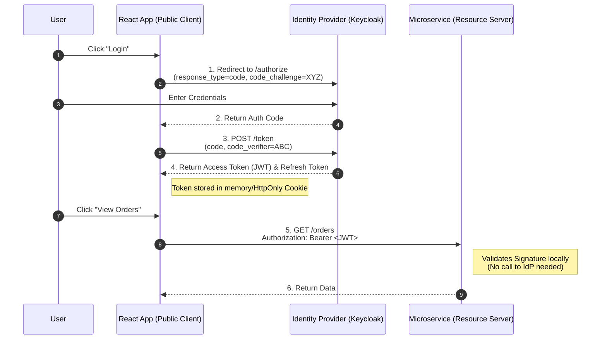
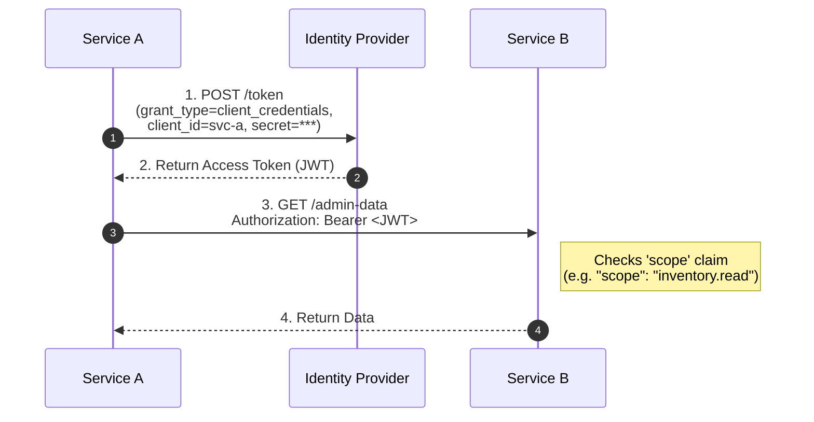

# How have you leveraged OAuth2 in your application ?

Sure, let me first clarify the problem and then walk you through my approach.

## 1. Interview-Style Opening

"Securing microservices is fundamentally different from a monolith. We can't use simple session-based auth (JSESSIONID) because services are stateless and distributed.

In my recent projects, I leveraged **OAuth2 with OpenID Connect (OIDC)** to handle authentication and authorization. Specifically, we used the **Authorization Code Flow with PKCE** for our frontend clients (React/Mobile) and the **Client Credentials Flow** for service-to-service communication.

The core idea is that no service manages passwords. They only validate **JWT Access Tokens** issued by a centralized Identity Provider (IdP) like Keycloak or Okta.

I will break this down into three parts:

1. **Architecture:** The specific roles (Resource Server, Client, Authorization Server).
2. **Implementation:** How we configured Spring Security to act as a Resource Server.
3. **Flow:** How a request travels from the user to the backend."

## 2. Problem Understanding and Clarification

The user is asking for a practical explanation of OAuth2 usage.
**Key Scenarios I will cover:**

1. **Frontend -> Backend:** A user logging in and accessing APIs.
2. **Backend -> Backend:** Service A calling Service B (Machine-to-Machine).
3. **Roles:**
    * **Authorization Server (IdP):** Keycloak (Issues tokens).
    * **Resource Server:** Our Microservices (Validate tokens).
    * **Public Client:** React App (Initiates login).

## 3. High-Level Approach

* **Token Format:** We use JWT (JSON Web Tokens) because they are stateless. The service doesn't need to call Keycloak to validate the token; it just verifies the **Digital Signature** using the IdP's Public Key.
* **Gateway Pattern:** We often place an **API Gateway** (Spring Cloud Gateway) at the edge. The Gateway handles the OAuth2 Login (exchanging code for token) and passes the Access Token downstream to microservices. This is the **Token Relay** pattern.


## 4. Visual Explanation (Mermaid-First, Mandatory)

### 4.1. User Login Flow (Auth Code with PKCE)

This diagram shows how a user gets a token safely.




### 4.2. Service-to-Service Flow (Client Credentials)

Service A needs to call Service B, but there is no user involved (e.g., a cron job).




## 5. Java Code (Production-Quality)

We implement the **Resource Server** using `spring-boot-starter-oauth2-resource-server`. This makes the service "OAuth2 Aware".

### 5.1. Dependency (pom.xml)

```xml
<dependency>
    <groupId>org.springframework.boot</groupId>
    <artifactId>spring-boot-starter-oauth2-resource-server</artifactId>
</dependency>
```


### 5.2. Configuration (SecurityConfig.java)

This configuration tells Spring Security to check the JWT signature and extract roles.

```java
import org.springframework.context.annotation.Bean;
import org.springframework.context.annotation.Configuration;
import org.springframework.security.config.annotation.web.builders.HttpSecurity;
import org.springframework.security.config.annotation.web.configuration.EnableWebSecurity;
import org.springframework.security.oauth2.server.resource.authentication.JwtAuthenticationConverter;
import org.springframework.security.oauth2.server.resource.authentication.JwtGrantedAuthoritiesConverter;
import org.springframework.security.web.SecurityFilterChain;

@Configuration
@EnableWebSecurity
public class SecurityConfig {

    @Bean
    public SecurityFilterChain filterChain(HttpSecurity http) throws Exception {
        http
            .authorizeHttpRequests(auth -> auth
                .requestMatchers("/public/**").permitAll()
                .requestMatchers("/api/admin/**").hasRole("ADMIN") // Checks 'ROLE_ADMIN'
                .anyRequest().authenticated()
            )
            // Configure as Resource Server accepting JWTs
            .oauth2ResourceServer(oauth2 -> oauth2
                .jwt(jwt -> jwt.jwtAuthenticationConverter(jwtAuthConverter()))
            );
        
        return http.build();
    }

    // Helper: Extract roles from JWT claims (e.g., Keycloak uses "realm_access.roles")
    private JwtAuthenticationConverter jwtAuthConverter() {
        JwtGrantedAuthoritiesConverter grantedAuthoritiesConverter = new JwtGrantedAuthoritiesConverter();
        // By default, Spring looks for "scope" or "scp". We can change it to "roles" or "groups"
        grantedAuthoritiesConverter.setAuthoritiesClaimName("roles");
        grantedAuthoritiesConverter.setAuthorityPrefix("ROLE_");

        JwtAuthenticationConverter jwtConverter = new JwtAuthenticationConverter();
        jwtConverter.setJwtGrantedAuthoritiesConverter(grantedAuthoritiesConverter);
        return jwtConverter;
    }
}
```


### 5.3. Application Properties (application.yml)

We point the service to the IdP's issuer URL so it can download the Public Keys (JWK Set).

```yaml
spring:
  security:
    oauth2:
      resourceserver:
        jwt:
          # Spring uses this to fetch Public Keys from /.well-known/openid-configuration
          issuer-uri: https://keycloak.my-company.com/realms/my-realm
```


## 6. Code Walkthrough (Line-by-Line)

* `@EnableWebSecurity`: Enables the security filter chain.
* `.oauth2ResourceServer(...)`: This one line does 90% of the work. It installs a filter that looks for the `Authorization: Bearer <token>` header, parses the JWT, validates the signature against the `issuer-uri`, and ensures it hasn't expired.
* `JwtAuthenticationConverter`: Standard JWTs have "scopes" (e.g., `read`, `write`), but Spring Security expects "roles" (e.g., `ROLE_ADMIN`). This converter maps the JWT claims to Spring's internal `GrantedAuthority` format so annotations like `@PreAuthorize("hasRole('ADMIN')")` work.


## 7. How I Would Explain This to the Interviewer

"In my application, I delegated all authentication to **Keycloak**. My microservices never see a password.

For the **Frontend**, we implemented the **BFF (Backend for Frontend) Pattern**. The React app doesn't handle tokens directly (to avoid XSS attacks). Instead, a lightweight Spring Cloud Gateway acts as the OAuth2 Client. It performs the login, gets the tokens, stores them in a secure session, and attaches the Access Token to downstream requests.

For the **Microservices**, I configured them as **Stateless Resource Servers**. They blindly trust any JWT that has a valid signature from Keycloak. This is highly scalable because validating a digital signature is a fast CPU operation that requires no network call or database lookup."

## 8. Edge Cases and Follow-Up Questions

**Q: How do you handle Token Revocation (Logout)?**

* *A:* "Since JWTs are stateless, you can't 'revoke' them easily before they expire.
    * **Short Lifespan:** We set Access Token expiry to 5 minutes.
    * **Blacklist:** For immediate revocation, we can use a Redis Blacklist, but that reintroduces state.
    * **Real Solution:** We revoke the **Refresh Token** at the IdP. Once the short-lived Access Token expires (max 5 mins), the user is forced to re-login."

**Q: What if Keycloak goes down?**

* *A:* "Since services use the cached Public Keys (JWK) to validate tokens, they can continue to authenticate *existing* valid tokens for a short time. However, new logins will fail. We typically deploy Keycloak in a High Availability cluster to mitigate this."


## 9. Optimization and Trade-offs

| Approach | Pros | Cons |
| :-- | :-- | :-- |
| **Opaque Tokens (Reference Tokens)** | Immediate revocation possible. Token is small. | High Latency. Every request requires a network call to IdP to validate token. |
| **JWT (Value Tokens) - My Choice** | **Zero Latency** validation. Stateless. Contains user info (email, role). | Hard to revoke instantly. Token size can be large. |

**Optimization:** "To optimize the payload size, we avoided putting too many custom claims in the JWT. Instead of embedding the entire User Profile, we just put the `user_id` and `roles`. If a service needs the user's phone number, it calls the User Service."

## 10. Real-World Application and Engineering Methodology

**Use Case: Partner API Integration**

* **Scenario:** We exposed an API for a third-party logistics partner to update order status.
* **Solution:** We created a specific **Client ID** and **Client Secret** for them in Keycloak.
* **Flow:** They used the **Client Credentials Flow** to get a token.
* **Methodology:** We used **Scopes** (`shipping.update`) to restrict their token. Even if their token was stolen, the attacker could only update shipping status, not read customer credit card data. This enforces the **Principle of Least Privilege**.
<span style="display:none">[^1][^10][^11][^12][^13][^14][^15][^2][^3][^4][^5][^6][^7][^8][^9]</span>

<div align="center">⁂</div>

[^1]: https://dzone.com/articles/how-to-achieve-oauth2-security-in-microservices-di

[^2]: https://www.sivalabs.in/spring-security-oauth2-tutorial-microservices-project-setup/

[^3]: https://github.com/piomin/sample-spring-oauth2-microservices

[^4]: https://www.geeksforgeeks.org/advance-java/spring-boot-oauth2-authentication-and-authorization/

[^5]: https://stackoverflow.com/questions/64607385/how-to-secure-communication-between-2-spring-boot-microservices-using-oauth2

[^6]: https://www.oauth.com/oauth2-servers/server-side-apps/example-flow/

[^7]: https://www.freecodecamp.org/news/oauth2-resourceserver-with-spring-security/

[^8]: https://developer.auth0.com/resources/guides/web-app/spring/securing-spring-boot-microservices

[^9]: https://community.forgerock.com/t/a-script-for-executing-the-oauth-2-0-authorization-code-flow-with-pkce-in-am/49

[^10]: https://stackoverflow.com/questions/66425144/what-is-the-difference-between-security-oauth2-resource-and-security-oauth2-c

[^11]: https://github.com/oktadev/spring-boot-microservices-example

[^12]: https://developer.okta.com/blog/2019/08/22/okta-authjs-pkce

[^13]: https://stackoverflow.com/questions/78113636/spring-security-configuration-in-application-yml-client-or-resource-server

[^14]: https://piotrminkowski.com/2024/03/01/microservices-with-spring-cloud-gateway-oauth2-and-keycloak/

[^15]: https://developers.arcgis.com/documentation/security-and-authentication/user-authentication/flows/authorization-code-with-pkce/

