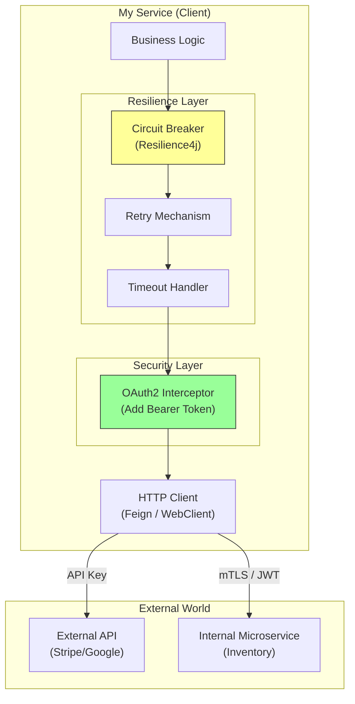

# What is the best way to call an API from another service ? What are the steps you need to take care of while you are integrating your service to external and internal services ? Do you see any security steps you need to take care about ?

Sure, let me first clarify the problem and then walk you through my approach.

## 1. Interview-Style Opening

"Integrating with other services is the backbone of microservices. While it looks simple—just making an HTTP call—in a production environment, it requires handling network flakiness, security, and observability.

For the 'best way' to call APIs in Java/Spring Boot, the industry has shifted. While `RestTemplate` was the standard for years, it is now in maintenance mode. The modern standard is **`WebClient`** (for both blocking and non-blocking) or **`Spring Cloud OpenFeign`** (for declarative, cleaner code). In Spring Boot 3.2+, we also have the new **`RestClient`**, which is a modern, synchronous alternative to `WebClient`.

Personally, I prefer **Feign** for internal microservices because it keeps the code clean (interface-based), and **WebClient/RestClient** for external public APIs where I need fine-grained control over headers and encoding."

## 2. Problem Understanding and Clarification

The user is asking three specific things:

1. **Best way:** Which client to use?
2. **Integration Steps:** What checklist should be followed?
3. **Security:** How to secure these calls?

**Clarification:** "I will assume we are in a Spring Boot ecosystem. I will break down the answer into 'Internal' (Service-to-Service) vs 'External' (Third-party SaaS) integration as they have different security needs."

## 3. High-Level Approach

1. **Technology Selection:** Compare Feign vs. WebClient vs. RestClient.
2. **Integration Checklist:** Cover the "must-haves" like Timeouts, Retries, Circuit Breakers, and Logging.
3. **Security Layer:** Discuss mTLS for internal and OAuth2/API Keys for external.

## 4. Visual Explanation (Mermaid-First, Mandatory)



**Explanation:**

* Notice that the **Business Logic** doesn't call the API directly. It goes through layers of **Resilience** (handling failure) and **Security** (handling auth).
* If the remote service is down, the **Circuit Breaker** pops open to save resources.


## 5. Java Code (Production-Quality)

Here is how I would implement a robust client using **Spring Boot 3.2+ `RestClient`** with Resilience4j.

### The Service Class

```java
import org.springframework.stereotype.Service;
import org.springframework.web.client.RestClient;
import io.github.resilience4j.circuitbreaker.annotation.CircuitBreaker;
import io.github.resilience4j.retry.annotation.Retry;
import org.slf4j.Logger;
import org.slf4j.LoggerFactory;

@Service
public class PaymentIntegrationService {

    private static final Logger log = LoggerFactory.getLogger(PaymentIntegrationService.class);
    private final RestClient restClient;

    public PaymentIntegrationService(RestClient.Builder builder) {
        this.restClient = builder
                .baseUrl("https://api.stripe.com/v1")
                .defaultHeader("Authorization", "Bearer sk_live_...")
                .build();
    }

    @CircuitBreaker(name = "paymentService", fallbackMethod = "fallbackPayment")
    @Retry(name = "paymentService")
    public String processPayment(PaymentRequest request) {
        log.info("Calling Payment API for order: {}", request.getOrderId());
        
        return restClient.post()
                .uri("/charges")
                .body(request)
                .retrieve()
                .onStatus(status -> status.is4xxClientError(), (req, resp) -> {
                    throw new RuntimeException("Invalid Payment Request: " + resp.getStatusCode());
                })
                .body(String.class);
    }

    // Fallback when API is down
    public String fallbackPayment(PaymentRequest request, Throwable t) {
        log.error("Payment API is down. Queuing for later. Error: {}", t.getMessage());
        return "QUEUED"; // Graceful degradation
    }
}
```


### The Configuration (Timeouts \& Connection Pooling)

*Never* rely on default timeouts.

```java
import org.apache.hc.client5.http.impl.classic.HttpClients;
import org.springframework.context.annotation.Bean;
import org.springframework.context.annotation.Configuration;
import org.springframework.http.client.HttpComponentsClientHttpRequestFactory;
import org.springframework.web.client.RestClient;

import java.time.Duration;

@Configuration
public class RestClientConfig {

    @Bean
    public RestClient.Builder restClientBuilder() {
        // Enforce Strict Timeouts at the factory level
        HttpComponentsClientHttpRequestFactory factory = new HttpComponentsClientHttpRequestFactory();
        factory.setConnectTimeout(Duration.ofSeconds(2)); // TCP Handshake limit
        factory.setConnectionRequestTimeout(Duration.ofSeconds(2)); // Pool wait limit

        return RestClient.builder()
                .requestFactory(factory);
    }
}
```


## 6. Code Walkthrough (Line-by-Line)

* **`RestClient.Builder`**: This is the modern replacement for `RestTemplate`. It is immutable and thread-safe.
* **`@CircuitBreaker`**: If the Stripe API fails 50% of the time, this annotation will stop sending requests immediately and call `fallbackPayment` instead. This prevents cascading failures in our system.
* **`onStatus`**: We explicitly handle 4xx errors. A common mistake is treating 400 (Bad Request) as a system failure. 400 means *we* sent bad data, so we shouldn't retry. We should only retry on 500 or network exceptions.
* **`setConnectTimeout(2s)`**: Default timeouts are often infinite. This is dangerous. If the external server hangs, our thread hangs forever. We capped it at 2 seconds.


## 7. How I Would Explain This to the Interviewer

"To integrate correctly, I treat every external call as a **potential failure point**.

My integration checklist has 3 phases:

1. **Configuration:** I ensure strict **Connection Timeouts** (so we don't hang) and **Read Timeouts**. I also configure a **Connection Pool** so we don't exhaust OS sockets during high load.
2. **Resilience:** I wrap the call in a **Circuit Breaker** (using Resilience4j). If the downstream service dies, I want to fail fast, not pile up threads. I also add **Retries** with 'Exponential Backoff'—but only for idempotent operations (like GET).
3. **Observability:** I ensure trace IDs (OpenTelemetry) are propagated in the headers so I can debug logs across services."

## 8. Security Steps (The "Must-Haves")

This is critical. You cannot just call an API naked.

### For Internal Services (Microservice A -> B):

1. **mTLS (Mutual TLS):** Ensures that Service A creates an encrypted tunnel to Service B, and both verify each other's certificates. This prevents "Man-in-the-Middle" attacks.
2. **OAuth2 (Client Credentials Flow):** Service A authenticates with an Identity Provider (like Keycloak) to get a JWT Access Token. It passes this token to Service B. Service B validates the token's scope (e.g., `inventory.read`).

### For External Services (Service -> Stripe/Google):

1. **Secrets Management:** Never hardcode API Keys. Inject them via **Vault** or Kubernetes Secrets.
2. **Egress Filtering:** Configure the firewall to allow outbound traffic *only* to `api.stripe.com` on port 443. This prevents a hacked service from stealing data and uploading it to a rogue server.

## 9. Optimization and Trade-offs

| Client Type | Use Case | Trade-off |
| :-- | :-- | :-- |
| **OpenFeign** | Internal Microservices | **Pros:** Clean interfaces. **Cons:** Reflection overhead, harder to debug deep issues. |
| **WebClient** | High Concurrency / Async | **Pros:** Non-blocking, high throughput. **Cons:** Complex "Reactive" programming model. |
| **RestClient** | General Purpose Sync | **Pros:** Modern, fluent API. **Cons:** Blocking threads (one thread per request). |

**Optimization:** "For high-load systems, I prefer **WebClient** (Reactive). A single thread can handle 1000 concurrent API calls waiting for responses. With RestClient/Feign, I'd need 1000 threads, which crashes the OS."

## 10. Real-World Application and Engineering Methodology

**Use Case: Payment Gateway Integration**

* **Scenario:** We integrated with a Legacy Banking API that was notoriously slow and unreliable.
* **Problem:** The bank API would randomly hang for 60 seconds. Our Tomcat threads would wait, leading to "Thread Pool Exhaustion" and taking down our entire platform.
* **Solution:**
    * Set a **Strict Read Timeout** of 5 seconds.
    * Implemented a **Bulkhead Pattern** (Resilience4j). We limited concurrent calls to the Bank to only 20 threads. Even if the Bank hangs, only 20 threads are stuck. The rest of our app stayed healthy.
    * Added a **Fallback**: If the Bank timed out, we saved the request to a DB table and ran a scheduled job to retry later (Eventual Consistency).
<span style="display:none">[^1][^10][^11][^12][^13][^14][^15][^2][^3][^4][^5][^6][^7][^8][^9]</span>

<div align="center">⁂</div>

[^1]: https://www.geeksforgeeks.org/java/how-to-call-or-consume-external-api-in-spring-boot/

[^2]: https://www.youtube.com/watch?v=8U0LFpEe8oA

[^3]: https://www.linkedin.com/pulse/day-15-consuming-external-apis-spring-boot-webclient-sahoo-8r5ic

[^4]: https://docs.spring.io/spring-boot/reference/io/rest-client.html

[^5]: https://www.youtube.com/watch?v=jEslx6rwEVc

[^6]: https://www.javaguides.net/2024/08/resttemplate-vs-webclient-vs-feign-client.html

[^7]: https://www.form3.tech/blog/engineering/buckle-up-your-mtls-with-oauth-2-0-client-authentication

[^8]: https://andifalk.gitbook.io/spring-cloud-gateway-workshop/hands-on-labs/lab2

[^9]: https://stackoverflow.com/questions/42365266/call-another-rest-api-from-my-server-in-spring-boot

[^10]: https://dev.to/nullvoidkage/webclient-vs-resttemplate-vs-feignclient-a-comparative-guide-4028

[^11]: https://dev.to/joswellahwasike/security-best-practices-for-microservices-architectures-1nfc

[^12]: https://github.com/google-gemini/gemini-cli/issues/2140

[^13]: https://blog.stackademic.com/best-practices-for-building-rest-apis-with-spring-boot-32a69563515b

[^14]: https://www.baeldung.com/spring-boot-feignclient-vs-webclient

[^15]: https://www.gravitee.io/blog/best-practices-for-microservices-development-security-and-efficiency

