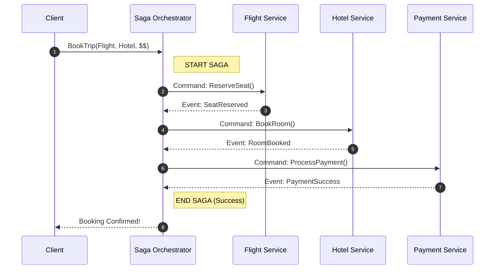
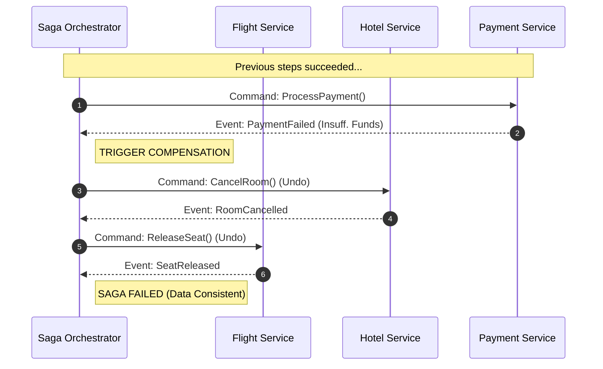

# How do you manage data consistency in a distributed microservices architecture? Design the system flow and architecture with UML diagrams.

Sure, let me first clarify the problem and then walk you through my approach.

## 1. Interview-Style Opening

"Managing data consistency in distributed systems is one of the hardest problems in software engineering because we lose the luxury of ACID transactions provided by a single database.

In a monolithic architecture, we can simply wrap multiple table updates in a `BEGIN TRANSACTION ... COMMIT` block. In microservices, data is partitioned across different services (e.g., Order Service uses Postgres, Inventory Service uses MongoDB).

To solve this, I avoid 'Two-Phase Commit' (2PC) because it locks resources and reduces throughput. Instead, I use the **Saga Pattern** for eventual consistency. For this answer, I will design a 'Flight Booking System' to demonstrate how we handle distributed transactions using **Saga Orchestration**."

## 2. Problem Understanding and Clarification

The user wants to know:

1. **How** to manage consistency (Strategy).
2. **Architecture:** The components involved.
3. **Visuals:** UML diagrams to explain the flow.

**Scenario:** A user wants to book a holiday. This involves three services:

1. **Flight Service:** Reserve a seat.
2. **Hotel Service:** Reserve a room.
3. **Payment Service:** Charge the credit card.

**Constraints \& Assumptions:**

* Each service has its own private database.
* We need **Eventual Consistency** (it's okay if the system is inconsistent for a few seconds, as long as it settles).
* We must handle failures (e.g., Payment fails -> Rollback Flight and Hotel).


## 3. High-Level Approach

I will use the **Saga Orchestration Pattern**.

* **Why Orchestration over Choreography?** Choreography (Event-based) becomes a "Tangly Dependency Web" when you have more than 3 services. Orchestration uses a central coordinator (The "Saga Manager") which makes the flow easy to visualize and debug.

**Core Concepts:**

1. **Local Transactions:** Each service performs its own atomic commit.
2. **Compensating Transactions:** If a step fails, we execute "undo" logic for previous steps.

## 4. Visual Explanation (Mermaid-First, Mandatory)

### 4.1. Success Flow (Happy Path)

This Sequence Diagram shows the Orchestrator commanding each service to do its work.




### 4.2. Failure Flow (Compensating Transaction)

This is critical. If Payment fails, we must "undo" the Hotel and Flight bookings.




## 5. Java Code (Production-Quality)

Here is how we implement the **Orchestrator** using a State Machine approach (conceptually similar to Spring StateMachine or Axon).

```java
import org.springframework.stereotype.Service;
import java.util.UUID;

@Service
public class BookingSagaOrchestrator {

    // Dependencies for sending commands (e.g., Kafka/RabbitMQ Producers)
    private final FlightClient flightClient;
    private final HotelClient hotelClient;
    private final PaymentClient paymentClient;

    public BookingSagaOrchestrator(FlightClient f, HotelClient h, PaymentClient p) {
        this.flightClient = f;
        this.hotelClient = h;
        this.paymentClient = p;
    }

    // Step 1: Start the Saga
    public void createBooking(BookingRequest request) {
        String sagaId = UUID.randomUUID().toString();
        // Persist Saga State: "STARTED"
        flightClient.reserveSeat(sagaId, request.getFlightDetails());
    }

    // Step 2: Handle Flight Success -> Trigger Hotel
    public void onFlightReserved(String sagaId) {
        // Persist Saga State: "FLIGHT_DONE"
        hotelClient.bookRoom(sagaId);
    }

    // Step 3: Handle Hotel Success -> Trigger Payment
    public void onHotelBooked(String sagaId) {
        // Persist Saga State: "HOTEL_DONE"
        paymentClient.processPayment(sagaId);
    }

    // Step 4: Handle Payment Success -> Complete Saga
    public void onPaymentSuccess(String sagaId) {
        // Persist Saga State: "COMPLETED"
        System.out.println("Booking Confirmed for Saga: " + sagaId);
    }

    // ---- FAILURE HANDLING (COMPENSATION) ----

    public void onPaymentFailed(String sagaId) {
        System.err.println("Payment Failed! Rolling back...");
        // Since Payment failed, we must undo Hotel and Flight
        hotelClient.cancelRoom(sagaId); 
    }

    public void onHotelCancelled(String sagaId) {
        // Hotel is undone, now undo Flight
        flightClient.releaseSeat(sagaId);
    }

    public void onFlightReleased(String sagaId) {
        // Persist Saga State: "ROLLED_BACK"
        System.out.println("Saga Rollback Complete. System is consistent.");
    }
}
```


## 6. Code Walkthrough (Line-by-Line)

* **`createBooking`**: The entry point. It assigns a `sagaId`. This ID is passed in every message to correlate events.
* **`onFlightReserved`**: This is an Event Listener. It waits for the Flight Service to reply "Done". Once it hears that, it triggers the next step (Hotel).
* **`onPaymentFailed`**: This is the logic that enforces consistency. If payment fails, we don't just stop. We explicitly call `hotelClient.cancelRoom()`.
* **State Persistence:** In a real system (like using **Camunda** or **Netflix Conductor**), every state change ("FLIGHT_DONE", "HOTEL_DONE") is saved to a database. If the Orchestrator crashes, it can reload the state from the DB and resume where it left off.


## 7. How I Would Explain This to the Interviewer

"To ensure data consistency, I treat the entire business process as a **State Machine**.

I define a 'Saga' which is a sequence of local transactions. Each step has a corresponding 'Compensating Action' (undo).
For example, the counterpart to `reserveSeat()` is `releaseSeat()`.

I use an **Orchestrator Service** to manage this state. It essentially says:
'Did step A succeed? Good, do step B.'
'Did step B fail? Okay, trigger undo for step A.'

This guarantees **Atomicity** at the Saga level: either all steps complete, or all completed steps are undone, leaving the system in a consistent state."

## 8. Edge Cases and Follow-Up Questions

**Q: What if the Compensation Step fails? (e.g., `cancelRoom` fails)**

* *A:* "This is the 'Zombie' scenario. We must implement **Idempotent Retries**. The Orchestrator will keep retrying the `cancelRoom` command until it succeeds. Since the command is idempotent, receiving it 10 times is safe. If it fails permanently (e.g., database corruption), it logs a 'Critical Alert' for manual human intervention."

**Q: Why not use 2PC (Two-Phase Commit)?**

* *A:* "2PC is blocking (synchronous). If the Hotel Service is slow, the Database locks on the Flight Service are held hostage, bringing down the whole system. Saga is asynchronous and non-blocking."


## 9. Optimization and Trade-offs

| Pattern | Pros | Cons |
| :-- | :-- | :-- |
| **Two-Phase Commit (2PC)** | Strong Consistency (ACID). Simple logic. | Poor Scalability. Blocking locks. Single Point of Failure. |
| **Saga Choreography** | Decentralized. No central coordinator bottleneck. | Hard to debug. Cyclic dependencies ("Event Hell"). |
| **Saga Orchestration** | Clear centralized logic. Easy to monitor/debug. | The Orchestrator can become a bottleneck (fixable with sharding). |

**Optimization:** "For high-volume systems, I would use **CDC (Change Data Capture)** like Debezium. Instead of the application sending events, we read the database transaction log to trigger the Saga steps. This prevents the 'Dual Write Problem' where the DB updates but the message isn't sent."

## 10. Real-World Application and Engineering Methodology

**Use Case: Uber Eats Order Flow**

* **Scenario:** Order Placed -> Restaurant Accepts -> Courier Assigned.
* **Pattern:** They utilize a highly scalable Orchestrator (Cadence/Temporal).
* **Real World:** If a Courier cannot be found (Step 3 fails), the system triggers a compensation: it notifies the Restaurant to stop cooking (Undo Step 2) and refunds the User (Undo Step 1).
* **Consistency:** The system is "Eventually Consistent". For a few seconds, the User might see "Order Accepted" even though no courier is found, but the system self-corrects quickly.
<span style="display:none">[^1][^10][^11][^12][^13][^14][^15][^2][^3][^4][^5][^6][^7][^8][^9]</span>

<div align="center">⁂</div>

[^1]: https://daily.dev/blog/10-methods-to-ensure-data-consistency-in-microservices

[^2]: https://hevodata.com/learn/data-consistency-between-microservices/

[^3]: https://dzone.com/articles/data-consistency-in-distributed-systems-transactio

[^4]: https://learn.microsoft.com/en-us/azure/architecture/microservices/design/data-considerations

[^5]: https://www.sayonetech.com/blog/managing-data-consistency-microservice-architecture/

[^6]: https://temporal.io/blog/to-choreograph-or-orchestrate-your-saga-that-is-the-question

[^7]: https://www.techblogspot.com/blog/two-phase-commit-2pc-vs-saga-pattern/

[^8]: https://talent500.com/blog/data-consistency-in-microservices/

[^9]: https://docs.aws.amazon.com/prescriptive-guidance/latest/cloud-design-patterns/saga-choreography.html

[^10]: https://developers.redhat.com/blog/2018/10/01/patterns-for-distributed-transactions-within-a-microservices-architecture

[^11]: https://blog.bytebytego.com/p/mastering-data-consistency-across

[^12]: https://learn.microsoft.com/en-us/azure/architecture/patterns/saga

[^13]: https://www.geeksforgeeks.org/system-design/difference-between-saga-pattern-and-2-phase-commit-in-microservices/

[^14]: https://dev.to/isaactony/consistency-vs-eventual-consistency-in-microservices-21pe

[^15]: https://blog.bytebytego.com/p/saga-pattern-demystified-orchestration

