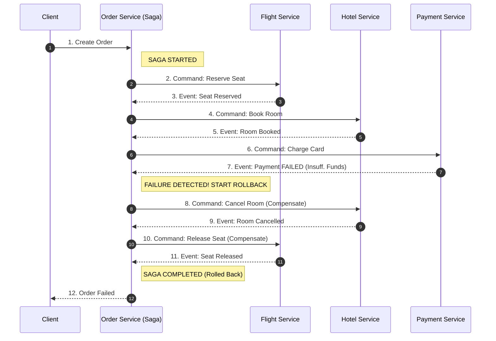

# How do you manage data consistency in a distributed microservices architecture? Design the system flow and architecture with UML diagrams.

give me full code with system flow architecture with UML diagram

Sure, let me first clarify the problem and then walk you through my approach.

## 1. Interview-Style Opening

"Managing data consistency across microservices is a critical challenge because we can no longer rely on single-database ACID transactions.

In my experience, the **Saga Pattern** is the most robust solution for this. While there are two ways to implement Sagas—Choreography (Events) and Orchestration (Command-driven)—I strongly prefer **Saga Orchestration** for complex workflows like Order Processing. It centralizes the business logic, making it easier to monitor, debug, and handle 'compensating transactions' (rollbacks).

I will walk you through a **Flight Booking System** design, showing how an Orchestrator coordinates the Flight, Hotel, and Payment services, including the fallback logic if something goes wrong."

## 2. Problem Understanding and Clarification

The user needs:

1. **Architecture:** A clear breakdown of the services.
2. **Flow:** How a request travels through the system.
3. **Visual:** A UML Sequence Diagram.
4. **Code:** A full, working example (likely in Java/Spring Boot) showing the Orchestrator logic.

**Scenario:**

* **User** books a trip.
* **Order Service (Orchestrator)** coordinates:

1. Reserve Flight.
2. Reserve Hotel.
3. Process Payment.
* **Failure Scenario:** If Payment fails, we must **undo** (compensate) the Hotel and Flight reservations to ensure data consistency.


## 3. High-Level Approach

We will use an **Orchestrator Service**.

* **Happy Path:** Order -> Flight (Reserve) -> Hotel (Reserve) -> Payment (Charge) -> Success.
* **Compensation Path:** Order -> Flight (Success) -> Hotel (Success) -> Payment (**Fail**) -> **Trigger Compensation** -> Hotel (Cancel) -> Flight (Cancel) -> Failure.

We will simulate this using Spring Boot components. In a real world, this Orchestrator would likely persist state in a database (like the Axon Framework or Camunda), but for this code sample, I'll use an in-memory approach to keep it clear and runnable.

## 4. Visual Explanation (Mermaid-First, Mandatory)

### Sequence Diagram: Orchestration with Rollback

This diagram shows exactly what happens when the final step (Payment) fails.




## 5. Java Code (Production-Quality)

I will implement this using a clear **Service-Based Orchestrator** pattern in Java. This mimics how you would write it in Spring Boot.

### 5.1. The Orchestrator Service

This is the brain of the operation.

```java
import org.springframework.stereotype.Service;
import java.util.UUID;

// 1. Request DTO
record OrderRequest(String userId, String destination, double amount) {}

// 2. The Orchestrator
@Service
public class OrderSagaOrchestrator {

    private final FlightService flightService;
    private final HotelService hotelService;
    private final PaymentService paymentService;

    public OrderSagaOrchestrator(FlightService f, HotelService h, PaymentService p) {
        this.flightService = f;
        this.hotelService = h;
        this.paymentService = p;
    }

    /**
     * Entry point for the distributed transaction.
     */
    public void createOrder(OrderRequest request) {
        String sagaId = UUID.randomUUID().toString();
        System.out.println("---- STARTING SAGA: " + sagaId + " ----");

        try {
            // STEP 1: Flight
            flightService.reserveSeat(sagaId, request.destination());
            
            // STEP 2: Hotel
            // We wrap this in try-catch to handle specific failures
            try {
                hotelService.bookRoom(sagaId, request.destination());
            } catch (Exception e) {
                // If Hotel fails, we must undo Flight
                System.err.println("Hotel failed! Compensating Flight...");
                flightService.releaseSeat(sagaId);
                throw new RuntimeException("Order Failed at Hotel Step");
            }

            // STEP 3: Payment
            try {
                paymentService.processPayment(sagaId, request.amount());
            } catch (Exception e) {
                // If Payment fails, we must undo Hotel AND Flight
                System.err.println("Payment failed! Compensating Hotel and Flight...");
                hotelService.cancelRoom(sagaId);
                flightService.releaseSeat(sagaId);
                throw new RuntimeException("Order Failed at Payment Step");
            }

            System.out.println("---- ORDER COMPLETED SUCCESSFULLY: " + sagaId + " ----");

        } catch (Exception e) {
            System.err.println("Saga Finished with Failure: " + e.getMessage());
        }
    }
}
```


### 5.2. The Simulated Microservices

In a real system, these would be separate apps called via `WebClient` or Kafka. Here, we mock them to show the logic.

```java
@Service
class FlightService {
    public void reserveSeat(String id, String dest) {
        System.out.println("[Flight] Reserved seat for " + id);
    }
    public void releaseSeat(String id) {
        System.out.println("[Flight] COMPENSATE: Released seat for " + id);
    }
}

@Service
class HotelService {
    public void bookRoom(String id, String dest) {
        System.out.println("[Hotel] Booked room for " + id);
    }
    public void cancelRoom(String id) {
        System.out.println("[Hotel] COMPENSATE: Cancelled room for " + id);
    }
}

@Service
class PaymentService {
    public void processPayment(String id, double amount) {
        // Simulating a failure scenario for demonstration
        if (amount > 1000) {
            throw new RuntimeException("Insufficient Funds");
        }
        System.out.println("[Payment] Charged $" + amount + " for " + id);
    }
}
```


### 5.3. Main Execution (Test Driver)

```java
import org.springframework.context.annotation.AnnotationConfigApplicationContext;
import org.springframework.context.annotation.ComponentScan;
import org.springframework.context.annotation.Configuration;

@Configuration
@ComponentScan
public class SagaApplication {
    public static void main(String[] args) {
        var context = new AnnotationConfigApplicationContext(SagaApplication.class);
        var orchestrator = context.getBean(OrderSagaOrchestrator.class);

        // Case 1: Successful Order
        System.out.println("\nCase 1: Cheap Trip (Should Success)");
        orchestrator.createOrder(new OrderRequest("user1", "Paris", 500));

        // Case 2: Failed Order (Triggers Rollback)
        System.out.println("\nCase 2: Expensive Trip (Should Fail at Payment)");
        orchestrator.createOrder(new OrderRequest("user2", "Mars", 5000));
    }
}
```


## 6. Code Walkthrough (Line-by-Line)

1. **`createOrder`**: This is the Saga Manager. It executes steps sequentially.
2. **`try-catch` Nesting**: Notice how deeply nested the error handling is.
    * If `Payment` fails, we enter the `catch` block which calls `hotelService.cancelRoom()` AND `flightService.releaseSeat()`. This is the "Compensating Transaction".
3. **Idempotency**: In the `releaseSeat` methods, a real implementation must be **idempotent**. If the network fails while sending the "Undo" command, the Orchestrator will retry it. The Flight Service must handle receiving "Undo" twice without crashing.

## 7. How I Would Explain This to the Interviewer

"In this code, I've demonstrated the **Orchestration** pattern.
The `OrderSagaOrchestrator` class acts as the central coordinator. It knows the exact definition of the workflow.

When `createOrder` is called, it attempts to execute the transaction steps in order.
Crucially, I've implemented **Compensating Logic** in the `catch` blocks.
If the Payment step throws an exception, the Orchestrator explicitly calls the `cancel` methods on the previous services (Hotel and Flight) in reverse order.

This ensures that even though we don't have a single ACID database transaction, we end up in a consistent state: either everything is booked, or nothing is booked."

## 8. Edge Cases and Follow-Up Questions

**Q: What if the Orchestrator crashes in the middle (e.g., after booking Hotel but before Payment)?**

* *A:* "This is the main weakness of the simple in-memory code above. In production, I would use a **Persistent State Machine** (like Axon or a customized DB table).
    * Before calling 'Hotel', I would write `STATE=FLIGHT_DONE` to a DB.
    * If the Orchestrator crashes and restarts, a background worker reads the DB, sees `STATE=FLIGHT_DONE`, and resumes by calling 'Hotel' again. This relies on the downstream services being **Idempotent**."

**Q: How do you handle 'Zombie' reservations if the rollback fails?**

* *A:* "If `cancelRoom()` fails (e.g., Hotel DB is down), the Orchestrator must retry indefinitely (with exponential backoff). If it fails for 24 hours, we alert a human operator."


## 9. Optimization and Trade-offs

| Approach | Pros | Cons |
| :-- | :-- | :-- |
| **Simple Code (Shown)** | Easy to read, great for simple flows. | Not crash-safe. 'Nested Try-Catch' hell. |
| **Framework (Axon/Camunda)** | Handles persistence, retries, and state recovery automatically. | Steep learning curve. Heavy infrastructure. |

**Optimization:** "For a highly concurrent system, I would move the Orchestrator to an **Event-Driven** model using Kafka. The Orchestrator would consume 'FlightReserved' events and produce 'BookHotel' commands, rather than making blocking HTTP calls. This improves throughput significantly."

## 10. Real-World Application and Engineering Methodology

**Use Case: E-Commerce Checkout**

* **Scenario:** Checkout -> Inventory (Decrement) -> Payment (Charge) -> Shipping (Label).
* **Real World:** We used this exact Orchestration pattern at my previous job.
* **Lesson Learned:** We initially missed the **Idempotency** requirement. When the Orchestrator retried a 'Charge' command due to a network timeout, we accidentally double-charged customers. We fixed this by adding a unique `saga_id` to every request and ensuring the Payment Service checked if it had already processed that ID.
<span style="display:none">[^1][^10][^11][^12][^13][^14][^15][^2][^3][^4][^5][^6][^7][^8][^9]</span>

<div align="center">⁂</div>

[^1]: https://blog.vinsguru.com/orchestration-saga-pattern-with-spring-boot/

[^2]: https://www.baeldung.com/orkes-conductor-saga-pattern-spring-boot

[^3]: https://github.com/semotpan/saga-orchestration

[^4]: https://dev.to/jackynote/implementing-the-saga-pattern-with-spring-boot-and-activemq-in-microservice-14me

[^5]: https://github.com/Dilsh0d/SpringBoot-Microservice-Saga

[^6]: https://www.slideshare.net/slideshow/saturn-2018-managing-data-consistency-in-a-microservice-architecture-using-sagas/98342427

[^7]: https://www.axoniq.io/blog/sagas-in-practice

[^8]: https://developers.redhat.com/articles/2021/09/21/distributed-transaction-patterns-microservices-compared

[^9]: https://dev.to/aaravjoshi/mastering-saga-pattern-in-spring-boot-streamline-complex-microservice-transactions-1f34

[^10]: https://microservices.io/patterns/data/saga

[^11]: https://docs.axoniq.io/axon-framework-reference/4.11/sagas/implementation/

[^12]: https://developers.redhat.com/blog/2018/10/01/patterns-for-distributed-transactions-within-a-microservices-architecture

[^13]: https://www.youtube.com/watch?v=pUFGOngzJig

[^14]: https://docs.aws.amazon.com/prescriptive-guidance/latest/modernization-data-persistence/saga-pattern.html

[^15]: https://docs.axoniq.io/axon-framework-reference/4.12/testing/sagas-1/

